# Introduction to Artificial Intelligence AI导论

**EBU4203**

- TB1: Introduction to AI, uncertainty in decision making, machine learning basics  
  人工智能入门，决策中的不确定性，机器学习基础

- TB2: Deep learning and reinforcement learning  
  深度学习和强化学习

- TB3: Practical AI Applications and Computer Vision  
  实用人工智能应用与计算机视觉

- TB4: Natural Language Processing (NLP) and future trends in AI  
  自然语言处理与人工智能的发展趋势

---

## Introduce 简要介绍

### assessment

- 1 x Class Test  3% 课堂小测
  
  - After teaching block 2

- 2 x Self-revision Online Quizzes 3% 网上自测
  
  - Open for a week

- Laboratory 14% 实验
  
  - Lab reports 实验报告
  
  - 一共三次,第一次不用写

- Final exam 80%
  
  - closed-book written exam 闭卷考试
  
  - Past papers will be put on QMPlus 过去的试卷将放在 QMPlus 上
  
  - Note: A minimum total mark of 40% is required to pass this module  
    注意: 通过本模块最低总分为40%

- Coursework: 
  
  - Note: There is a coursework hurdle of 30% (A minimum total coursework mark of 30% is required to pass this module)  
    注: 有一个30% 的课程作业障碍(通过此模块需要最少30% 的课程作业总分)

### Information

- Course website: 课程网站
  
  - Login to QMPlus
  
  - Course Area: EBU4203 (Introduction to AI)
  
  - <mark>Check it regularly, as it is possible there could be additional information e.g. messages, extra practice exercises, tutorials, etc.  
    定期检查，因为可能会有额外的信息，如信息，额外的练习，教程等。</mark>

- Email
  
  - <mark>You are expected to check your QM email every week at least!   
    你至少应该每周查看一次 QM 邮件！</mark>

### Recommended Text book and references 推荐的教科书和参考资料

- ["1"] Russell, S., & Norvig, P. (2021). Artificial Intelligence: a modern approach, 4th US ed. University of California, Berkeley.  
  ["1"]拉塞尔，S。 & 诺维格，P。(2021)。人工智能: 一种现代方法，美国第四版。加州大学伯克利分校。

- There are plenty of books available on this topic.  
  有很多关于这个主题的书。

### Few tips

- Attend every lecture, tutorial, lab and assessment sessions.  
  参加每一个讲座，辅导，实验室和评估会议。

- Revise your lecture materials after every class.  
  每节课后都要修改讲义。

- Make use of available materials, and read books and online materials.  
  利用现有的资料，阅读书籍和网上资料。

- Be interactive during the class and tutorial sessions.  
  在课堂和辅导课程中保持互动。

- Ask your lecturers/TAs and discuss with your classmates.  
  询问你的讲师/助教，并与你的同学讨论。

### mentimeter

interaction tools

## week 1

- Part 1: Introduction to AI AI引入

- Part 2: Uncertainty in decision making 决策的不确定性

- Part 3: Machine learning basics 机器学习基础

### Part 1: Introduction to AI 第一部分: 人工智能导论

- Definition and scope of AI 人工智能的定义和范围

- Motivation for exploring AI 探索人工智能的动机

- Brief history of AI 人工智能简史

- Branches and applications of AI 人工智能的分支与应用

- Ethical considerations in AI 人工智能的伦理思考

#### What is artificial intelligence？

<u>Definition and scope of AI 人工智能的定义和范围</u>

##### Alan Turing 图灵 —— 图灵测试 Turing Test

- The Turing Test aims to  evaluate **whether a machine  can exhibit intelligence  comparable to that of a human.**  
  图灵测试的目的是评估一台机器能否展现出与人类相当的智力。

- A **text conversation** between a judge, a human, and a machine, where the judge tries to determine whether he is conversing with a human or a machine.  
  一种法官、人类和机器之间的文本对话，法官试图确定他是在与人类还是机器交谈。

- 重要性和局限
  
  - Significance:
    
    - The Turing Test serves as a method for assessing the level of artificial intelligence.  
      图灵测试是评估人工智能水平的一种方法。
    
    - If a machine can pass the Turing Test, it indicates a certain level of intelligence and raises questions about AI capabilities.  
      如果一台机器能够通过图灵测试，它表明了一定程度的智能，并提出了关于人工智能能力的问题。
  
  - Limitations：
    
    - The Turing Test focuses **solely on external behavior** and does not evaluate internal cognitive processes.  
      图灵测试只关注外部行为，不评估内部认知过程。
    
    - It may be influenced by **subjective judgments** from the judge and other factors.  
      它可能受到法官主观判断等因素的影响。

- IBM's Jeopardy Challenge: An intriguing step toward AI passing the Turing Test  
  IBM 的危险挑战: 迈向人工智能通过图灵测试的有趣一步
  
  - In 2011, IBM's **supercomputer "Watson" won the Jeopardy Challenge**, becoming the first robot champion.  
    2011年，IBM 的超级计算机“沃森”赢得了危险挑战赛，成为第一个机器人冠军。
  
  - Watson's performance in the Jeopardy Challenge: **Comprehending questions, analysing information, and selecting the most probable answer**.  
    沃森在危险挑战中的表现: 理解问题，分析信息，选择最可能的答案。
  
  - IBM's Jeopardy Challenge provided a demonstration of **a technological breakthrough related to
  
  - the Turing Test**, proving the potential of machines to process natural language and reasoning, and driving further development in the field of artificial intelligence.  
    IBM 的 Jeopardy Challenge 展示了与图灵测试相关的技术突破，证明了机器处理自然语言和推理的潜力，并推动了人工智能领域的进一步发展。

##### The Four potential goals or definitions of AI 人工智能的四个潜在目标或定义

- They differentiates computer systems on the basis of rationality and thinking vs. acting  
  他们区分计算机系统的基础是理性和思考与行动:
  
  
  
  

- At its simplest form, artificial intelligence is a field, which **combines computer science and robust datasets**, to enable **problem-solving**.  
  简单来说，人工智能是一个将计算机科学和强大的数据集结合起来的领域，它能够解决问题。

- It also encompasses sub-fields of **machine learning and deep learning**, which are frequently mentioned in conjunction with artificial intelligence.   
  它还包括机器学习和深度学习的子领域，这些领域经常与人工智能一起被提及。

- These disciplines are comprised of AI algorithms which seek to **create expert systems which make predictions or classifications based on input data**.  
  这些学科由人工智能算法组成，该算法寻求创建专家系统，根据输入数据进行预测或分类。

##### The scope of AI 人工智能的范围

- As we begin the new millennium   
  千禧年后开始
  
  - science and technology are changing rapidly   
    科学技术正在迅速变化
  
  - “old” sciences such as physics are relatively well-understood   
    像物理这样的“古老”科学相对来说已经被广为人知了
  
  - computers are ubiquitous  
    电脑无处不在

- Grand Challenges in Science and Technology  
  科学技术面临的重大挑战
  
  - understanding the brain   
    对脑科学的理解与研究
  
  - reasoning, cognition, creativity   
    推理、认知、创造力
  
  - creating intelligent machines  
    创造智能机器

##### The Foundations of AI 人工智能的基础

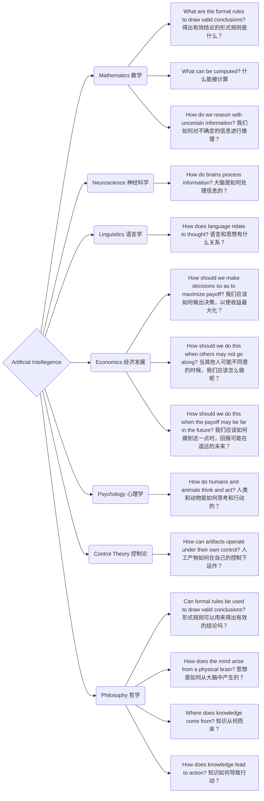
```mermaid
flowchart LR
    AI{Artificial Intellegence}-->A(Mathematics 数学)
    A-->AA["What are the formal rules to draw valid conclusions? 得出有效结论的形式规则是什么？"]
    A-->A2["What can be computed? 什么能被计算"]
    A-->A3["How do we reason with uncertain information? 我们如何对不确定的信息进行推理？"]
    AI-->B(Neuroscience 神经科学)
    B-->B1["How do brains process information? 大脑是如何处理信息的？"]
    AI-->C(Linguistics 语言学)
    C-->C1["How does language relate to thought? 语言和思想有什么关系？"]
    AI-->D(Economics 经济发展)
    D-->D1["How should we make decisions so as to maximize payoff? 我们应该如何做出决策，以使收益最大化？"]
    D-->D2["How should we do this when others may not go along? 当其他人可能不同意的时候，我们应该怎么做呢？"]
    D-->D3["How should we do this when the payoff may be far in the future? 我们应该如何做到这一点时，回报可能在遥远的未来？"]
    AI-->E(Psychology 心理学)
    E-->E1["How do humans and animals think and act? 人类和动物是如何思考和行动的？"]
    AI-->F(Control Theory 控制论)
    F-->F1["How can artifacts operate under their own control? 人工产物如何在自己的控制下运作？"]
    AI-->G(Philosophy 哲学)
    G-->G1["Can formal rules be used to draw valid conclusions? 形式规则可以用来得出有效的结论吗？"]
    G-->G2["How does the mind arise from a physical brain? 思想是如何从大脑中产生的？"]
    G-->G3["Where does knowledge come from? 知识从何而来？"]
    G-->G4["How does knowledge lead to action? 知识如何导致行动？"]

```

#### How does AI work?  人工智能是如何工作的？

<u>Motivation for exploring AI</u> 

##### Why AI Matters? 为什么人工智能很重要

1. Potential to Transform
   AI has the potential **to revolutionize various aspects** of our lives, work, and leisure activities.  
   人工智能有可能彻底改变我们生活、工作和休闲活动的各个方面。

2. Business Automation
   AI has been effectively utilized in businesses **to automate tasks** that were previously performed by humans, such as customer service, lead generation, fraud detection, and quality control.  
   人工智能已经被有效地应用于企业中，使以前由人类执行的任务自动化，例如客户服务、引导生成、欺诈检测和质量控制。

3. Superior Performance
   In many areas, **AI outperforms humans** in tasks, especially those that are **repetitive and detail-oriented**. AI tools can **quickly analyse large volumes of legal documents**, ensuring accurate and complete information.  
   在许多领域，人工智能在任务方面胜过人类，尤其是那些重复性和注重细节的任务。人工智能工具可以快速分析大量的法律文件，确保准确和完整的信息

4. Efficiency and Accuracy
   AI tools can **complete tasks quickly and with relatively few errors**, particularly in areas that require analysing extensive data sets. This enables businesses to gain insights into their operations that may have otherwise gone unnoticed.  
   人工智能工具可以快速完成任务，错误相对较少，特别是在需要分析大量数据集的领域。这使得企业能够深入了解他们的业务，否则可能会被忽视。

5. Generative AI Tools
   The growing population of generative AI tools holds great importance in fields like education, marketing, and product design. These tools offer **innovative solutions and creative outputs**.  
   越来越多的生成性人工智能工具在教育、市场营销和产品设计等领域具有重要意义。这些工具提供了创新的解决方案和创造性的产出。

##### AI opens the door to new opportunities 人工智能为新的机会打开了大门

- UBER

- Meta

- Microsoft

- Alphabet

- Apple

##### The advantages of AI 人工智能的优势

1. Good at detail-oriented jobs  
   擅长细节导向的工作

2. Saves labour and increases productivity  
   节省劳动力，提高生产力

3. Delivers consistent results  
   产生一致的结果

4. AI-powered virtual agents are always available  
   人工智能驱动的虚拟代理总是可用的

5. Reduced time for data-heavy tasks  
   减少数据量大的任务的时间

6. Can improve customer satisfaction through personalization  
   可以通过个性化提高客户满意度

##### AI is NOT everything (limitations) 人工智能不是一切(局限性)

1. Expensive  
   昂贵的

2. Requires deep technical expertise  
   需要深厚的专业技术

3. Limited supply of qualified workers to build AI tools  
   人工智能工具的合格工人供应有限

4. Reflects the biases of its  training data, at scale.  
   在规模上反映了其训练数据的偏差。

5. Lack of ability to generalize from one task to another  
   缺乏从一项任务归纳到另一项任务的能力

6. Eliminates human jobs, increasing unemployment rates  
   减少人类工作，增加失业率

#### Brief history of AI 人工智能简史

<u>Ancient Roots of Intelligent Artifacts
智能物品的古老根源</u>

##### From Mythical Servants 来自神话仆人

- The concept of inanimate objects endowed with intelligence has been around since ancient times.  
  被赋予智慧的无生命物体的概念自古以来就存在。
  
  - Greek god Hephaestus and robot-like servants out of gold   
    希腊神赫菲斯托斯和机器人般的仆人用金子做的
  
  - Engineers in ancient Egypt and statues  of gods animated by priests  
    古埃及的工程师和祭司制作的神像

##### To Symbolic Thinkers 对象征思想家的思考

- They used the tools and logic of their times to describe human thought processes as symbols, laying the foundation for AI concepts such as general knowledge representation.  
  他们利用当时的工具和逻辑将人类的思维过程描述为符号，为一般知识表示等人工智能概念奠定了基础。

- Aristotle 亚里士多德
  Ramon Llull 拉蒙·柳利
  René Descartes 勒内 · 笛卡尔
  Thomas Bayes 托马斯·贝叶斯

##### Pioneers of Programmable Machines 可编程机器的先驱

The foundational work that would give rise to the modern computer  
产生现代计算机的基础工作

- the mill with a printing mechanism of the Analytical Engine 带有分析机打印机构的磨坊

- Babbage's difference engine 巴贝奇的差分引擎

##### Milestones in the Journey of AI

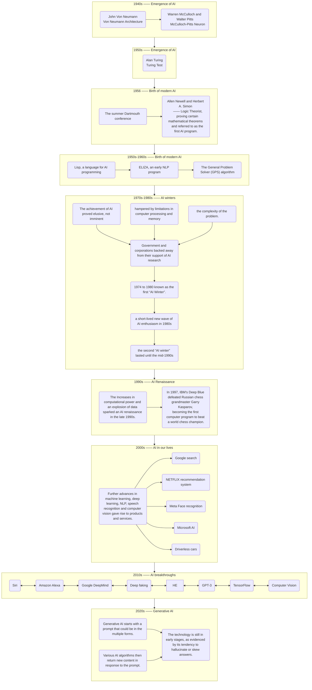
```mermaid
flowchart TB
    subgraph A["1940s —— Emergence of AI"]
      direction LR
      AA("John Von Neumann
      Von Neumann Architecture")
      AB("Warren McCulloch and Walter Pitts
      McCulloch-Pitts Neuron")
      AA-->AB
    end
    subgraph B["1950s —— Emergence of AI"]
    direction LR
    BA("Alan Turing
    Turing Test")
    end
    subgraph C["1956 —— Birth of modern AI"]
    direction LR
    CA("The summer Dartmouth conference")
    CB("Allen Newell and Herbert A. Simon 
    —— Logic Theorist,
    proving certain mathematical theorems 
    and referred to as the first AI program.")
    CA-->CB
    end
    subgraph D["1950s-1960s —— Birth of modern AI"]
    direction LR
    DA("Lisp, a language for AI programming")
    DB("ELIZA, an early NLP program")
    DC("The General Problem Solver (GPS) algorithm")
    DA-->DB-->DC
    end
    subgraph E["1970s-1980s —— AI winters"]
    direction TB
    EAA("The achievement of AI proved elusive, not imminent")
    EAB("hampered by limitations in computer processing and memory")
    EAC("the complexity of the problem.")
    EB("Government and corporations backed away from their support of AI research")
    EC("1974 to 1980 known as the first “AI Winter”.")
    ED("the second “AI winter” lasted until the mid-1990s")
    EE("a short-lived new wave of AI enthusiasm in 1980s")
    EAA-->EB
    EAB-->EB
    EAC-->EB
    EB-->EC-->EE-->ED
    end
    subgraph F["1990s —— AI Renaissance"]
    direction LR
    FA("The Increases in computational power and an explosion of data sparked an AI renaissance in the late 1990s.")
    FB("In 1997, IBM's Deep Blue defeated Russian chess grandmaster Garry Kasparov, 
becoming the first computer program to beat a world chess champion.")
    FA-->FB
    end
    subgraph G["2000s —— AI in our lives"]
    direction LR
    GA("Further advances in machine learning, deep learning, NLP, speech recognition and computer vision gave rise to products and services.")
    GBA("Google search")
    GBB("NETFLIX recommendation system")
    GBC("Meta Face recognition")
    GBD("Microsoft AI")
    GBE("Driverless cars")
    GA-->GBA
    GA-->GBB
    GA-->GBC
    GA-->GBD
    GA-->GBE
    end
    subgraph H["2010s —— AI breakthroughs"]
    direction LR
    HA("Siri")
    HB("Amazon Alexa")
    HC("Google DeepMind")
    HD("Deep faking")
    HF("GPT-3")
    HG("TensorFlow")
    HI("Computer Vision")
    HA<-->HB<-->HC<-->HD<-->HE<-->HF<-->HG<-->HI
    end
    subgraph I["2020s —— Generative AI"]
    direction LR
    IAA("Generative AI starts with a prompt that could be in the multiple forms. ")
    IAB("Various AI algorithms then return new content in response to the prompt.")
    IB("The technology is still in early stages, as evidenced by its tendency to hallucinate or skew answers.")
    IAA-->IB
    IAB-->IB
    end
    A-->B-->C-->D-->E-->F-->G-->H-->I


```

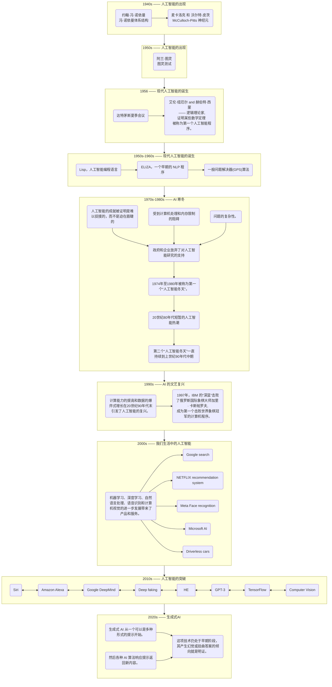
```mermaid
flowchart TB
    subgraph A["1940s —— 人工智能的出现"]
      direction LR
      AA("约翰·冯·诺依曼
      冯·诺依曼体系结构")
      AB("麦卡洛克 和 沃尔特·皮茨
      McCulloch-Pitts 神经元")
      AA-->AB
    end
    subgraph B["1950s —— 人工智能的出现"]
    direction LR
    BA("阿兰·图灵
    图灵测试")
    end
    subgraph C["1956 —— 现代人工智能的诞生"]
    direction LR
    CA("达特茅斯夏季会议")
    CB("艾伦·纽厄尔 and 赫伯特·西蒙 
    —— 逻辑理论家,
    证明某些数学定理 
    被称为第一个人工智能程序。")
    CA-->CB
    end
    subgraph D["1950s-1960s —— 现代人工智能的诞生"]
    direction LR
    DA("Lisp，人工智能编程语言")
    DB("ELIZA，一个早期的 NLP 程序")
    DC("一般问题解决器(GPS)算法")
    DA-->DB-->DC
    end
    subgraph E["1970s-1980s —— AI 寒冬"]
    direction TB
    EAA("人工智能的成就被证明是难以捉摸的，而不是迫在眉睫的")
    EAB("受到计算机处理和内存限制的阻碍")
    EAC("问题的复杂性。")
    EB("政府和企业放弃了对人工智能研究的支持")
    EC("1974年至1980年被称为第一个“人工智能冬天”。")
    ED("第二个“人工智能冬天”一直持续到上世纪90年代中期")
    EE("20世纪80年代短暂的人工智能热潮")
    EAA-->EB
    EAB-->EB
    EAC-->EB
    EB-->EC-->EE-->ED
    end
    subgraph F["1990s —— AI 的文艺复兴"]
    direction LR
    FA("计算能力的提高和数据的爆炸式增长在20世纪90年代末引发了人工智能的复兴。")
    FB("1997年，IBM 的“深蓝”击败了俄罗斯国际象棋大师加里 · 卡斯帕罗夫,
成为第一个击败世界象棋冠军的计算机程序。")
    FA-->FB
    end
    subgraph G["2000s —— 我们生活中的人工智能"]
    direction LR
    GA("机器学习、深度学习、自然语言处理、语音识别和计算机视觉的进一步发展带来了产品和服务。")
    GBA("Google search")
    GBB("NETFLIX recommendation system")
    GBC("Meta Face recognition")
    GBD("Microsoft AI")
    GBE("Driverless cars")
    GA-->GBA
    GA-->GBB
    GA-->GBC
    GA-->GBD
    GA-->GBE
    end
    subgraph H["2010s —— 人工智能的突破"]
    direction LR
    HA("Siri")
    HB("Amazon Alexa")
    HC("Google DeepMind")
    HD("Deep faking")
    HF("GPT-3")
    HG("TensorFlow")
    HI("Computer Vision")
    HA<-->HB<-->HC<-->HD<-->HE<-->HF<-->HG<-->HI
    end
    subgraph I["2020s —— 生成式AI"]
    direction LR
    IAA("生成式 AI 从一个可以是多种形式的提示开始。")
    IAB("然后各种 AI 算法响应提示返回新内容。")
    IB("这项技术仍处于早期阶段，其产生幻觉或扭曲答案的倾向就是明证。")
    IAA-->IB
    IAB-->IB
    end
    A-->B-->C-->D-->E-->F-->G-->H-->I


```

#### Branches and applications of AI 人工智能的分支与应用

##### Weak AI vs. Strong AI

- Weak AI
  
  - also called Narrow AI or Artificial Narrow Intelligence (ANI)
  
  - is **AI trained and focused to perform specific tasks.** 
  
  - Weak AI drives most of the AI that surrounds us today. ‘Narrow’ might be a more accurate descriptor for this type of AI as it is anything but weak; it enables some very robust applications.  
    今天我们周围的大部分人工智能都是由弱人工智能驱动的。“窄”可能是一个更准确的描述这种类型的人工智能，因为它是任何东西，但弱，它使一些非常健壮的应用程序。

- Strong AI
  
  - made up of **Artificial General Intelligence (AGI)** and **Artificial Super Intelligence (ASI)**.  
    由人工通用智能(AGI)和人工超级智能(ASI)组成。
  
  - AGI, or general AI, is a theoretical form of AI where a machine would have **an intelligence equal to humans**; it would have a **self-aware consciousness** that has the ability to solve problems, learn, and plan for the future.   
    人工智能(AGI)是人工智能的一种理论形式，在这种形式中，机器拥有与人类相当的智能; 它具有自我意识，能够解决问题、学习和规划未来。
  
  - ASI—also known as superintelligence—would **surpass the intelligence and ability of the human brain**.   
    人工智能ーー也被称为超级智能ーー将超越人类大脑的智力和能力。
  
  - While strong AI is still entirely theoretical with no practical examples in use today, that doesn't mean AI researchers aren't also exploring its development.  
    虽然强大的人工智能仍然完全是理论上的，没有实际应用的例子，但这并不意味着人工智能研究人员没有探索它的发展。

##### Four Types of AI

- <u>Type 1: Reactive machines 类型1: 活性机器</u>
  
  - have no memory 没有记忆
  
  - task-specific 只能执行特定任务
  
  - EXP.
    
    - An example is **Deep Blue**, the IBM chess program that beat Garry Kasparov in the 1990s.  
      一个例子是深蓝(Deep Blue) ，IBM 的国际象棋程序在上世纪90年代击败了加里•卡斯帕罗夫(Garry Kasparov)。
    
    - Deep Blue can identify pieces on a chessboard and make predictions, but because it has no memory, it **cannot use past experiences to inform future ones.**  
      深蓝可以识别棋盘上的棋子并做出预测，但是因为它没有记忆，所以它不能用过去的经历来告诉未来的经历。

- <u>Type 2: Limited memor  第2类: 记忆力有限</u>
  
  - have memory 拥有记忆  
  
  - use past experiences to inform future decisions.   
    利用过去的经验为将来的决策提供依据。  
    Some of the decision-making functions in self-driving cars are designed this way.  
    自动驾驶汽车的一些决策功能就是这样设计的。

- <u>Type 3: Theory of mind 类型3: 心理理论</u>
  
  - have the social intelligence to **understand emotions**  
    具有理解情感的社会智慧
  
  - This type of AI will be able to infer human intentions and predict behavior, a necessary skill for AI systems to become integral members of human teams.  
    这种类型的人工智能将能够推断人类的意图和预测行为，这是人工智能系统成为人类团队不可或缺的成员所必需的技能。

- <u>Type 4: Self-awareness 类型4: 自我意识</u>
  
  - have **a sense of self**, which gives them consciousness.   
    有自我意识，这给了他们意识。
  
  - understand their own current stateThis type of AI does not yet exist.  
    了解自己的现状这种类型的人工智能尚不存在。

##### Relationship between artificial intelligence, machine learning, and deep learning 人工智能、机器学习与深度学习的关系


##### How machine learning works?

- ➢ Models 模型
  
  - Assumptions to be mapped to the learning problem  
    映射到学习问题的假设
  
  - **(problem modelling, defining the assumption space)**   
    (问题建模，定义假设空间)

- ➢ Strategies 策略
  
  - Criteria for learning/selecting the optimal model from the hypothesis space  
    从假设空间学习/选择最优模型的准则
  
  - **(Determine objective function)**  
    (确定目标函数)

- ➢ Algorithm 算法
  
  - Specific calculations for solving the optimal model based on the objective function  
    基于目标函数求解最优模型的具体计算
  
  - **(solving for model parameters)**   
    (模型参数求解)

##### Classification of models by data label

- Data Label
  
  - Supervised learning 监督学习
    Supervised learning samples have labels (output targets); learns labelled interfaces from data (input-output mapping function), suitable for predictive data labelling  
    监督式学习样本有标签(输出目标) ，从数据中学习有标签的界面(输入输出映射功能) ，适用于预测性数据标签
    
    - 分类 classfication
  
  - unsupervised learning 无监督学习
    Unsupervised learning samples have no labelling; learns patterns from data, suitable for describing data  
    非监督式学习样本没有标签，从数据中学习模式，适合描述数据
    
    - 聚类 clustering
  
  - Semi-supervised learning 半监督学习 （不算到三种里面，而是作为前两种的融合）
    
    - Starting point: labelled samples difficult to obtain, unlabelled samples relatively inexpensive.  
      起始点: 标记样品难以获得，未标记样品相对便宜。
    
    - Idea: Assume that unlabelled samples are independently and identically distributed with labelled samples, i.e., contain important information about the distribution of the data  
      想法: 假设未标记的样品与标记的样品分布独立且相同，即含有关于数据分布的重要信息


```mermaid
flowchart LR
    A[["large amount of unlabeled data"]]
    B[["small amount of labeled data"]]
    C("machine learning model")
    D[["Pseudo-labeled Dataset"]]
    E(ML model trained on pseudo labeled data and labeled data)
    F>"it will be either an apple or a pineapple"]
    A-->|"learning process"|C
    B-->C
    C-->D-->E
    E-->|"predicted"|F
```


```mermaid
flowchart LR

    G[["data to be predicted"]]
    H("Trained Machine learning model")
    I>"two groups are identified, Now a human could label group 1 as apples and group 2 as pineapples"]
    G-->H-->I
```

- Reinforcement Learning 强化学习
  uses unlabelled data but can know whether it is getting closer or further away from the goal (rewarding feedback)  
  使用未标记的数据，但可以知道它是否离目标越来越近或越来越远(奖励反馈)

- ##### Use cases of AI technology  人工智能技术的用例
1. Automation: AI technologies paired with automation tools like robotic process automation (RPA) **automate repetitive, rules-based tasks, expanding task volume and types**.  
     自动化: 人工智能技术配合自动化工具，如机器人过程自动化(RPA)自动化重复，基于规则的任务，扩大任务量和类型。

2. Machine Learning: Enables computers to **act without explicit programming**. Deep learning automates **predictive analytics**.  
   机器学习: 使计算机不需要编程就能运行。深度学习使预测分析自动化。  

3. Computer Vision (CV): Gives machines the ability to **see and analyse visual information** using cameras and digital signal processing.  
   计算机视觉(CV) : 使机器能够看到和分析视觉信息使用相机和数字信号处理。

4. Natural Language Processing (NLP): **Processes human language by computer programs**, including tasks like translation, sentiment analysis, and speech recognition.   
   自然语言处理(NLP) : 通过计算机程序处理人类语言，包括翻译、情感分析和语音识别等任务。

5. Robotics: Engineering field focused on designing and manufacturing robots for tasks challenging for humans or requiring consistent performance.  
   机器人学: 工程领域专注于设计和制造机器人来完成对人类具有挑战性或需要一致性能的任务。  

6. Self-Driving Cars: Utilize computer vision, image recognition, and deep learning to navigate roads and avoid obstacles.   
   自动驾驶汽车: 利用计算机视觉、图像识别和深度学习来驾驶道路和避开障碍物。

7. Text, Image, and Audio Generation: Generative AI techniques create various media types based on text prompts, applied extensively across businesses for content creation.  
   文本、图像和音频生成: 生成式人工智能技术基于文本提示创建各种媒体类型，广泛应用于企业内容创建。

##### AI applications

1. Healthcare: AI is used to improve diagnoses, mine patient data, and assist with administrative tasks like scheduling appointments.  
   医疗保健: 人工智能用于改善诊断，挖掘患者数据，并协助行政任务，如安排预约。

2. Business: Machine learning and chatbots enhance customer service, while generative AI has the potential to revolutionize product design and disrupt business models.  
   业务: 机器学习和聊天机器人提高了客户服务，而生成性人工智能有可能彻底改革产品设计和颠覆商业模式。

3. Education: AI automates grading, adapts to student needs, and provides additional support. It also aids in crafting course materials and changing the learning process.  
   教育: 人工智能自动评分，适应学生的需要，并提供额外的支持。它还有助于精心制作课程材料和改变学习过程。

4. Finance: AI disrupts the financial industry through personal finance applications, automated trading, and the buying process for homes.  
   金融: 人工智能通过个人理财应用、自动交易和购房过程扰乱了金融业。

5. Law: AI assists with legal processes such as document classification, data description, and outcome prediction.  
   法律: 人工智能协助法律程序，如文档分类，数据描述和结果预测。

6. Entertainment and Media: AI is used for targeted advertising, content recommendation, script creation, automated journalism, and movie production.  
   娱乐和媒体: 人工智能用于定向广告、内容推荐、剧本创作、自动化新闻和电影制作。

7. Software Coding and IT Processes: Generative AI tools aid in code generation, while AI automates IT processes like data entry and security measures.  
   软件编码和 IT 过程: 生成 AI 工具帮助代码生成，而 AI 自动化 IT 过程，如数据输入和安全措施。

8. Security: AI is applied to cybersecurity for threat detection, anomaly detection, and behavior analytics.  
   安全性: 人工智能应用于网络安全，用于威胁检测、异常检测和行为分析。

9. Manufacturing: Robots collaborate with human workers in tasks previously done separately, increasing efficiency and multitasking capabilities.  
   制造业: 机器人与人类工人协作完成以前单独完成的任务，提高效率和多任务处理能力。

10. Banking: Chatbots and virtual assistants improve customer service and compliance with regulations, while AI aids in decision-making for loans and investments.  
    银行业务: 聊天机器人和虚拟助理改善客户服务和遵守规定，而人工智能协助贷款和投资决策。

11. Transportation: AI manages traffic, predicts flight delays, enhances supply chain management, and promotes safer and more efficient transportation methods.  
    运输: 人工智能管理交通，预测航班延误，加强供应链管理，促进更安全和更有效的运输方法。

#### Ethical considerations in AI  人工智能的伦理思考 （limitations）

##### Training Bias 含有歧视的训练

- AI systems can **perpetuate biases present in the training data**, which can lead to **unfair or discriminatory outcomes**.  
  人工智能系统可能使培训数据中存在的偏见长期存在，从而导致不公平或歧视性的结果。  

- Monitoring and addressing bias in machine learning algorithms is crucial to ensure fairness and avoid reinforcing existing inequalities.  
  监测和处理机器学习算法中的偏差对于确保公平性和避免加剧现有的不平等是至关重要的。

##### Misuse 误用，滥用

- AI technology can be misused for malicious purposes  
  人工智能技术可能被滥用于恶意目的
  
  - creating deepfakes 
  
  - engaging in phishing attacks. 进行网络钓鱼攻击。

- Safeguarding against misuse requires careful regulation and security measures.  
  防止滥用需要认真的监管和安全措施。

##### Interpretability 可解释性

- AI algorithms can be **difficult to interpret**. AI算法难以被数学解释  
  
  - deep learning 深度学习
  
  - generative adversarial network (GAN)  生成式对抗网络

- This poses challenges in industries with regulatory compliance requirements, where **interpretability is necessary to meet legal obligations**.  
  这对有守规要求的行业提出了挑战，因为在这些行业，解释性对于履行法律义务是必要的。

##### Job Displacement 工作被替代

- The automation enabled by AI can lead **to job losses and significant disruptions in the workforce.**   
  人工智能带来的自动化可能导致失业和劳动力大量中断。 

- Preparing for the impact on employment and addressing the need for upskilling and reskilling becomes crucial.  
  为对就业的影响做好准备以及解决提高技能和重新提高技能的需要变得至关重要。

##### Legal Concerns 法律问题

- AI raises legal issues, including potential cases of **AI-generated libel and copyright infringement**.   
  AI 提出了法律问题，包括可能出现的由AI引发的诽谤和盗版案件 。

- Developing appropriate legal frameworks and regulations to address these concerns is essential.  
  必须制定适当的法律框架和条例来解决这些问题。

##### Data Privacy 数据隐私

- AI applications often **rely on vast amounts of sensitive data**, particularly in fields like banking, healthcare, and law.  
  人工智能应用程序通常依赖于大量的敏感数据，特别是在银行、医疗保健和法律等领域。

- Ensuring proper data privacy protections and adhering to relevant regulations is crucial to safeguard individuals’ privacy.  
  确保适当的数据隐私保护和遵守相关法规对于保护个人隐私至关重要。

##### Address 解决方法

- responsible AI development 负责任的人工智能开发

- robust regulations 强有力的监管

- transparency 透明，透明性

- ongoing monitoring 持续监测

- stakeholder engagement 利益相关者参与

- <u>Ethical considerations must be an integral part of the AI development process.</u>
  <u>道德考虑必须是人工智能开发过程的一个部分。</u>

---

### Part 2: Uncertainty in decision making 决策的不确定性

- Logic and uncertainty 逻辑和不确定性

- Probability theory 概率论

- Random Variables 随机变量

- Bayes rule and conditional independence 贝叶斯规则和条件独立

- Bayes (belief) network 贝叶斯(信念)网络

#### Logic and uncertainty 逻辑和不确定性

```
- Aim 
  - To familiarise with uncertainty quantifications
  - To understand probabilistic reasoning and Bayes rule
- Outcome
  - Appreciate uncertainties
  - Quantification and reasoning using Probability
  - Probabilistic reasoning
  - Brief uncertain reasoning using 
  - Bayes Network
```

##### Major problem with logical-agent approaches 用逻辑去应用智能的主要问题

1. Agents almost never have access to the whole truth about theirenvironments  
   智能几乎永远无法了解他们所处环境的全部真相

2. There are important questions for which there is no yes/no answer (even in simple terms)  
   有些重要的问题没有是非回答(即使是简单的回答)

3. Therefore, an agent must reason under uncertainty.  
   因此，智能必须在不确定条件下进行推理。

4. Uncertainty also arises because of an agent’s incomplete or incorrect understanding of itsenvironment.  
   不确定性的产生也是由于智能对其环境的不完全或不正确的理解。

##### Why application fails (when uncertainties are not considered appropriately) ? 实际应用为何失败

1. <u>**LAZINESS**:</u> **too much work** to list the complete set ofantecedents or consequents needed to ensure an **exceptionless rule** and **too hard** to use such rules.  
   懒惰: 为了确保一个无例外的规则和太难使用这样的规则，需要列出一整套完整的前因后果，工作量太大。

2. <u>**THEORETICAL** ignorance:</u> Medical science has no completetheory for the domain.  
   理论上的无知: 医学在这个领域没有完整的理论。

3. <u>**PRACTICAL** ignorance:</u> Even if we **know all the rules**,we might be **uncertain** about a particular patient because not **all the necessary tests** have **been or can be run**.  
   实际无知: 即使我们知道所有的规则，我们也可能对某个特定的病人不确定，因为并非所有必要的检查都已经或可以运行。

##### Reasoning under uncertainty 不确定性推理

- A rational agent is one that makes rational decisions — to maximize its performance measure  
  理性代理人是做出理性决策的人ーー为了最大限度地提高其绩效指标

- A rational decision depends on  
  理性的决定取决于
  
  - the **relative** importance of various goals  
    不同目标的相对重要性
  
  - the **likelihood** they will be achieved  
    实现这些目标的可能性  
  
  - the **degree** to which they will be achieved  
    达到的程度

##### Types of uncertainty 不确定性类型

- Uncertainty in **prior knowledge**  
  先验知识的不确定性

- Uncertainty in **actions**  
  行动的不确定性

- Uncertainty in **perception**  
  感知的不确定性

Uncertainty is a summary of all that is not explicitly considered in the agent’s knowledge base.  
不确定性是代理的知识库中没有明确考虑的所有不确定性的总结。

##### Handling uncertainty 不确定性处理

- **Default reasoning [Optimistic]**   
  **正向推理〔乐观〕**  
  an agent assumes normality, until there is evidence of thecontrary.  
  除非有相反的证据，否则智能就会假装一切正常。

- **Worst-case reasoning [Pessimistic]**  
  **最坏情况推理〔悲观者〕**  
  The agent assumes the **worst case**, and chooses the actions that maximizes a **utility function** in this case.  
  智能假设最坏的情况，并在这种情况下选择使效用函数最大化的操作。  
  <u>Disadvantages: </u>  
  ❑ not **worth the effort** to develop or explore such a scenario; 不值得努力发展或探索这种情况  
  ❑ may **waste resources** preparing for highly unlikelycontingencies; 可能会浪费资源，为极不可能发生的突发事件做准备  
  ❑ **restricted** way of handling an emergency. 处理紧急事件的有限方式  

- **Probabilistic reasoning [Realist]**  
  **概率性推理 [现实]**

#### Probability theory 概率论

##### Probabilistic reasoning 概率性推理

- The agent has **probabilistic beliefs**  
  
  - pieces of knowledge with associated probabilities (**strengths**)  
    具有相关概率(优势)的知识片段
  
  - chooses its actions to maximize the expected value of some **utility function**  
    选择自己的行为来使某种效用函数的期望值最大化

- Rationale: The world is not divided between “normal” and“abnormal”, nor is it adversarial. Possible situations have various **likelihoods/chance** (probabilities)  
  理由: 这个世界没有“正常”和“不正常”之分，也没有对抗。可能的情况有各种各样的可能性/机会(概率)

##### Probabilistic reasoning and degrees of belief 概率推理和信任度

- The agent’s knowledge can only provide a **degree of belief** in the relevant sentences  
  代理人的知识只能提供对相关句子的一定程度的信任

- The agent cannot say whether a sentence is true, but only that is **true 𝒙%** of the times  
  代理不能说出一个句子是否为真，但只能说出真的 x% 的次数

- The main tool for handling degrees of belief is **Probability Theory**   
  处理信任度的主要工具是概率论

- The use of probability **summarizes** the **uncertainty** that stems from human’s **laziness or ignorance** about the domain  
  概率的使用概括了由于人类的懒惰或对领域的无知而产生的不确定性

##### Probability theory & facts 概率论与事实

- Probability Theory makes the same ontological commitments as First-order Logic:  
  概率论作出与一阶逻辑相同的本体论承诺:  
  Every sentence 𝜑 is either true or false  
  每个句子 φ 不是真就是假

- The **degree** of belief that 𝜑 is true is a number P between 0 and 1
  
  - P(𝜑) = 1 → 𝜑 is certainly true
  
  - P(𝜑) = 0 → 𝜑 is certainly not true
  
  - P(𝜑) = 0.65 → 𝜑 is true with a 65% chance

##### Probability facts 概率事实

- Let 𝑨 be a propositional variable, a symbol denoting aproposition that is either true or false.  
  设 a 是一个命题变量，一个表示命题是真或假的符号。

- 𝑷(𝑨) denotes the probability that 𝑨 is true in the absence of any other information.  
  P (A)表示在没有任何其他信息的情况下 A 为真的概率。

- Similarly:
  
  - 𝑃(¬𝐴) = probability that 𝐴 is false (~ or NOT)
    𝑃(¬𝐴) = A 为假(或非假)的概率
  
  - 𝑷(𝑨 ∩ 𝑩) = probability that both 𝑨 and 𝑩 are true
    P (A ∩ B) = A 和 B 都为真的概率
  
  - 𝑷(𝑨 ∪ 𝑩) = probability that either 𝑨 or 𝑩 (or both) are true
    P (A ∪ B) = A 或 B (或两者)为真的概率

- Interpretation
  
  - If P is the probability of an event:𝟎 ≤ 𝑷 ≤ 𝟏
  
  - P = 0 means the event **cannot** occur
  
  - P = 1 means the event is **certain** to occur
  
  - The closer to 1, the **more likely** the event
    
    
    - A priori 先前信息
    
    - Relative frequency 相对频率
    
    - Subjective 主观

##### Recap: axioms of probability 概述: 概率公理

- Complementary events 互补事件
  
  - 𝑃(𝐴)+ 𝑃(¬𝐴) = 1
    Hence, 𝑃(𝐴) = 1 − 𝑃(¬𝐴)

- Combining events 复合事件
  
  - 𝐴 or 𝐵; 𝑃(𝐴∪𝐵) = 𝑃(𝐴)+𝑃(𝐵)−𝑃(𝐴∩𝐵) [Union (dark blue and yellow)]  
  
  - 𝐴 and 𝐵; 𝑃(𝐴∩𝐵) = 𝑃(𝐴) × 𝑃(𝐵) [Intersection]

##### Subjective/Bayesian Probability 主观/贝叶斯概率

1. Probabilities relate propositions to one’s own state of knowledge  
   概率将命题与自己的知识状态联系起来

2. Probabilities of propositions change with new evidence  
   命题的概率随着新证据的出现而改变

3. This is analogous to logical entailment status KB |= 𝜑(which changes with more knowledge), NOT truth!  
   这类似于逻辑蕴含状态 KB | = φ (随着知识的增加而改变) ，不是真理！
- Therefore, Probability is an important reasoning for decisionmaking analysis!  
   因此，概率论是决策分析的一个重要推理方法！

##### Unconditional & conditional probability 无条件及无条件概率

1. 𝑷(𝑨) is the **unconditional (or prior) probability** of fact 𝑨  
   P (A)是事实 A 的无条件(或优先)概率

2. An agent can use the unconditional probability of 𝑨 to reason about 𝑨 in theabsence of further information  
   在没有进一步信息的情况下，智能可以使用 A 的无条件概率来推理 A

3. If further evidence 𝑩 becomes available, the agent must use the **conditional (or posterior) probability**: $P(𝑨 | 𝑩)$      
   如果进一步的证据 B 变得可用，智能必须使用条件(或后验)概率: $P (A | B)$

4. the probability of 𝐴 **given that (all) the agent knows (is)** 𝑩  
   给定智能知道 B 的可能性

Note: 𝑷(𝑨) can be thought as the conditional probability of 𝑨 with respect to the empty evidence: $P(A) = P(A |B)$  
注: 对于空证据，P (A)可以被认为是 A 的条件概率: $P (A) = P (A | B)$

##### Conditional probability 条件概率

- Definition：
  
  $$
  𝑷(𝑨 ∩ 𝑩) = 𝑷(𝑨|𝑩) 𝑷(𝑩)
  $$
  
  - **Read $P(A|B)$: Probability of 𝑨 given that we know 𝑩**
    $P(A)$ is called the **prior probability** of 𝑨  
    $P(A)$被称为A的先验概率
    $P(A|B)$ is called the **posterior or conditional probability** of 𝑨 given 𝑩 
    $P(A|B)$被称为 a 给定的 b 的后面或条件概率

- Definition:
  
  $$
  𝑷(𝑩 | 𝑨)= 𝑷(𝑨 ∩ 𝑩) / 𝑷(𝑨)
  $$
  
  - “𝐵 | 𝐴” means “𝐵 given 𝐴”
    $P (B | A)$ is the probability that 𝐵 will happen if 𝐴 has already happened.
    $P (B | A)$是当 A 已经发生时 B 将发生的概率。

- Conditional probabilities are defined in terms of unconditional ones
  条件概率是用无条件概率来定义的

- Whenever $𝑷(𝑩) > 𝟎,$
  
  $$
  𝑷(𝑨 | 𝑩) = 𝑷(𝑨 ∩ 𝑩) / 𝑷(𝑩)
  $$
  
  $$
  𝑷(𝑨 ∩ 𝑩)= 𝑷(𝑨 | 𝑩) 𝑷(𝑩) = 𝑷(𝑩 | 𝑨) 𝑷(𝑨)
  $$

- 𝐴 and 𝐵 are independent,then A 和 B 是独立的，则
  
  $$
  𝑃(𝐴 | 𝐵) = 𝑃(𝐴)
  $$
  
  $$
  𝑃(𝐵 | 𝐴) = 𝑃(𝐵)
  $$
  
  $$
  𝑃(𝐴 ∩ 𝐵) = 𝑃(𝐴)𝑃(𝐵)
  $$

- Another generalisation：另一个概括是:
  
  $$
  P(A∩ B ∩ C) = P(A|B,C) P(B|C) P(C)
  $$

##### Frequency Interpretation 频率解释

- Draw a ball from a bag containing n balls of the same size, red and s yellow.
  从装有红色和黄色等大小的 n 个球的袋子中抽出一个球。

- The probability that the proposition A = “the ball is red” is true corresponds to the relative frequency with which we expect to draw a red ball
  命题 A = “球是红色的”是真的的概率对应于我们期望画一个红色球的相对频率

$$
P(𝐴) = \frac{r}{n}
$$

#### Random Variables 随机变量

##### Random Variables Definition

---

- A random variable is a variable rangingover a certain domain of 𝑽𝒂𝒍𝒖𝒆𝒔
  一个随机变量是一个变量范围超过一定的值域

- It is discrete if it ranges over a discrete (that is,countable) domain
  如果它的范围超过一个离散(即可数)域，则它是离散的

- continuous if it ranges over the real numbers
  在实数范围内是连续的

- We will only consider discrete randomvariables with finite domains
  我们只考虑有限域的离散随机变量

> Note: Propositional variables can be seen as randomvariables over the Boolean domain
>            命题变量可以看作是布尔域上的随机变量

---

- A proposition that takes the value True with probability 𝑝 and False with probability $1 − p$ is a random variable with distribution $(p, 1 − p)$

- If a bag contains balls having 3 possible colors – red, yellow, and blue – the color of a ball picked at random from the bag is a random variable with 3 possible values
  一个取概率为 p 的 True 和概率为1-p 的 False 值的命题是一个具有分布的随机变量

- The (probability) distribution of a random variable $X$ with n values $x_1,x_2,...,x_n$ is:
  随机变量 $X $与 n 值 $x _ 1,x _ 2,... ,x _ n $的(概率)分布是:
  
  $$
  (p_1,p_2,...,p_n)
  $$
  
  $$
  P(X = x_i)=p_i
  $$
  
  $$
  \sum_{i=i,...,n}p_n=1
  $$

---

| Variable | Domain                           |
| -------- | -------------------------------- |
| Age      | {1, 2, . . . , 120}              |
| Weather  | {sunnt, dry, cloudy, rain, snow} |
| Size     | {amsll, medium, large}           |
| Blonde   | {true, false}                    |

- The probability that a random variable 𝑋 has value 𝑣𝑎𝑙 is written as
  随机变量 X 具有值 val 的概率写为
  
  $$
  P(X=val)
  $$

> Note 1: 𝑃(𝐴 = 𝑡𝑟𝑢𝑒) is written shortly as 𝑃(𝑎) while 𝑃(𝐴 = 𝑓𝑎𝑙𝑠𝑒) iswritten as 𝑃(¬𝑎)
>               P (A = true)简写为 P (a) ，而 P (A = false)简写为 P (a)
> Note 2: Traditionally, in ProbabilityTheory variables are capitalized andconstant values are NOT.
>               传统上，在概率论中，变量是大写的，而常数值不是。

---

##### Probability distribution 概率分布

- If 𝑿 is a random variable, we use the bold case 𝑷(𝑿) to denote a vector ofvalues for the probabilities of each individual element that 𝑿 can take.
  如果 X 是一个随机变量，我们使用粗体大小写 P (X)来表示 X 可以接受的每个单独元素的概率的值向量。

- Example
  
  $$
  𝑃(𝑊𝑒𝑎𝑡ℎ𝑒𝑟 = 𝑠𝑢𝑛𝑛𝑦) = 0.6\\
𝑃(𝑊𝑒𝑎𝑡ℎ𝑒𝑟 = 𝑟𝑎𝑖𝑛) = 0.2\\
𝑃(𝑊𝑒𝑎𝑡ℎ𝑒𝑟 = 𝑐𝑙𝑜𝑢𝑑𝑦) = 0.18\\
𝑃(𝑊𝑒𝑎𝑡ℎ𝑒𝑟 = 𝑠𝑛𝑜𝑤) = 0.02\\
Then \ 𝑃(𝑊𝑒𝑎𝑡ℎ𝑒𝑟) = \{ 0.6,0.2,0.18,0.02\}
  $$

- 𝑷(𝑾𝒆𝒂𝒕𝒉𝒆𝒓) is called a **probability distribution** for the random variable
  𝑷(𝑾𝒆𝒂𝒕𝒉𝒆𝒓) 被称为随机变量的**概率分布**

##### Expected value 期望值

- Random variable $X$ with $n$ values $x_1,x_2,...,x_n$ and distribution $(p _1,p_2,...,p_n)$      
  随机变量 $X $with $n $值 $x _ 1,x _ 2,... ,x _ n $和分布 $(p _ 1,p _ 2,... ,p _ n) $     

- Function $U$ of  $X$       
  函数 $U $对于 $X $   

- The **expected value** of $𝑈$ after doing $𝐴$ is   
  在完成 $A $之后，$U $的**预期值**是
  
  $$
  E[U]=\sum_{i=1,...,n}p_iU(x_i)
  $$

##### Joint Probability Distribution (JPD) 联合概率分布

- If $X_1,...,X_n$ are random variables,
  
  $$
  P(X_1,...,X_n)
  $$
  
  denotes their **joint probability distribution (JPD)**, an 𝑛-dimensional matrix specifying the probability of every possible combination of values for $X_1,...,X_n$   
  
  > 即多个随机变量的概率分布组合成一个概率分布

- All relevant probabilities about a vector $\{X_1,...,X_n\}$ of random variables can becomputed from $P(X_1,...,X_n)$   
  关于随机变量向量 ${ X _ 1，... ，X _ n } $的所有相关概率都可以从 $P (X _ 1，... ，X _ n) $中计算出来
  
  > 单个随机变量中各个事件概率和仍为1，矩阵中的概率要同时满足两个轴

- A JPD $P(X_1,...,X_n)$ **provides complete information** about the probabilities of its random variables.   
  联合概率分布 $P (X _ 1,... ,X _ n) $提供关于其随机变量概率的完整信息。

---

- EXP
  
  |        | Sky=sunny | Sky=cloudy | Sky=rain | Sky=snow | P(Wind) |
  | ------ | --------- | ---------- | -------- | -------- | ------- |
  | W      | 0.3       | 0.15       | 0.17     | 0.01     | 0.63    |
  | -W     | 0.3       | 0.05       | 0.01     | 0.01     | 0.37    |
  | P(Sky) | 0.6       | 0.20       | 0.18     | 0.02     | 1.00    |
  
  |                 | $Toothache$ | $\neg \ Toothache$ |
  | --------------- | ----------- | ------------------ |
  | $Cavity$        | 0.04        | 0.06               |
  | $\neg \ Cavity$ | 0.01        | 0.89               |

---

- Limitation of Joint Probability Distribution 联合概率分布的局限
  
  - However, JPD’s are often **hard to create** (incomplete knowledge of the domain).   
    然而，联合概率分布通常很难创建(不完整的领域知识)。
  
  - Even when available,  JPD **tables are very expensive**, or **impossible**, to store because of **their size**.    
    即使在可用的情况下，由于联合概率分布表的大小，存储它们也是非常昂贵的，甚至是不可能的。  
  
  - A JPD table for $n$ random variables, each ranging over $k $ distinct values, has $k^n$ entries!     
    用于 $n $随机变量的 联合概率分布表(每个变量的范围都超过 $k $不同的值)具有 $k ^ n $条目！   
  
  - A better approach is to come up with conditional probabilities as needed and compute the others from them.     
    一个更好的方法是根据需要提出条件概率，然后从中计算其他概率。

#### Bayes rule and conditional independence 贝叶斯规则和条件独立

##### Bayes Rule 贝叶斯规则

$$
𝑃(𝐴 ∩ 𝐵) = 𝑃(𝐴 | 𝐵)𝑃(𝐵) = 𝑃(𝐵 | 𝐴)𝑃(𝐴)\\ 
\ \\
𝑃(𝐵 | 𝐴) = \frac{𝑃(𝐴 | 𝐵) 𝑃(𝐵)}{𝑃(𝐴)}

$$

- 通常是知道在B发生的情况下A发生的概率有多少，反过来难求  

- 两个事件发生的各自概率也能被很好的统计  

##### Bayes rule – another version 贝叶斯规则-另一个版本

- $$
  P(A|B)=\frac{P(B|A)P(A)}{P(B)}=\frac{P(B|A)P(A)}{P(A)P(B|A)+P(\neg A)P(B|\neg A)}
  $$

- $$
  P(B)=P(A)P(B|A)+P(\neg A)P(B|\neg A)
  $$

- 不需要知道$P(B)$

---

- EXP  
  12% of the men and 4% of the women are taller than6 feet. Furthermore, 20% of the students in the classare women.  
  Suppose that a randomly selected student is taller than 6 feet.Find the probability 𝑝 that the student is a woman.
  
  $$
  𝑃(𝑤𝑜𝑚𝑎𝑛|𝑡𝑎𝑙𝑙) = \frac{𝑃(𝑡𝑎𝑙𝑙|𝑤𝑜𝑚𝑎𝑛)𝑃(𝑤𝑜𝑚𝑎n)}{𝑃(𝑡𝑎𝑙𝑙)}=\frac{𝑃(𝑡𝑎𝑙𝑙|𝑤𝑜𝑚𝑎𝑛)𝑃(𝑤𝑜𝑚𝑎n)}{𝑃(𝑡𝑎𝑙𝑙|𝑤𝑜𝑚𝑎𝑛)𝑃(𝑚𝑎n)+𝑃(𝑡𝑎𝑙𝑙|𝑤𝑜𝑚𝑎𝑛)𝑃(𝑚𝑎n)}\\ \ \\ =\frac{0.04 \times 0.2}{0.104} = 0.0769
  $$

---

##### Bayes theorem application 贝叶斯定理的应用

- Bayes Theorem has found numerous applications in manyfields, including Computer Science  
  贝叶斯定理在许多领域都有广泛的应用，包括计算机科学
  
  - Bayesian Networks 贝叶斯网络
  
  - Bayesian Classifiers 贝叶斯分类机
  
  - spam filtering, web page classification (e.g. Yahoostyle hierarchies), object classification, etc.  
    垃圾邮件过滤、网页分类(如 Yahoostyle 层次结构)、对象分类等。

- **Bayesian Machine Learning**: Bayesian Inference / Bayesian Decision Theory  
  贝叶斯机器学习: 贝叶斯推断/贝叶斯决策理论

##### Conditional independence 条件独立性

- Two random variables 𝐴 and 𝐵 are (absolutely) independent if  
  两个随机变量 A 和 B 是(绝对)独立的，如果
  
  $$
  P(A,B)=P(A)P(B)
  $$

- Using product rule for 𝐴 & 𝐵 independent, we can show  
  使用独立于 A & B 的乘积规则，我们可以知道
  
  $$
  𝑃(𝐴,𝐵) = 𝑃(𝐴 | 𝐵)𝑃(𝐵) = 𝑃(𝐴)𝑃(𝐵) \\ \ \\ Therefore \ 𝑃(𝐴 | 𝐵) = 𝑃(𝐴)

  $$

- If 𝑛 Boolean variables are independent, the full JPD is:  
  如果 n 个布尔变量是独立的，则完整的 JPD 是:    
  
  $$
  P(X_1,...,X_2) = {\textstyle \prod_{i}^{}} P(X_i)
  $$
  
  Full joint is generally specified by $2^n-1$ numbers, but when independent only $n$ numbers are needed.  
  完全连接通常由 $2 ^ n-1 $数字指定，但是当独立时只需要 $n $数字。

- Absolute independence is a very strong requirement, seldom met
  绝对独立是一个非常强烈的要求，很少得到满足

- Conditional Independence - expressed as:
  
  $$
  P(A|B,C)=P(A|C)
  $$

##### The chain rule for JPD JPD的链式法则

$$
P(X_1,...,X_n)\\=P(X_1,...,X_{n-1})P(N_n|X_1,...,X_{n-1})\\=P(X_1,...,X_{n-2})P(X_{n-1}|X_1,...,X_{n-2})P(Xn|X_1,...,X_{n-1})\\ . \\ . \\ . \\= {\textstyle \prod_{i}^{n}} P(X_i|X_1,...,X_{i-1})
$$

#### Bayes (Belief) Network 贝叶斯(信念)网络

- Bayesian Networks are a successful example of probabilistic systems that exploit conditional independence to reason efficiently under uncertainty.   
  贝叶斯网络是一个成功的例子，它利用条件独立系统在不确定情况下有效地进行推理。

- A simple, graphical notation for conditional independence assertions and hence for compact specification of full joint distributions.  
  一个简单的，图形化的符号用于条件独立断言，因此也用于完整联合分布的紧凑规范。

- Syntax:  句法:
  
  - a set of nodes, one per random variable   
    一组节点，每个随机变量一个
  
  - links mean parent “directly influences” child   
    链接意味着父母“直接影响”孩子
  
  - a directed acyclic graph   
    有向无环图
  
  - a conditional distribution (a table) for each node given its parents  $P(X_i|parents(X_i))$  
    给定其父节点 $P (X _ i | 父节点(X _ i)) $的每个节点的条件分布(表) 

- In the simplest case, conditional distribution represented as a conditional probability table (CPT)  
  在最简单的情况下，条件分布表示为一个条件概率表(CPT)

##### A two node network & conditional probability 双节点网络及条件概率

- Node𝐴is independent of Node 𝐵, so it is described by an unconditional probability $P(A)$

- $P(\neg A)$ is given by $1-P(A)$ 

- Node 𝐵 is conditionally dependent on 𝐴. It is described by four numbers, $P(B|\neg A)$,$P(B|\neg A)$, $P(\neg B|A)$and $P(\neg B|\neg A)$. 

- This can be expressed as 2 by 2 **conditional probability table (CPT)**. 

- But$P(\neg B|A)= 1=P(B|A)$ and $P(\neg B|\neg A) = 1-P(B|\neg A)$. 

- Therefore, only **two** independent numbers in CPT.

### Part 3: Machine learning basics 第3部分: 机器学习基础

- Definition of Learning 

- Three Types of Machine Learning 

- Supervised Learning: Decision Trees 

- Linear and non-linear classification methods

#### Machine Learning Basics 机器学习基础

- Artificial Intelligence is a scientific field concerned with the development of algorithms that allow computers to learn without being explicitly programmed   
  人工智能是一门研究算法的科学，这种算法使得计算机不需要明确的编程就能学习

- Machine Learning is a branch of Artificial Intelligence, which focuses on methods that learn from data and make predictions on unseen data  
  机器学习是人工智能的一个分支，主要研究从数据中学习和对未知数据进行预测的方法

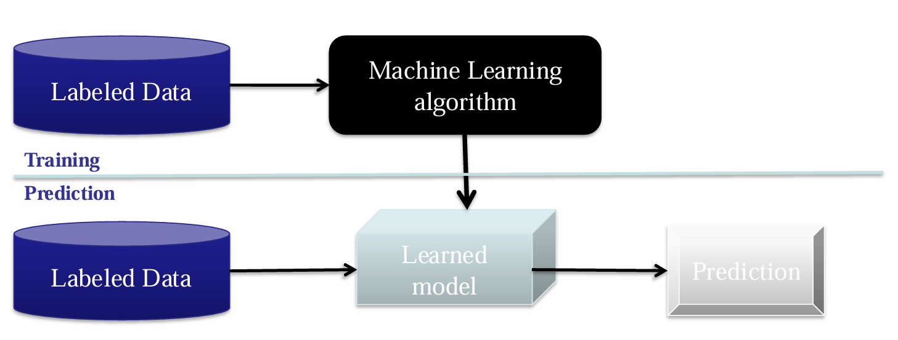

##### Learning 学习

- Definition: “learning is a goal-directed process of a system that **improves the knowledge** or the **knowledge representation** of the system by exploring **experience** and prior **knowledge**”   
  定义: “学习是一个以目标为导向的系统过程，它通过探索经验和先验知识来提高系统的知识或知识表示。”

- Acquisition of **new declarative knowledge**  
  获取新的陈述性知识

- Development of motor and cognitive skills through **instruction** and **practice**  
  通过指导和练习发展运动和认知技能

- Organization of new knowledge into general effective representation   
  将新知识组织成一般有效的表示形式

- Discovery of new facts and theories through **observation** and **experimentation** 
  通过观察和实验发现新的事实和理论

##### Forms of Learning 学习形式

Any component of an agent can be improved by learning from data. The improvements, and the techniques used to make them, depend on four major factors:  
代理的任何组件都可以通过从数据中学习来改进。这些改进以及制造它们的技术，取决于四个主要因素:

- **component** 

- **prior knowledge**

- **representation**

- **feedback**

##### Components 组成

##### Representation and prior knowledge 表征和先验知识

- We have seen several examples of representations for agent components: Propositional and first-order logical sentences for the components in a logical agent;   
  我们已经看到了代理组件表示的几个例子: 逻辑代理中组件的命题和一阶逻辑句;

- Bayesian networks for the inferential components of a decision-theoretic agent, and so on.   
  贝叶斯网络用于推断分量的决策理论代理，等等。

- Markov Chain and Hidden Markov Models   
  马尔可夫链与隐马尔可夫模型

- We say that learning a (possibly incorrect) general function or rule from specific input–output pairs is called inductive learning (more about this later).   
  我们说从特定的输入输出对中学习一个(可能不正确的)一般函数或规则叫做归纳学习(稍后详述)。

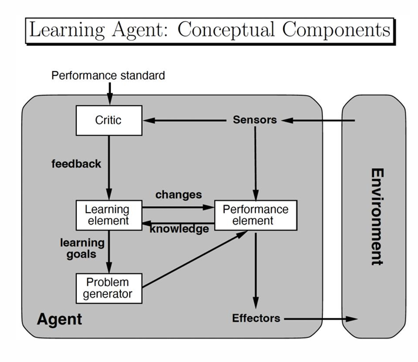

#### Three Types of Machine Learning 机器学习的三种类型

##### Feedback to learn from 需要学习的反馈

- Three types of feedback that determine the three main types of learning: 
  
  - Unsupervised learning: the agent learns patterns in the input even though no explicit feedback is supplied.   
    非监督式学习: 即使没有提供明确的反馈，代理也会在输入中学习模式。（聚类 clustering）
    
    > Unsupervised learning categories and techniques 
    > 
    > - Clustering 
    >   
    >   - ok-means clustering 
    >   
    >   - Mean-shift clustering Spectral clustering 
    > 
    > - Density estimation 
    >   
    >   - Gaussian mixture model (GMM) 
    >   
    >   - Graphical models 
    > 
    > - Dimensionality reduction 
    >   
    >   - Principal component analysis (PCA) 
    >   
    >   - Factor analysis
  
  - Supervised learning: the agent **observes** some example inputoutput pairs and learns a function that maps from input to output.  
    监督式学习: 代理观察一些示例输入输出对，并学习一个从输入到输出的映射函数。
    
    > Supervised learning categories and techniques 
    > 
    > - Numerical classifier functions 
    >   
    >   - Linear classifier, perceptron, logistic regression, support vector machines (SVM), neural networks 
    > 
    > - Parametric (probabilistic) functions 
    >   
    >   - Naïve Bayes, Gaussian discriminant analysis (GDA), hidden Markov models (HMM), probabilistic graphical models 
    > 
    > - Non-parametric (instance-based) functions 
    >   
    >   - k-nearest neighbors, kernel regression, kernel density estimation, local regression 
    > 
    > - Symbolic functions 
    >   
    >   - Decision trees, classification and regression trees (CART)
  
  - Reinforcement learning: the agent learns from a series of reinforcements—rewards or punishments.  
    强化学习: 代理人从一系列的增援中学习-奖励或惩罚。

- Summary of Machine Learning Types 机器学习类型综述
  
  - Supervised: learning with labeled data 监督: 使用标记数据学习
  
  - Unsupervised: discover patterns in unlabeled data  无监督: 在未标记的数据中发现模式
  
  - Reinforcement learning: learn to act based on feedback/reward  强化学习: 学会根据反馈/回报行事

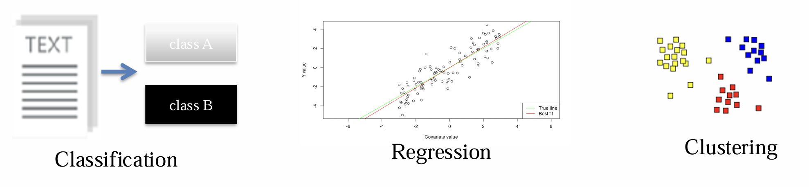

#### Supervised Learning: Decision Trees 监督式学习: 决策树

- A simple yet effective form of learning from examples   
  一种简单而有效的从实例中学习的形式

- is a function that: 
  
  - maps objects with a certain set of discrete attributes to discrete values based on the values of those attributes  
    将具有某组离散属性的对象映射为基于这些属性的值的离散值

- It is representable as a tree in which   
  它可以表示为一棵树，其中
  
  - every non-leaf node corresponds to a test on the value of one of the attributes   
    每个非叶节点对应于一个属性值的测试
  
  - every leaf node specifies the value to be returned if that leaf is reached   
    每个叶子节点指定到达该叶子时要返回的值

- A decision tree based on attributes $A_1, ...,A_n$ acts as classifier for objects that have those attributes  
  基于属性 $A _ 1，... ，A _ n $的决策树充当具有这些属性的对象的分类器

##### Decision Trees 决策树

- Decision trees make predictions by recursively splitting on different attributes according to a tree structure.  
  决策树通过根据树结构对不同的属性进行递归分裂来进行预测。

- A decision tree with Boolean output defines a logical predicate
  具有布尔输出的决策树定义了逻辑谓词

---

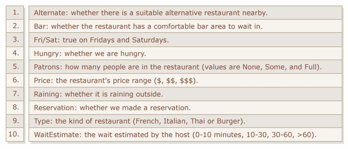

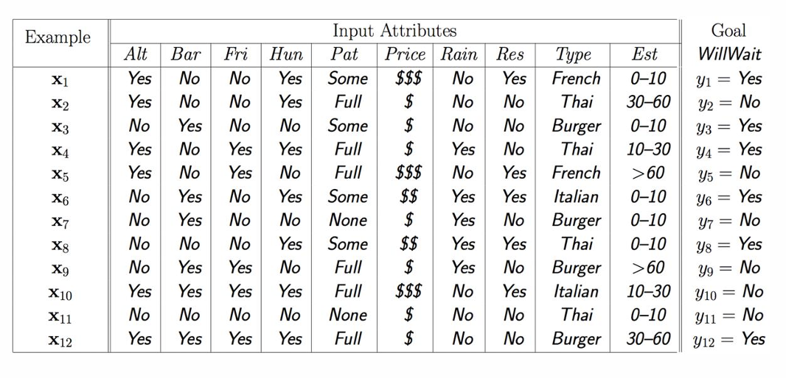

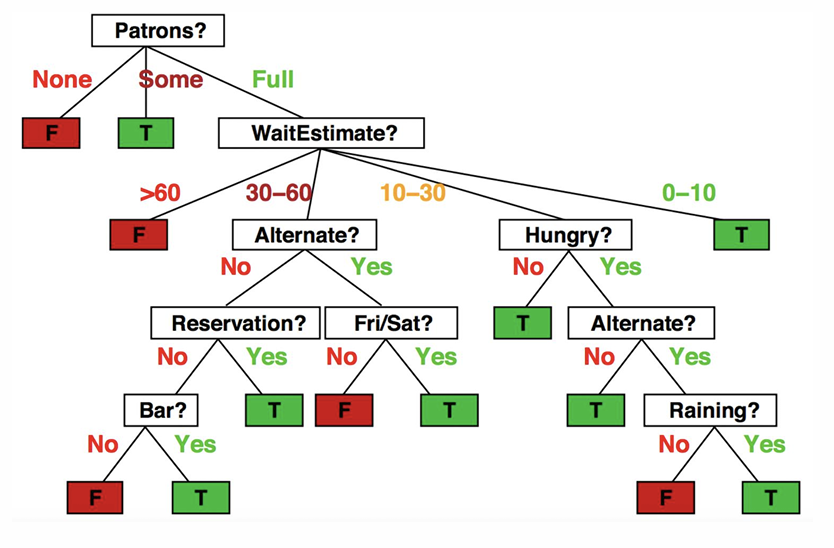

---

##### Some terminology  一些术语

- The **goal predicate** is the predicate to be implemented by a decision tree.   
  目标谓词是由决策树实现的谓词。

- The **training set** is the set of examples used to build the tree.   
  训练集是用于构建树的示例集。

- A member of the training set is a **positive example** if it satisfies the goal predicate, it is a **negative example** if it does not.  
  如果训练集的成员满足目标谓词，那么它就是一个正面例子; 如果不满足目标谓词，那么它就是一个负面例子。

##### A Good Decision Tree  一个好的决策树

- extrapolates a **common pattern** from the examples   
  从例子中推断出一个公共模式

- **correctly classifies all possible examples**, not just those in the training set  
  正确分类所有可能的例子，而不仅仅是那些在训练集

---

##### Choosing an attribute  选择属性

patrons is a better choice: it gives more information about the classification  
patrons是一个更好的选择: 它提供了更多关于分类的信息 （训练数据即patrons）

Prefer more informative attributes leads to smaller trees
更喜欢信息更丰富的属性会导致更小的树

Main Idea: start building the tree by testing at its root an attribute that better splits the training set into homogeneous classes  
主要思想: 通过测试一个能够更好地将训练集划分为同构类的属性，开始构建树

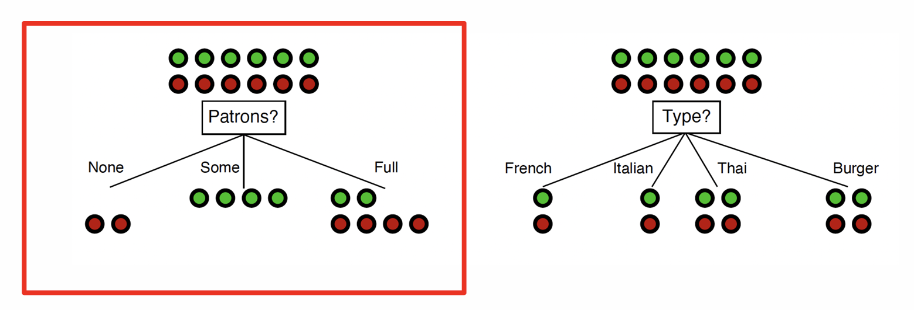

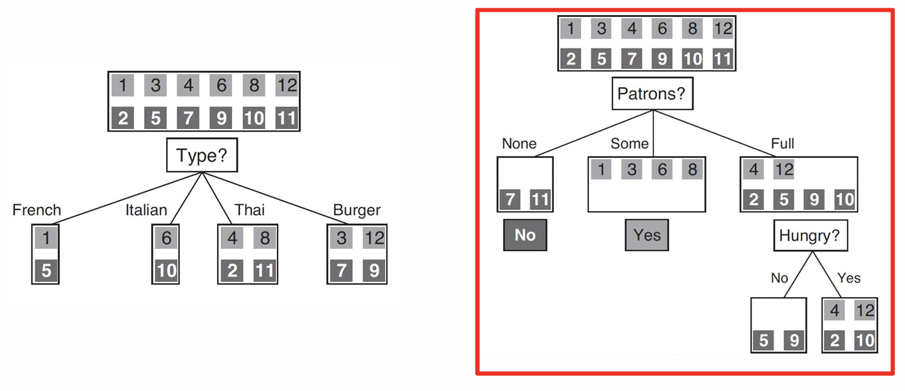

##### Choosing the best attribute 选择最好的属性

- 需要解决什么
  
  - What do we exactly mean by “best partitions the training set into homogeneous classes?”  
    我们究竟是什么意思“最佳分区的训练集到同质类?”
  
  - What if every attribute splits the training set into non-homogeneous classes?  
    如果每个属性都将训练集划分为非同构类会怎样？
  
  - Which one is better?  
    哪个更好？

- 解决方法
  
  - **Information Theory** can help us **choosing**  
    信息论可以帮助我们选择

##### Information theory 信息论

* Studies the mathematical laws governing systems designed to **communicate** or **manipulate** information.  
  研究用于交流或操纵信息的系统的数学规律。

* It defines **quantitative** measures of information and the capacity of various systems to **transmit**, **store**, and **process** information.  
  它定义了信息的定量度量以及各种系统传输、存储和处理信息的能力。

* it measures **the information content**, or e**ntropy**, of **messages/events**.  
  它度量消息/事件的信息内容或熵。

* Information is measured in **bits**.  
  信息是以位来衡量的。

* One bit represents the information we need to answer a yes/no question when we have no idea about the answer.  
  一个位表示当我们不知道答案时回答是或否问题所需要的信息。

---

##### Information Content / entropy 信息内容/熵

If an event has 𝑛 possible outcomes $(X=i)$, each with prior probability $P(X=i)$, the **information content or entropy** 𝐻 of the event’s actual outcome is  
如果一个事件有 n 个可能的结果 $(X=i)$ ，每个都有先验概率 $P(X=i)$ ，那么该事件实际结果的信息含量或熵 H 是  

$$
\mathrm{H}(X)=-\sum_{i=1}^{n} P(X=i) \log _{2} P(X=i)
$$

i.e., the average information content $-\log_2 P(X = i)$  of each possible outcome $X=i$ weighted by the outcome’s probability  
即，每个可能结果的平均信息内容 $- log _ 2P (X = i) $由结果的概率加权

**<u>！！！熵越高数据分布和普适性越好，越有利于训练！！！</u>**

- Entropy is a measure of **disorder or uncertainty** 
  熵是对无序或不确定性的度量

- a measure of ”Expected surprise”   
  “意料之中的惊喜”的衡量标准

- The goal of machine learning model in general is to reduce uncertainty.   
  机器学习模型的总体目标是降低不确定性。

- Measured in **bits**.
  用位来衡量

**“Low Entropy”** 低熵

- Distribution of variable has many peaks and valleys   
  变量的分布有多个峰谷

- Histograms has many low and highs   
  直方图有许多低点和高点

- Value sampled are more predictable (low disorder/high level of purity)   
  取样的值更可预测(低无序/高纯度)

**“High Entropy”**  高熵

- Variable has uniform like distribution  
  变量具有均匀似分布

- Flat histogram  
  平直直方图

- Value sampled are less predictable (high disorder/low level of purity)   
  取样的数值不易预测(高无序度/低纯度)

##### Entropy Formula 熵公式

- entropy
  
  $$
  \mathrm{H}(X)=-\sum_{i=1}^{n} P(X=i) \log _{2} P(X=i)
  $$

- Conditional Entropy 条件熵
  
  $$
  H(Y|X) = - \sum_{x \in X} \sum_{y \in Y} p(x, y) \log_2 p(y | x)
  $$

---

EXAMPLES：

- Entropy of fair coin toss  公平掷硬币的熵
  
  $$
  H(P(h), P(t)) = H\left( \frac{1}{2}, \frac{1}{2} \right) = -\frac{1}{2} \log_2 \frac{1}{2} - \frac{1}{2} \log_2 \frac{1}{2} = \frac{1}{2} + \frac{1}{2} = 1 \ \text{bit}

  $$

- Entropy of a loaded coin toss where $P(head) = 0.99$  加载后抛硬币的熵，其中 $P (head) = 0.99 $
  
  $$
  H(P(h), P(t)) = H\left( \frac{99}{100}, \frac{1}{100} \right) = -0.99 \log_2 0.99 - 0.01 \log_2 0.01 \approx 0.08 \ \text{bits}
  $$

- Entropy of a loaded coin toss with heads on both side  两边都有人头的加载硬币投掷的熵
  
  $$
  H(P(h), P(t)) = H(1, 0) = -1 \log_2 1 - 0 \log_2 0 = 0 - 0 = 0 \ \text{bits}

  $$

- What is the entropy of a group in which all examples belong to the same 一个群的熵是多少，其中所有的例子都属于同一个群
  
  $$
  = H(1) = -1 \log_2 1 = 0
  $$
  
  <u>not a good training set for learning 不是很好的训练数据</u> 

- What is the entropy of a group in which all examples belong to the same class?  一个群中所有的例子都属于同一个类的熵是多少？
  
  $$
  = H\left( \frac{1}{2}, \frac{1}{2} \right) = -0.5 \log_2 0.5 - 0.5 \log_2 0.5 = 1
  $$
  
  <u>good training set for learning  良好的学习训练数据</u>

---

##### Entropy of a decision tree 决策树的熵

- For decision trees, the event is question is whether the tree will return “yes” or “no” for a given input example 𝑒   
  对于决策树，问题是对于给定的输入示例 e，树是否将返回“ yes”或“ no”

- Assume the training set 𝐸 is a **representative sample** of the domain   
  假设训练集 E 是域的一个代表性样本

- Then, the relative frequency of positive examples in 𝐸 closely approximates the prior probability of a positive example   
  然后，E 中正面例子的相对频率与正面例子的先验概率非常接近

- If 𝐸 contains 𝑝 positive examples and 𝑛 negative examples, the probability distribution of answers by a correct decision tree is:  
  如果 E 包含 p 正例子和 n 负例子，正确的决策树的答案概率分布是:
  
  $$
  P(\text{yes}) = \frac{p}{p + n} \quad \quad P(\text{no}) = \frac{n}{p + n}

  $$

- Entropy of a correct decision tree: 正确决策树的熵:
  
  $$
  H\left( \frac{p}{p + n}, \frac{n}{p + n} \right) = -\frac{p}{p + n} \log_2 \frac{p}{p + n} - \frac{n}{p + n} \log_2 \frac{n}{p + n}
  $$

##### Information gain 信息增益

Measures the reduction in entropy or surprise by splitting a dataset according to a given value of a random variable.  
测量按照一个随机变量的给定值将数据集分割后所引起的熵或意外减少程度。

$$
I(X_n, Y) = H(Y) - H(Y | X_n)

$$

𝑛 = number of splits  N = 分割的次数

---

EXAMPLES

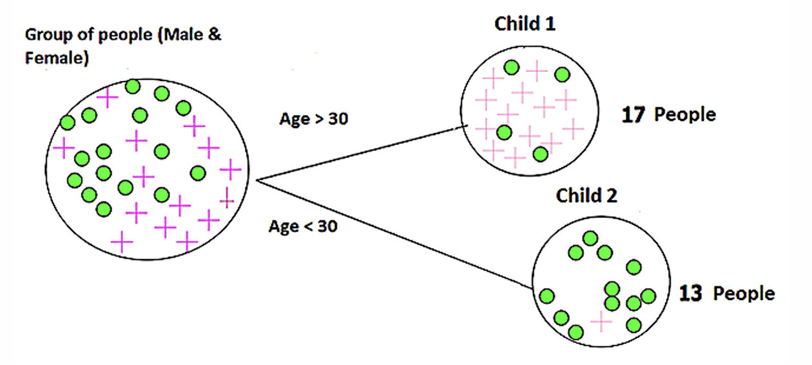

Find: 

1. Entropy 𝛨(𝑃𝑒𝑜𝑝𝑙𝑒); 
   $H(\text{People}) = - \left( \frac{14}{30} \log_2 \frac{14}{30} \right) - \left( \frac{16}{30} \log_2 \frac{16}{30} \right) = 0.996$ 
2) Entropy 𝛨(𝐶ℎ𝑖𝑙𝑑1); 
   $H(\text{Child}_1) = - \left( \frac{13}{17} \log_2 \frac{13}{17} \right) - \left( \frac{4}{17} \log_2 \frac{4}{17} \right) = 0.787$ 

3) Entropy 𝛨(𝐶ℎ𝑖𝑙𝑑2); 
   $H(\text{Child}_2) = - \left( \frac{1}{13} \log_2 \frac{1}{13} \right) - \left( \frac{12}{13} \log_2 \frac{12}{13} \right) = 0.391$ 

4) Information Gain I for 1) - 3).
   Weighted average entropy of children 儿童的加权平均数熵 $= -\left( \frac{17}{30} \cdot 0.787 \right) - \left( \frac{13}{30} \cdot 0.391 \right) = 0.615$   
   Information Gain $I = 0.996 - 0.615 = 0.38$  for the split.

---

##### Decision Tree - Summary 决策树-总结

- At each level, one must choose:  在每个层次，必须做出一个选择
  
  - Which variable to split. 要拆分哪个变量。
  
  - Possibly where to split it.  可能在哪里分。

- Choose them based on how much information we would gain from the decision!   
  根据我们能从决策中获得多少信息来选择它们！  
  (choose attribute that gives the highest gain)!   
  (选择获益最高的属性) ！

##### Decision tree - limitations 决策树-局限性

- **Noise.** Two training examples may have identical values for all the attributes but be classified differently.  
  噪声。两个训练例子可能对所有属性具有相同的值，但是分类不同。

- **Overfitting.** Irrelevant attributes may make spurious distinctions among training examples.  
  过拟合。不相关的属性可能会在训练例子中造成虚假的区别。

- **Missing data.** The value of some attributes of some training examples may be missing.   
  部分数据缺失。某些训练示例的某些属性的值可能缺少。

- **Multi-valued attributes.** The information gain of an attribute with many different values tends to be non-zero even when the attribute is irrelevant.  
  多值属性。具有许多不同值的属性的信息增益往往是非零的，即使该属性是不相关的。

- **Continuous-valued attributes.** They must be discretized to be used.  
  连续值属性。它们必须离散化才能使用。

#### Linear and non-linear classification methods  线性和非线性分类方法

##### linear techniques 线性方法

###### Nearest Neighbor Classifier 最近邻分类器

Nearest Neighbor – for each test data point, assign the class label of the nearest training data point  
最近邻-对于每个测试数据点，分配最近训练数据点的类标签

- Adopt a distance function to find the nearest neighbor   
  采用距离函数求最近邻
  
  - Calculate the distance to each data point in the training set, and assign the class of the nearest data point (minimum distance)   
    计算到训练集中每个数据点的距离，并分配最近数据点的类(最小距离)

- It does not require learning a set of weights  
  它不需要学习一组权重

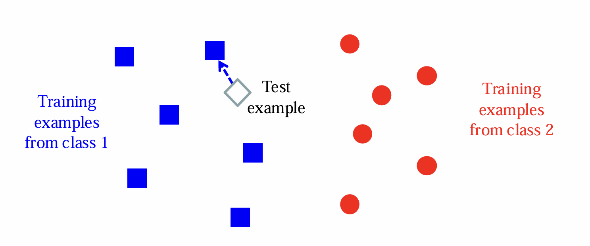

- For image classification, the distance between all pixels is calculated (e.g., using $l_1$ norm, or $l_2$ norm) 
  对于图像分类，计算所有像素之间的距离(例如，使用 $l _ 1 $标准或 $l _ 2 $标准)

- Disadvantages: 缺点:
  
  - The classifier **must remember** all training data and store it for future comparisons with the test data   
    分类器必须记住所有的训练数据并存储它，以便将来与测试数据进行比较
  
  - Classifying a test image is **expensive** since it requires a comparison to all training images  
    分类测试图像是昂贵的，因为它需要比较所有的训练图像

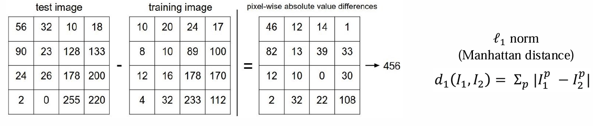

###### k-Nearest Neighbors Classifier k-近邻分类器

k-Nearest Neighbors approach considers multiple neighboring data points to classify a test data point  
k近邻方法考虑多个相邻数据点对测试数据点进行分类

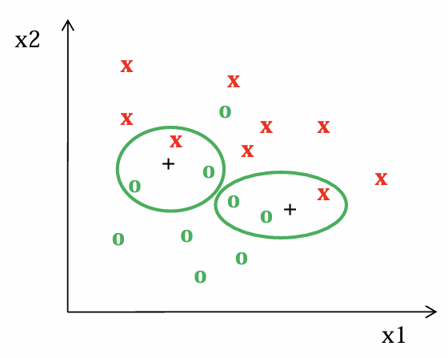

###### Linear Classifier 线性分类器

- Find a linear function f of the inputs $x_i$ that separates the classes   
  找到分隔类的输入的线性函数

- $f(x_i,W,b) = Wx_i+b$  **$W,b$为参数**

- Use pairs of inputs and labels to find the **weights matrix W** and the **bias vector b** The weights and biases are the **parameters** of the function f  
  使用输入和标签对来寻找权重矩阵 W 和偏差向量 b 权重和偏差是函数 f 的参数

- Several methods have been used to find the optimal set of parameters of a linear classifier.   
  A common method of choice is the **Perceptron algorithm**, where the parameters are updated until a minimal error is reached (single layer, does not use backpropagation)   
  有几种方法已经被用来寻找线性分类器的最佳参数集。  
  一个常见的选择方法是感知器算法，其中的参数被更新，直到达到最小的错误(单层，不使用反向传播)

- Linear classifier is a simple approach, but it is a building block of advanced classification algorithms, such as SVM and neural networks Earlier multi-layer neural networks were referred to as multi-layer perceptrons (MLPs)  
  线性分类器是一种简单的方法，但它是先进的分类算法，如支持向量机和神经网络的一个组成部分。早期的多层神经网络被称为多层感知器(MLPs)
  
  

- The decision boundary is linear  决策边界是线性的
  
  - A straight line in 2D, a flat plane in 3D, a hyperplane in 3D and higher dimensional space  
    二维的直线，三维的平面，三维的超平面和高维空间

###### Support Vector Machines  支持向量机

- How to find the best decision boundary?   
  如何找到最好的决策边界？
  
  - All lines in the figure correctly separate the 2 classes   
    图中的所有线条正确地将两个类分开
  
  - The line that is farthest from all training examples will have better generalization capabilities   
    距离所有培训实例最远的线将具有更好的泛化能力

- SVM solves an optimization problem:   
  SVM 解决了一个最佳化问题:
  
  - First, identify a decision boundary that correctly classifies the examples   
    首先，确定一个正确分类示例的决策边界
  
  - Next, increase the geometric margin between the boundary and all examples   
    接下来，增加边界和所有示例之间的几何边界

- The data points that define the **maximum margin width** are called **support vectors**   
  定义最大边距宽度的数据点称为支持向量

- Find W and b by solving:
  
  $$
  \min \frac{1}{2} \| w \|^2 \\
\text{s.t. } y_i (w \cdot x_i + b) \geq 1, \quad \forall x_i
  $$

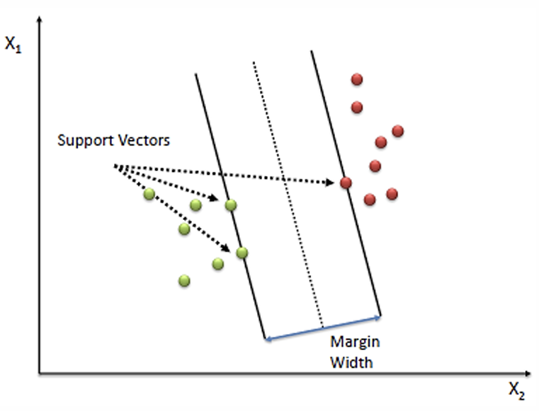

##### Linear vs Non-linear Techniques

- techniques
  
  - Linear classification techniques 线性分类方法
    
    - Linear classifier 线性分类器
    
    - Perceptron 感知机
    
    - Logistic regression 逻辑回归
    
    - Linear SVM 线性支持向量机
    
    - Naïve Bayes 贝叶斯机
  
  - Non-linear classification techniques 非线性分类方法
    
    - k-nearest neighbors  K-近邻
    
    - Non-linear SVM 非线性支持向量机
    
    - Neural networks  神经网络
    
    - Decision trees  决策树
    
    - Random forest  随机森林

- compare
  
  - For some tasks, input data can be linearly separable, and linear classifiers can be suitably applied   
    对于某些任务，输入数据可以线性分离，适当应用线性分类器
  
  - For other tasks, linear classifiers may have difficulties to produce adequate decision boundaries  
    对于其他任务，线性分类器可能难以产生足够的决策边界

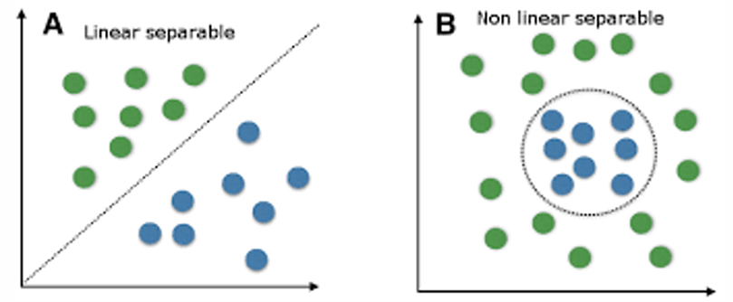

##### Non-linear Techniques 非线性方法

###### Non-linear classification 非线性分类

- Features $z_i$ are obtained as **non-linear functions** of the inputs $x_i$   
  特征 $z _ i $作为输入 $x _ i $的 **非线性函数** 获得

- It results in non-linear decision boundaries   
  它导致非线性决策边界

- Can deal with non-linearly separable data   
  可以处理非线性可分数据

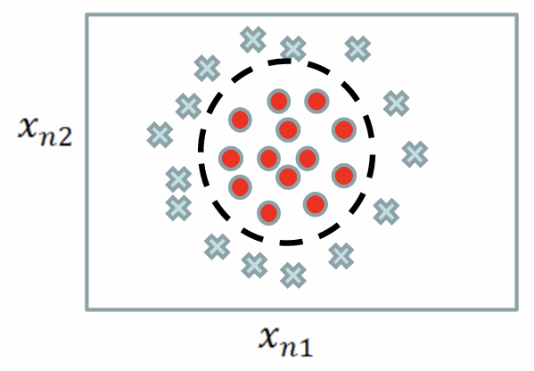

###### Non-linear Support Vector Machines  非线性支持向量机

- The original input space is mapped to a higher-dimensional feature space where the training set is linearly separable  
  将原始输入空间映射到训练集线性可分的高维特征空间

- Define a non-linear kernel function to calculate a non-linear decision boundary in the original feature space  
  定义一个非线性核函数来计算原始特征空间中的非线性决策边界

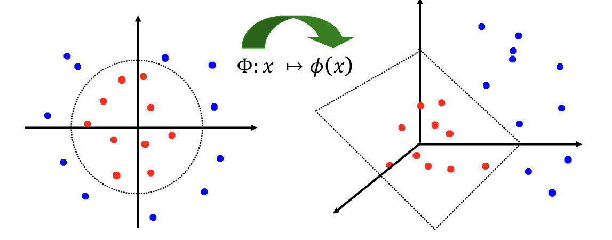

###### Binary vs Multi-class Classification  二分类与多分类

- A classification problem with only 2 classes is referred to as binary classification. The output labels are 0 or 1.   
  只有两个类的分类问题称为二进制分类，输出标签为0或1。

- A problem with 3 or more classes is referred to as multi-class classification  
  有3个或更多类的问题称为多类分类

- Both the binary and multi-class classification problems can be linearly or nonlinearly separated   
  二进制和多类分类问题都可以线性或非线性分离   
  
  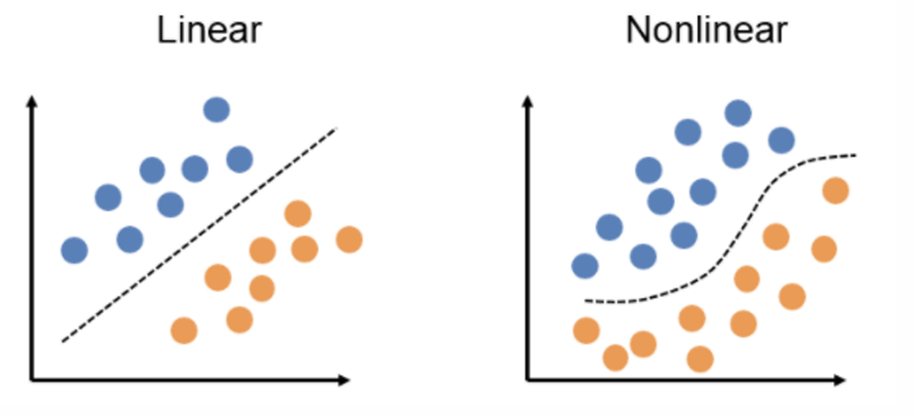

##### No-Free-Lunch Theorem 不免费午餐定理

- The derived classification models for supervised learning are simplifications of the reality   
  衍生出来的监督式学习分类模型是对现实的简化
  
  - The simplifications are based on certain assumptions.   
    这些简化是基于某些假设。
  
  - The assumptions fail in some situations.   
    这些假设在某些情况下会失败。

- <u>In summary, No-Free-Lunch Theorem states:   
  总而言之，“没有免费午餐”定理指出:</u>
  
  - <u>No single classifier works the best for all possible problems   
    对于所有可能的问题，没有一个分类器是最好的</u>
  
  - <u>Since we need to make assumptions to generalize  
    因为我们需要做一些假设来推广</u>

## Week 2: Deep Learning & Reinforcement Learning 第二周: 深度学习与强化学习

- Part 1: Deep Learning 
  
  - Introduction to deep learning 
  
  - Elements of neural networks and activation functions 
  
  - Training NNs 
  
  - Gradient descent 
  
  - Regularization methods 
  
  - NN architectures 

- Part 2: Reinforcement Learning 
  
  - Introduction to Reinforcement Learning 
  
  - Markov Decision Processes (MDPs) 
  
  - RL Techniques: From Q-learning to Actor-Critic 
  
  - Applications of RL

### Part 1: Deep Learning 第一部分: 深度学习

- Introduction to deep learning 

- Elements of neural networks and activation functions 

- Training NNs 

- Gradient descent 

- Regularization methods 

- NN architectures

#### Introduction to deep learning  深度学习入门

##### ML vs. Deep Learning 机器学习与深度学习

- Conventional machine learning methods **rely on human-designed feature representations**   
  传统的机器学习方法依赖于人工设计的特征表示
  
  - ML becomes just optimizing weights to best make a final prediction   
    机器学习只是优化权重，以最好地做出最终预测 

- Deep learning (DL) is a machine learning subfield that uses multiple layers for learning data representations   
  深度学习(DL)是一个机器学习子领域，它使用多个层次来学习数据表示
  
  - DL is exceptionally effective at **learning patterns**  
    DL 在学习模式方面特别有效

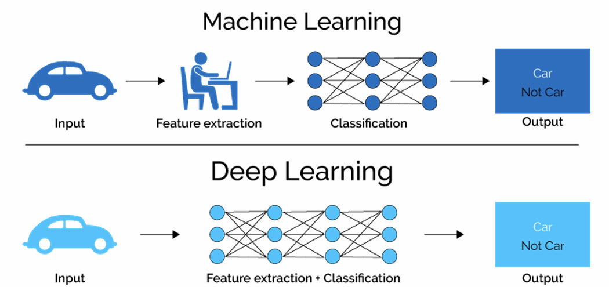

- DL applies a multi-layer process for learning rich hierarchical features (i.e., data representations)   
  DL 应用多层过程来学习丰富的层次特性(即数据表示)
  
  - Input image pixels → Edges → Textures → Parts → Objects

##### Why is DL Useful?

- DL provides a flexible, learnable framework for representing visual, text, linguistic information   
  DL 为表示视觉、文本和语言信息提供了一个灵活的、可学习的框架

- Can learn in supervised and unsupervised manner   
  可以在有监督和无监督的情况下学习

- an effective end-to-end learning system   
  有效的端到端学习系统

- Requires large amounts of training data   
  需要大量的训练数据
  
  

- Since about 2010, DL has outperformed other ML techniques   
  自2010年以来，DL 已经超越了其他机器学习技术  
  First in vision and speech, then NLP, and other applications  
  首先是视觉和语言，然后是自然语言处理和其他应用

##### A biological neuron vs. artificial neuron 生物神经元对比人工神经元

Brains advantages with respect to digital computers:  
与数字计算机相比，大脑的优势

- Massively parallel  大规模并行处理

- Fault-tolerant  容错

- Reliable  可靠的

- Graceful degradation 优雅降级

##### Representational Power 表象性

NNs with at least one hidden layer are **universal approximators**  
具有至少一个隐层的神经网络是通用逼近器

(具有至少一个隐藏层的神经网络是通用逼近器。具体来说，对于任何连续函数 $h(x)$ 和任意的小误差 $\epsilon >0$，总存在一个只有一个隐藏层的神经网络 $f(x)$，使得对于所有 $x$，都满足 $∣h(x)−f(x)∣< \epsilon $。)

NN can approximate any arbitrary complex continuous function  
神经网络可以逼近任意复杂的连续函数

NNs use nonlinear mapping of the inputs x to the outputs f(x) to compute complex decision boundaries  
神经网络使用输入 x 到输出 f (x)的非线性映射来计算复杂的决策边界

- reason of use deeper NNs:
  
  - The fact that deep NNs work better is an empirical observation   
    事实上，深层神经网络工作得更好是一个经验观察
  
  - Mathematically, deep NNs have the same representational power as a one-layer NN  
    从数学上讲，深层神经网络具有与单层神经网络相同的表示能力

##### Introduction to Neural Networks 神经网络导论

Handwritten digit recognition (MNIST dataset)   
手写数字识别(MNIST 数据集)

- The intensity of each pixel is considered an input element  
  每个像素的强度被认为是一个输入元素

- Output is the class of the digit  
  输出是数字的类

对于手写数字识别，输入为一个图片矩阵，输出为从1到0的数字的概率（Each dimension represents the confidence of a digit  每个维表示一个数字的置信度）

#### Elements of neural networks and activation functions 神经网络元素和激活函数

##### Elements of Neural Networks 神经网络要素

- NNs consist of hidden layers with neurons (i.e., computational units)   
  神经网络由带有神经元(即计算单元)的隐层组成

- A single neuron maps a set of inputs into an output number, or $f:R^k \to R $  
  单个神经元将一组输入映射到一个输出数字，即 $f: R ^ k\to R $

- neuron 神经元
  
  $$
  z = a_1 w_1 + a_2 w_2 + \cdots + a_K w_K + b
\\
a = \sigma(z)

  $$
  
  $a_i$ input 输入, $w_k$ weights 权重, $b$ bias 基础值, $\sigma (z)$ avtivation function 激活函数, $a$ output输出.

- hidden layer（图片中间的层）
  
  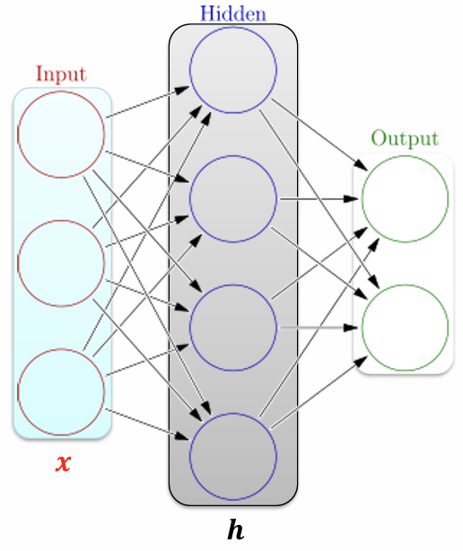
  
  $hidden \ layer \ h=\sigma (W_1x+b_1)$
  
  - 图片中：
    4 + 2 = 6 neurons (not counting inputs)   
    [3 × 4] + [4 × 2] = 20 weights  
    4 + 2 = 6 biases   
    26 learnable parameters

- Deep NNs have many **hidden layers**   
  深层神经网络有许多隐藏层
  
  - **Fully-connected (dense)** layers (a.k.a. **Multi-Layer Perceptron or MLP**)   
    完全连接(密集)层(又称多层感知器或 MLP)
  
  - Each neuron is connected to all neurons in the succeeding layer  
    每个神经元连接到下一层的所有神经元
  
  - 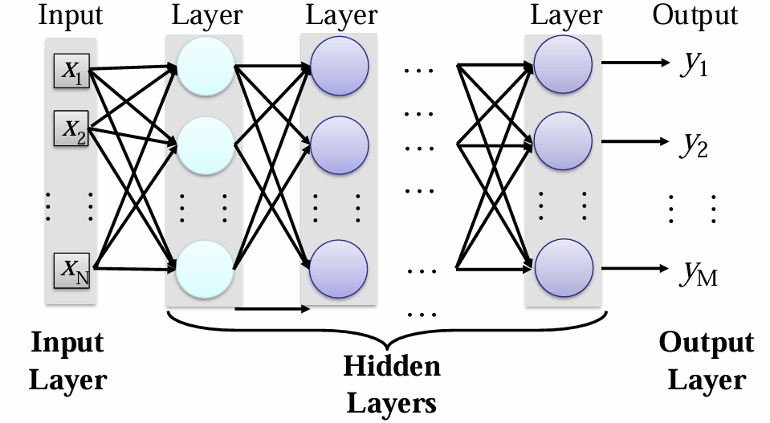

###### Matrix Operation 矩阵操作

- Matrix operations are helpful when working with multidimensional inputs and outputs  
  矩阵运算在处理多维输入和输出时很有帮助

- $$
  \sigma(Wx+b)=a
\\ \
\\
\sigma \left( \begin{bmatrix} 1 & -2 \\ -1 & 1 \end{bmatrix} \begin{bmatrix} 1 \\ -1 \end{bmatrix} + \begin{bmatrix} 1 \\ 0 \end{bmatrix} \right) = \begin{bmatrix} 0.98 \\ 0.12 \end{bmatrix}

  $$

- Multilayer NN, matrix calculations for the first layer  
  多层神经网络，第一层的矩阵计算
  $\text{Input vector } x, \text{ weights matrix } W^1, \text{ bias vector } b^1, \text{ output vector } a^1$ 
  
  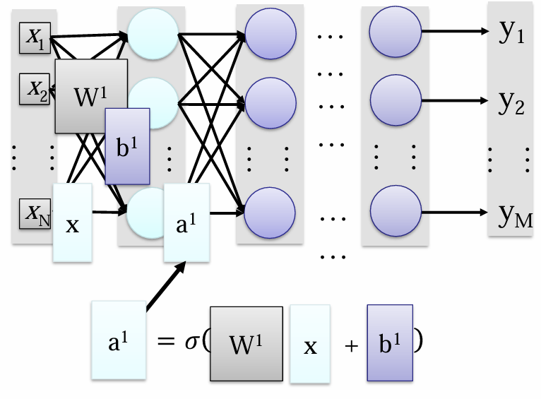

##### Activation Functions 激活函数

- **Non-linear activations** are needed to learn complex (non-linear) data representations  
  学习复杂(非线性)数据表示需要非线性激活  
  Otherwise, NNs would be just a linear function (such as $W_1W_2𝑥 = 𝑊𝑥$)   
  否则，NN 将只是一个线性函数(例如 $W _ 1W _ 2x = Wx $)

- NNs with large number of layers (and neurons) can approximate more complex functions   
   具有大量层(和神经元)的神经网络可以逼近更复杂的函数
  
  - Figure: more neurons improve representation (but, may overfit)  
    图: 更多的神经元改善表征(但是，可能过度)

###### Activation: Linear Function 激活: 线性函数

- **Linear function** means that the output signal is proportional to the input signal to the neuron  
  线性函数表示输出信号与神经元的输入信号成正比
  
  $$
  f(x) = cx,\mathbb{R}^n \rightarrow \mathbb{R}^n
  $$

- 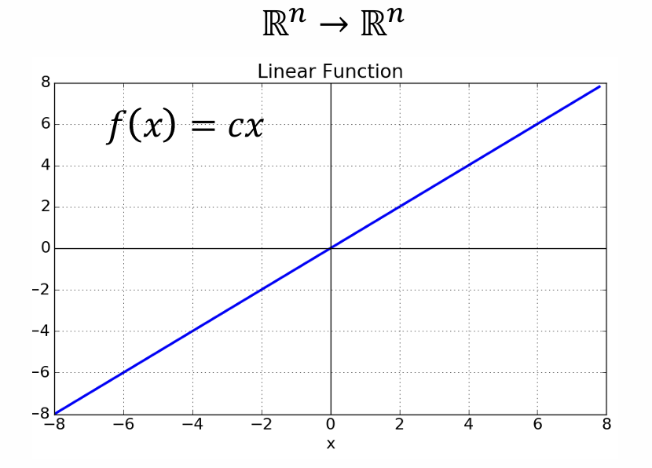
  
  - If the value of the constant c is 1, it is also called **identity activation function**  
    如果常数 c 的值为1，它也被称为恒等式激活函数
  
  - This activation type is used in **regression problems**  
    此激活类型用于回归问题

###### Activation: Sigmoid sigmoid函数

- **Sigmoid function** σ: takes a real-valued number and “squashes” it into the range between 0 and 1   
  S形函数 σ: 取一个实值数，并将其“压缩”到0到1之间的范围内
  
  $$
  f(x) = \frac{1}{1+e^{-x}},\mathbb{R}^n \rightarrow [0, 1]
  $$
  
  - The output can be interpreted as the firing rate of a biological neuron  
    输出可以解释为生物神经元的放电速率
  
  - When the neuron’s activation are 0 or 1, sigmoid neurons saturate 
    当神经元激活为0或1时，sigmoid神经元饱和
    
    - Gradients at these regions are almost zero (almost no signal will flow)  
      这些区域的梯度几乎为零(几乎没有信号会流动)
  
  - Sigmoid activations are less common in modern NNs  
    sigmoid激活在现代神经网络中不常见
  
  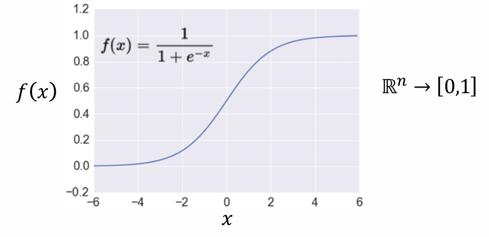

###### Activation: Tanh

- Tanh function: takes a real-valued number and “squashes” it into range between -1 and 1   
  Tanh 函数: 获取一个实值数字，并将其“压缩”到 -1到1之间
  
  $$
  \tanh(x) = \frac{2}{1 + e^{-2x}} - 1, \mathbb{R}^n \rightarrow [-1, 1]

  $$
  
  - Like sigmoid, tanh neurons saturate 饱和
  
  - Unlike sigmoid, the output is zero-centered 与 sigmoid 不同，输出是以零为中心的
    
    - It is therefore preferred than sigmoid  比sigmoid更好
  
  - Tanh is a scaled sigmoid: $\tanh(x) = 2 \cdot \sigma(2x) - 1$ 
  
  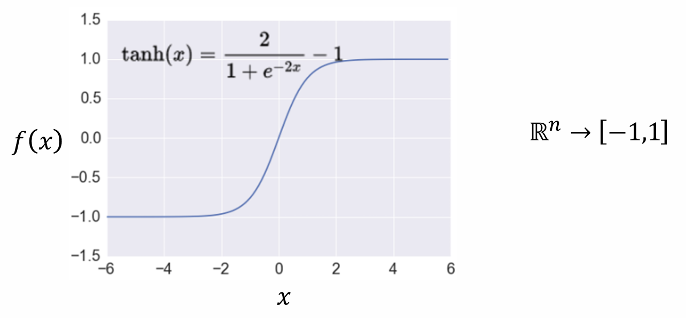

###### Activation: ReLU

- ReLU (Rectified Linear Unit): takes a real-valued number and thresholds it at zero  
  修正线性单位(ReLU) : 取一个实值数，阈值为零
  
  $$
  f(x) = \max(0, x)
\\ \ \\
f(x) = \begin{cases} 
0 & \text{for } x < 0 \\ 
x & \text{for } x \geq 0 
\end{cases}
\\ \ \\
\mathbb{R}^n \rightarrow \mathbb{R}_{+}^n
  $$

- 应用
  
  - Most modern deep NNs use ReLU activations   
    大多数现代深层神经网络使用 ReLU 激活

- 优势
  
  - ReLU is fast to compute (Compared to sigmoid, tanh ; Simply threshold a matrix at zero)
    ReLU 计算速度很快 (与 sigmoid 相比，tanh; 简单地阈值为零的矩阵)
  
  - Accelerates the convergence of gradient descent  (Due to linear, non-saturating form)
    加速梯度下降法的融合 (由于线性，非饱和形式)
  
  - Prevents the gradient vanishing problem  
    防止渐变消失问题

            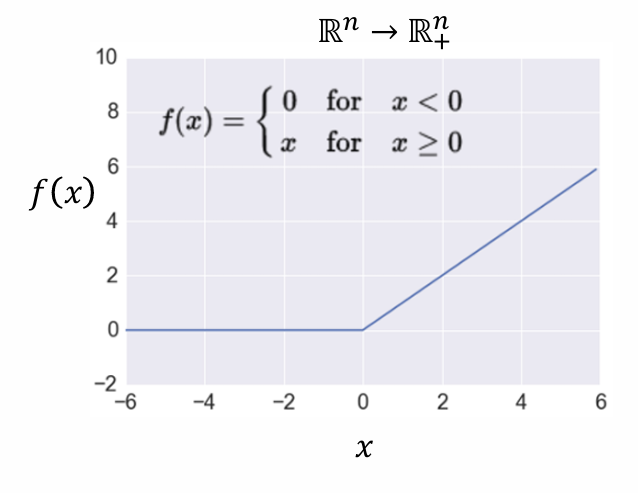

###### Activation: Leaky ReLU

- 普通ReLU的问题  
  
  - The problem of ReLU activations: they can “die”  
    ReLU 激活的问题: 它们可能“死亡”  
  
  - ReLU could cause weights to update in a way that the gradients can become zero and the neuron will not activate again on any data  
    ReLU 可能导致权重更新的方式，梯度可以成为零，神经元不会再次激活任何数据

- **Leaky ReLU** activation function is a variant of ReLU 
  
  - Instead of the function being 0 when 𝑥<0, a leaky ReLU has a small negative slope (e.g., α = 0.01, or similar)  
    当 x < 0时，函数不是0，而是一个小的负斜率(例如，α = 0.01，或类似)
  
  $$
  f(x) = \begin{cases} 
ax & \text{for } x < 0 \\ 
x & \text{for } x \gg 0 
\end{cases}
  $$
  
  - 优势（解决问题）  
     resolves the dying ReLU problem 
  
  - 应用   
    
    - Most current works still use ReLU  
      目前大部分的作品仍然使用 ReLU
    
    - With a proper setting of the learning rate, the problem of dying ReLU can be avoided    
      通过合理设置学习速率，可以避免 RLU 死亡的问题

                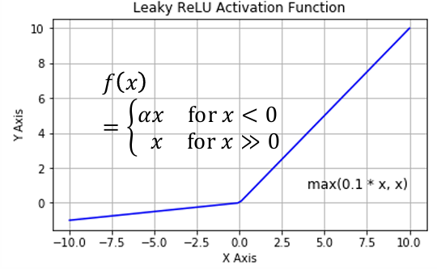

###### Activation: Softmax

- The softmax layer applies softmax activations to output a probability value in the range [0, 1]  
  Softmax 层应用 softmax 激活来输出范围[0,1]内的概率值

- 即将所有的输入规范成一个从0到1的概率值，且每一个概率的值加起来就是1

- The values z inputted to the softmax layer are referred to as **logits**   
  输入到 softmax 层的值 z 称为 logits

$$
\sigma(z_i) = \frac{e^{z_i}}{\sum_{j=1}^{n} e^{z_j}} \quad \quad (\text{满足} \sum_{i=1}^n \sigma(z_i) = 1)
\\ \ \\
\sigma(z_i) \text{ 表示第 } i \text{ 个类别的Softmax输出。} \\ \ \\
z_i \text{ 是每个类别的输入值。} \\
\sum_{j=1}^n e^{z_j} \text{ 是所有类别输入值的指数和，用于归一化。}


$$

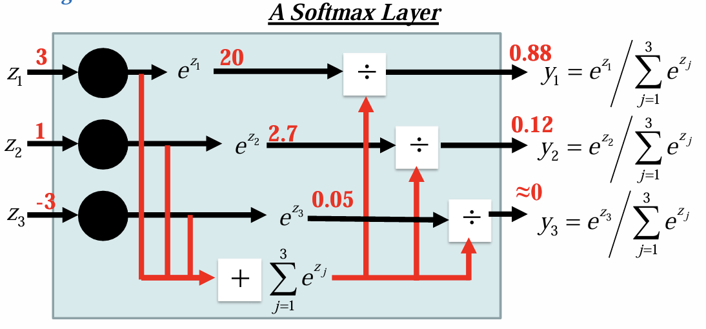

#### Training NNs 神经网络训练

- The network **parameters 𝜃** include the **weight matrices** and **bias vectors** from all layers  
  网络 **参数 θ** 包括来自所有层的 **权矩阵** 和 **偏向向量** 
  
  $$
  \theta = \{ W^1, b^1, W^2, b^2, \dots, W^L, b^L \}

  $$
  
  Often, the model parameters 𝜃 are referred to as weights  
  通常，模型参数 θ 被称为权重

- Training a model **to learn a set of parameters 𝜃 that are optimal** (according to a criterion) is one of the greatest challenges in ML  
  训练一个模型来学习一组最优的参数 θ (根据一个标准)是机器学习中最大的挑战之一
  
  

- **Data preprocessing** - helps **convergence** during training   
  数据预处理-有助于在训练期间收敛
  
  - **Mean subtraction**, to obtain zero-centered data   
    平均减法，得到零中心的数据 
    
    - Subtract the mean for each individual data dimension (feature)  
      减去每个独立数据维度(特性)的平均值
  
  - **Normalization**  规范化
    
    - Divide each feature by its standard deviation  
      将每个特征按其标准差划分
      
      - To obtain standard deviation of 1 for each data dimension (feature)  
        为每个数据维度(特征)取得1的标准差
    
    - Or, scale the data within the range [0,1] or [-1, 1]  
      或者，在[0,1]或[-1,1]范围内缩放数据
  
  - 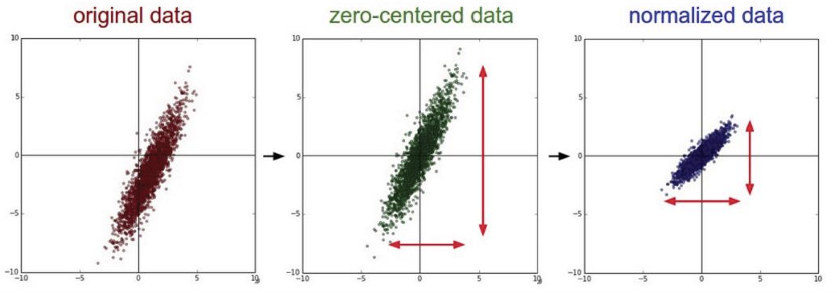

- To train a NN, set the parameters 𝜃 such that for a training subset of images, the corresponding elements in the predicted output have maximum values  
  为了训练神经网络，需要设置参数 θ，使得对于图像的训练子集，预测输出中的相应元素具有最大值

- Define a **loss function/objective function/cost function** $\mathcal{L}(\theta)$ that calculates the difference (error) between the model prediction and the true label  
  定义一个损失函数/目标函数/成本函数 $\mathcal{L}(\theta)$，用于计算模型预测与真实标签之间的差异(误差)

- Find the optimal parameters $\theta^*$ that minimize the total loss $\mathcal{L}(\theta)$   
  寻找最小化总损失 $\mathcal{L}(\theta)$ 的最佳参数 $\theta ^ * $ 
  
  > For a training set of 𝑁 images, calculate the total loss overall all images:  
  > 对于 N 幅图像的训练集，计算所有图像的总损失:
  > 
  > $$
  > \mathcal{L}(\theta) = \sum_{n=1}^N \mathcal{L}_n(\theta)
  > $$

##### Loss Functions  损失函数

###### Classification tasks 分类任务

- Training examples  训练样本
  
  $$
  \text{Pairs of } N \text{ inputs } x_i \text{ and ground-truth class labels } y_i
\\ 
N \text{ 个输入 } x_i \text{ 与真实类别标签 } y_i \text{ 的配对}
  $$

- Output Layer 输出层
  Softmax Activations [maps to a probability distribution]  
  Softmax 激活[映射到一个概率分布]
  
  $$
  P(y = j \mid \mathbf{x}) = \frac{e^{\mathbf{x}^\top \mathbf{w}_j}}{\sum_{k=1}^K e^{\mathbf{x}^\top \mathbf{w}_k}}

  $$

- Loss function 损失函数
  Cross-entropy  交叉熵
  
  $$
  \mathcal{L}(\theta) = -\frac{1}{N} \sum_{i=1}^N \sum_{k=1}^K \left[ y_k^{(i)} \log \hat{y}_k^{(i)} + \left( 1 - y_k^{(i)} \right) \log \left( 1 - \hat{y}_k^{(i)} \right) \right]
\\
\text{Ground-truth class labels （实际值） } y_i \text{ and model predicted class labels （模型预测值） } \hat{y}_i

  $$

###### Regression tasks  回归任务

- Training examples  训练样本
  
  $$
  \text{Pairs of } N \text{ inputs } x_i \text{ and ground-truth output values } y_i
\\
N \text{ 个输入 } x_i \text{ 与真实输出值 } y_i \text{ 的对}

  $$

- Output Layer 输出层
  
  $$
  \text{Linear (Identity) or Sigmoid Activation}
\\
\text{线性或者sigmoid激活函数}
  $$

- Loss function 损失函数
  
  - Mean Squared Error  均方误差
    
    $$
    \mathcal{L}(\theta) = \frac{1}{n} \sum_{i=1}^n \left( y^{(i)} - \hat{y}^{(i)} \right)^2
    $$
  
  - Mean Absolute Error  平均绝对误差
    
    $$
    \mathcal{L}(\theta) = \frac{1}{n} \sum_{i=1}^n \left| y^{(i)} - \hat{y}^{(i)} \right|
    $$

#### Training NNs (2)

- Optimizing the loss function $\mathcal{L}(\theta)$  优化损失函数
  
  - **gradient descent (GD)** algorithm  
    梯度下降法算法
    
    - GD applies iterative refinement of the network parameters $\theta$   
      GD 对网络参数$\theta$进行迭代求精
    
    - GD uses the opposite direction of the **gradient** of the loss with respect to the NN parameters for updating $\theta$ ($\nabla \mathcal{L}(\theta) = \left[ \frac{\partial \mathcal{L}}{\partial \theta_i} \right]$) 
      GD 使用相对于神经网络参数的损失梯度的相反方向来更新 $\theta $ 
    
    - The gradient of the loss function $\nabla \mathcal{L}(\theta)$ gives the direction of fastest increase of the loss function $\mathcal{L}(\theta)$ when the parameters $\theta$ are changed  
      损失函数 $\nabla \mathcal { L }(\theta) $的梯度给出了当参数 $\theta $改变时损失函数 $\mathcal{L}(\theta ) $增长最快的方向
      
      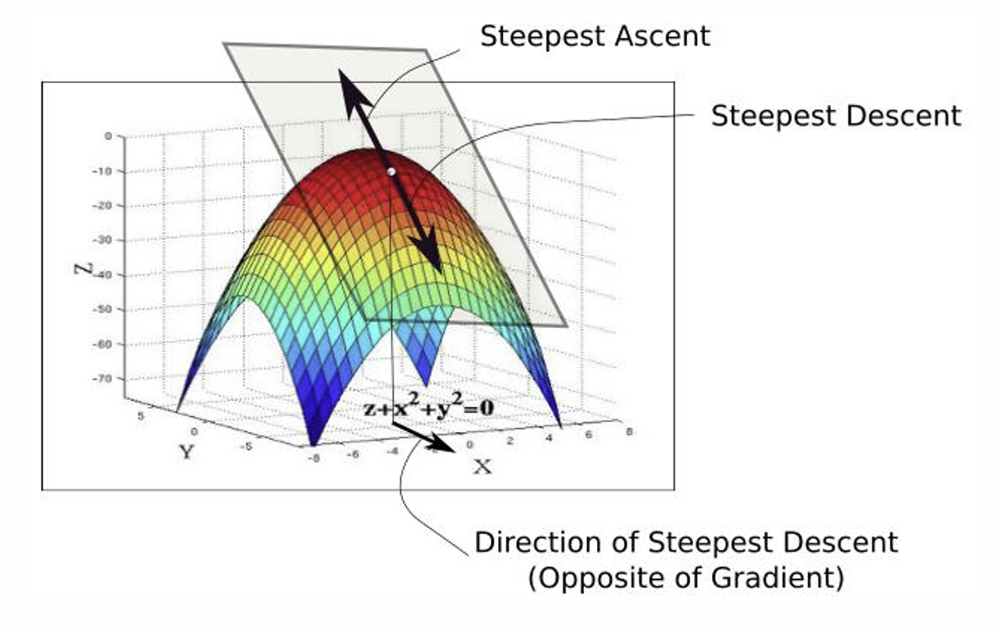

#### Gradient descent  梯度下降

- Steps in the gradient descent algorithm:  
  梯度下降法算法中的步骤:
  
  
  
  

- 关键算法：
  
  $$
  \theta^{\text{new}} = \theta^0 - \alpha \nabla \mathcal{L}(\theta^0)
  $$

- 图解：
  
  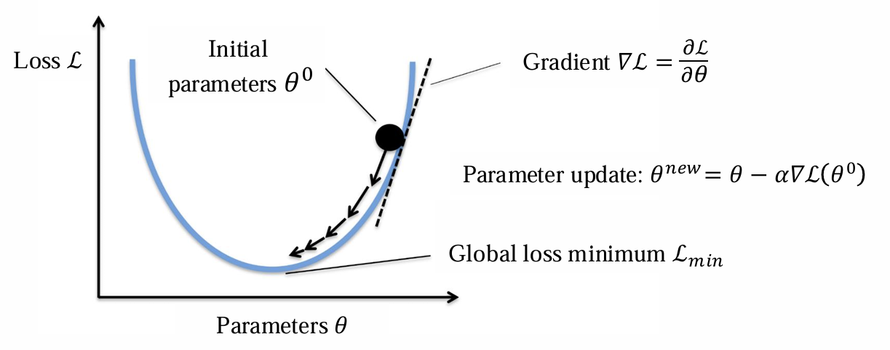

- Gradient Descent Algorithm  梯度下降算法
  
  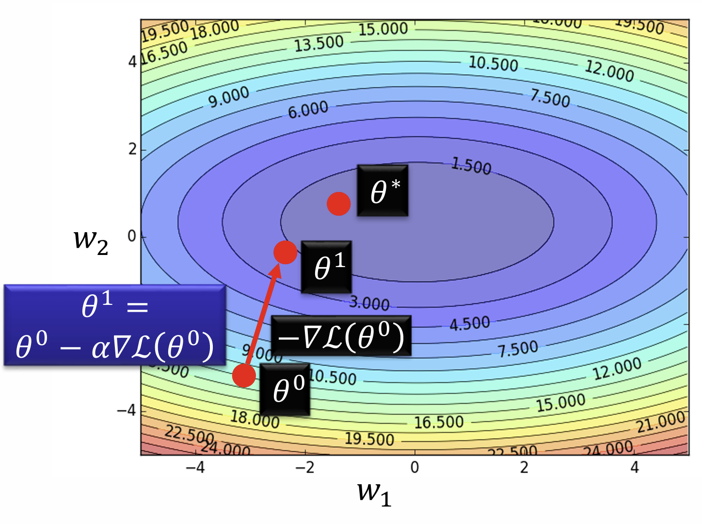
  
  
  
  - Gradient descent algorithm stops when a local minimum of the loss surface is reached  
    当损耗面达到局部最小时，梯度下降法算法停止
    
    - GD does not guarantee reaching a global minimum   
      GD 并不能保证达到全球最低水平
    
    - However, empirical evidence suggests that GD works well for NNs  
      但是，经验证据体现出梯度下降对于神经网络具有良好的效果
    
    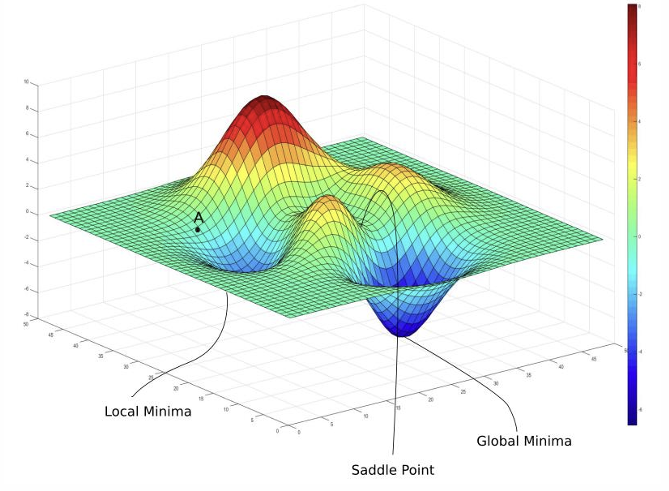
  
  - Random initialization in NNs results in different initial parameters $\theta^0$ every time the NN is trained  
    神经网络中的随机初始化在每次训练神经网络时都会产生不同的初始参数 $\theta ^ 0 $ 
    
    - Gradient descent may reach different minima at every run ▪  
      每次运行时，梯度下降法可能达到不同的最小值。
    
    - Therefore, NN will produce different predicted outputs  
      因此，神经网络将产生不同的预测输出
  
  - currently we don’t have algorithms that guarantee reaching a global minimum for an arbitrary loss function.  
    目前我们还没有算法可以保证达到任意损失函数的全局最小值。

##### Backpropagation (“backward propagation”) 反向传播

- Modern NNs employ the backpropagation method for calculating the gradients of the loss function $\nabla \mathcal{L}(\theta) =  \frac{\partial \mathcal{L}}{\partial \theta_i} $

- For training NNs, forward propagation (forward pass) refers to passing the inputs 𝑥 through the hidden layers to obtain the model outputs (predictions)   
  对于训练神经网络，前向传播(前向传递)是指将输入 x 通过隐藏层以获得模型输出(预测)
  
  - The loss $\mathcal{L}(y, \hat{y})$ function is then calculated  
    然后计算亏损函数
  
  - Backpropagation traverses the network in reverse order, from the outputs 𝑦 backward toward the inputs 𝑥 to calculate the gradients of the loss $\nabla \mathcal{L} (\theta)$   
    反向传播以相反的顺序遍历网络，从输出 y 向后到输入 x 计算损失的梯度
  
  - The chain rule is used for calculating the partial derivatives of the loss function with respect to the parameters 𝜃 in the different layers in the network  
    利用链式规则计算网络各层损失函数对参数 θ 的偏导数

- Each update of the model parameters 𝜃 during training takes one forward and one backward pass (e.g., of a batch of inputs)  
  在训练期间对模型参数 θ 的每次更新都需要一次向前和一次向后传递(例如，一批输入)

- Automatic calculation of the gradients (automatic differentiation) is available in all current deep learning libraries  
  目前所有的深度学习库都可以自动计算梯度(自动微分) 
  
  - It significantly simplifies the implementation of deep learning algorithms, since it obviates deriving the partial derivatives of the loss function by hand  
    该方法避免了手工求损失函数的偏导数，大大简化了深度学习算法的实现

##### Mini-batch Gradient Descent 迷你梯度下降法

- It is wasteful to compute the loss over the entire training dataset to perform a single parameter update for large datasets  
  为了对大型数据集执行单个参数更新，计算整个训练数据集上的损失是很浪费的
  （GD通常被mini-batch GD取代）

- Mini-batch gradient descent  迷你梯度下降法
  
  - Approach: 
    
    - Compute the loss $\mathcal{L} (\theta)$ on a mini-batch of images, update the parameters $\theta $, and repeat until all images are used   
      在一小批图像上计算丢失 $\mathcal { L }(\theta) $，更新参数 $\theta $，然后重复，直到使用所有图像
    
    - At the next epoch, shuffle the training data, and repeat the above process  
      在下一个时期，重组训练数据，并重复上述过程
  
  - Mini-batch GD results in much faster training  
    小批量 GD 导致更快的训练
  
  - Typical mini-batch size: 32 to 256 images  
    典型的小批量: 32至256张图像
  
  - It works because the gradient from a mini-batch is a good approximation of the gradient from the entire training set  
    它之所以有效是因为来自一个小批量的梯度是来自整个训练集的梯度的一个很好的近似值

##### Stochastic Gradient Descent (SGD) 随机梯度下降

- SGD uses mini-batches that consist of a single input example  
  SGD 使用由单个输入示例组成的迷你批处理

- Although this method is very fast, it may cause significant fluctuations in the loss function  
  虽然这种方法很快，但可能会造成损失函数的显著波动
  
  - Therefore, it is less commonly used, and mini-batch GD is preferred  
    因此，它较少被使用，而小批量的 GD 是首选

- In most DL libraries, SGD typically means a mini-batch GD (with an option to add  momentum)  
  在大多数深度学习库中，SGD 通常意味着一个小批量的迷你梯度下降(可以选择增加动力)

##### Problems with Gradient Descent  梯度下降法的问题

Besides the local minima problem, the GD algorithm can be very slow at plateaus, and it can get stuck at saddle points  
除了局部极小问题外，GD 算法在高原时速度很慢，并且在鞍点处会卡住

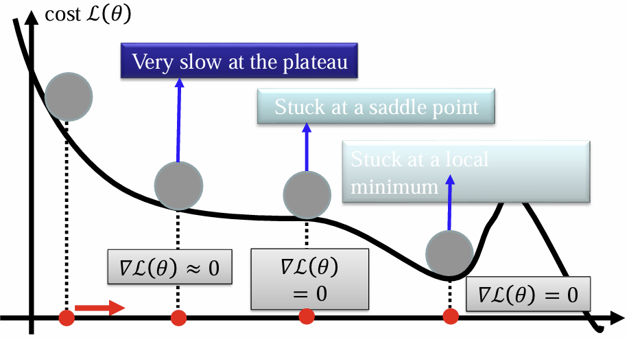

##### Gradient Descent with Momentum  动量梯度下降法

Gradient descent with momentum uses the momentum of the gradient for parameter optimization  
动量梯度下降法利用梯度的动量进行参数优化  

$$
Movement = Negative \ of \ Gradient + Momentum
$$

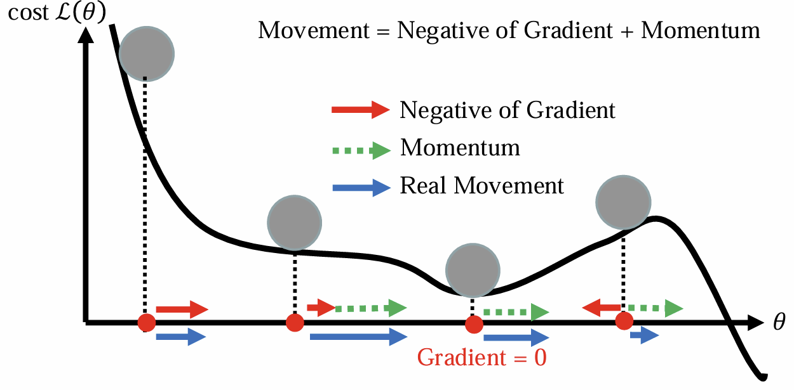

- Parameters update in GD with momentum at iteration  
  基于动量迭代的 GD 参数更新
  
  $$
  \theta^t = \theta^{t-1} - V^t
\\
V^t = \beta V^{t-1} + \alpha \nabla \mathcal{L}(\theta^{t-1})
\\
\text{i.e., } \theta^t = \theta^{t-1} - \alpha \nabla \mathcal{L}(\theta^{t-1}) - \beta V^{t-1}

  $$

- The parameter 𝛽 is referred to as a coefficient of momentum   
  参数 β 被称为动量系数
  
  - A typical value of the parameter 𝛽 is 0.9  
    参数 β 的典型值为0.9

- This method updates the parameters 𝜃 in the direction of the weighted average of the past gradients  
  这种方法沿着过去梯度加权平均数的方向更新参数 θ

##### Adaptive Moment Estimation (Adam) 自适应矩估计

Adam combines insights from the momentum optimizers that accumulate the values of past gradients, and it also introduces new terms based on the second moment of the gradient  
Adam 结合了积累过去梯度值的动量优化器的见解，并且还引入了基于梯度第二阶段的新术语

- Similar to GD with momentum, Adam computes a weighted average of past gradients (first moment of the gradient)  
  与动量的 GD 类似，亚当计算了过去梯度的加权平均数(梯度的第一个时刻)

- Adam also computes a weighted average of past squared gradients (second moment of the gradient)  
  亚当还计算了过去平方梯度的加权平均数(梯度的第二个时刻)

$$
\theta^t = \theta^{t-1} - \alpha \frac{\hat{V}^t}{\sqrt{\hat{U}^t + \epsilon}}
\\
\text{Where: } \hat{V}^t = \frac{V^t}{1 - \beta_1} \text{ and } \hat{U}^t = \frac{U^t}{1 - \beta_2}
\\ \ \\
\text{The proposed default values are （建议的默认值为） } \\ \beta_1 = 0.9, \beta_2 = 0.999, \text{ and } \epsilon = 10^{-8}


$$

- Other commonly used optimization methods include:   
  其他常用的优化方法包括:
  
  - Adagrad, Adadelta, RMSprop, Nadam, etc.
  
  - Most commonly used optimizers nowadays are Adam and SGD with momentum.   
    目前最常用的优化器是 Adam 和带动量的 SGD

##### Optimizer 优化器

- How to update the weights based on the loss function  
  如何根据损失函数更新权重

- Learning rate (+scheduling)  
  学习率(+ 进度)

- Stochastic gradient descent, momentum, and their variants  
  随机梯度下降、动量及其变体
  
  - RMSProp is usually a good first choice   
    RMSProp 通常是不错的首选

---

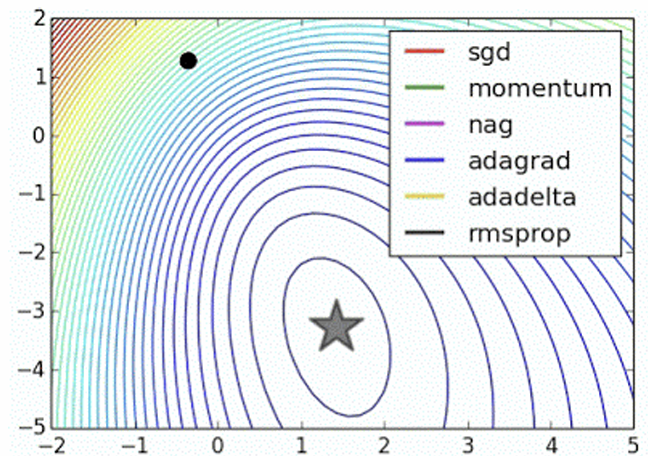

这张图显示了不同优化算法在一个典型的凸函数中的优化路径。图中的五角星通常表示目标最小值点，而黑点是优化的起始点。彩色的曲线图示了不同算法在优化过程中的轨迹。

图例中的标识符表示每种优化算法：

1. **SGD (Stochastic Gradient Descent)**：红色线条，显示了基本的梯度下降路径。
2. **Momentum**：绿色线条，加入了动量项，使路径平滑，加快收敛速度。
3. **NAG (Nesterov Accelerated Gradient)**：紫色线条，改进了动量法，通过在预期方向上进行梯度计算来加速收敛。
4. **Adagrad**：蓝色线条，自适应学习率方法，更适合处理稀疏数据。
5. **Adadelta**：黄色线条，解决了Adagrad学习率衰减过快的问题。
6. **RMSprop**：黑色线条，通过指数加权平均来调整学习率，避免了过快的学习率衰减。

这张图可以帮助对比不同优化算法的特性，例如它们的收敛速度和路径平滑程度。这在机器学习模型训练中有助于选择合适的优化器。

---

##### Learning Rate  学习率

- The gradient tells us the direction in which the loss has the steepest rate of increase, but it does not tell us how far along the opposite direction we should step  
  梯度告诉我们损失增长速度最快的方向，但它并不告诉我们应该沿着相反的方向走多远

- Choosing the learning rate (also called the **step size**) is one of the most important hyper-parameter settings for NN training    
  选择学习率(也称为步长)是神经网络训练中最重要的超参数设置之一

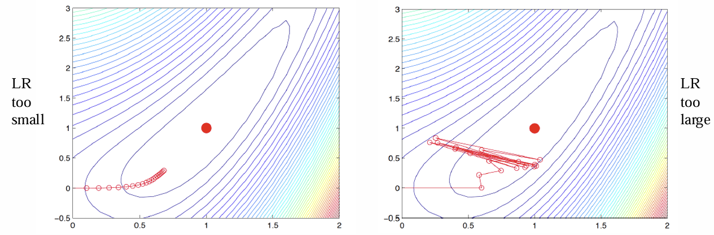

- Training loss for different learning rates 
  
  - High learning rate: the loss increases or plateaus too quickly  
    高学习率: 损失增加或停滞过快
  
  - Low learning rate: the loss decreases too slowly (takes many epochs to reach a solution)  
    学习率低: 损失降低得太慢(需要很多时期才能达到解决方案)

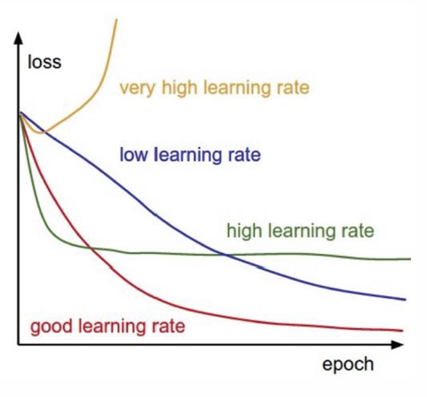

##### Vanishing Gradient Problem 梯度消失问题

- In some cases, during training, the gradients can become either very small (vanishing gradients) of very large (exploding gradients) 
  在某些情况下，在训练期间，梯度可以变得非常小(消失的梯度)非常大(爆炸梯度)
  
  - They result in very small or very large update of the parameters   
    它们会导致非常小或非常大的参数更新
  
  - Solutions: change learning rate, ReLU activations, regularization, LSTM units in RNNs  
    解决方案: 改变学习速率，ReLU 激活，正则化，在 RNN 中的 LSTM 单位

##### Generalization

- Underfitting 欠拟合
  
  - The model is too “simple” to represent all the relevant class characteristics   
    模型过于“简单”，不能代表所有相关的类别特征
  
  - Produces high error on the training set and high error on the validation set  
    在训练集上产生高误差，在验证集上产生高误差
  
  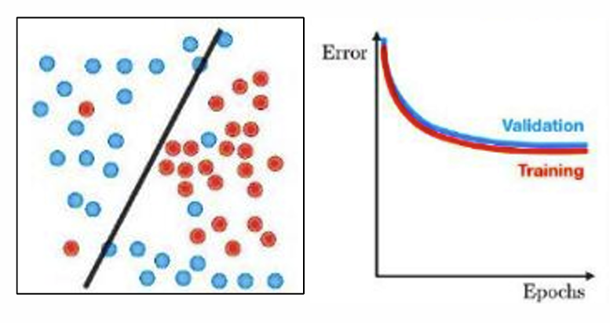

- Overfitting 过拟合
  
  - The model is too “complex” and fits irrelevant characteristics (noise) in the data    
    该模型过于“复杂”，适合数据中不相关的特征(噪声)
  - Produces low error on the training error and high error on the validation set  
    在训练错误上产生较低的错误，在验证集上产生较高的错误
  
  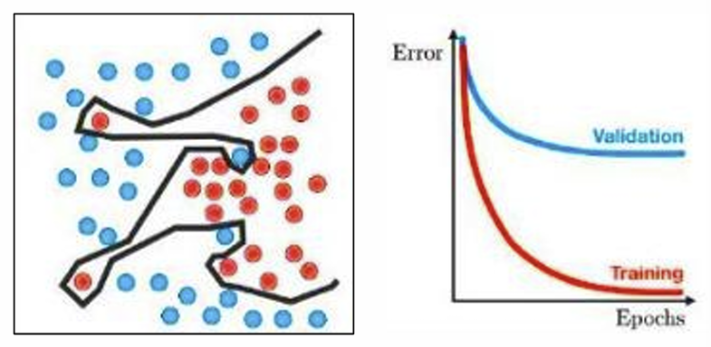

#### Regularization methods 正则化方法

##### Overfitting 过拟合

- Overfitting – a model with high capacity fits the noise in the data instead of the underlying relationship  
  过度拟合-一个高容量的模型拟合数据中的噪声，而不是潜在的关系
  
  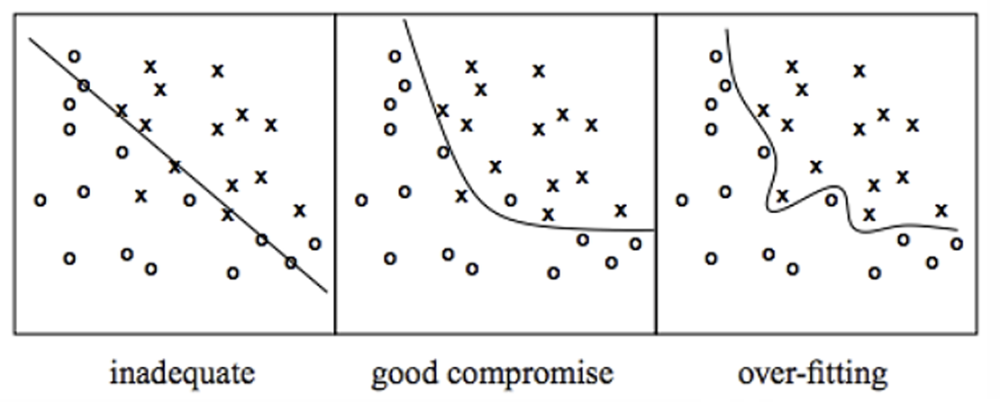
  
  The model may fit the training data very  well, but fails to generalize to new  examples (test or validation data)  
  该模型可能非常适合训练数据，但不能推广到新的例子(测试或验证数据)

##### Regularization: Early Stopping  正规化: 提前停止

- During model training, use **a validation set**  
  在模型训练期间，使用验证集 

- Stop when the validation accuracy (or loss) has not improved after n epochs   
  当验证精度(或损失)在 n 个纪元后没有改善时停止
  
  - The parameter n is called **patience**  
    参数 n 叫做耐心

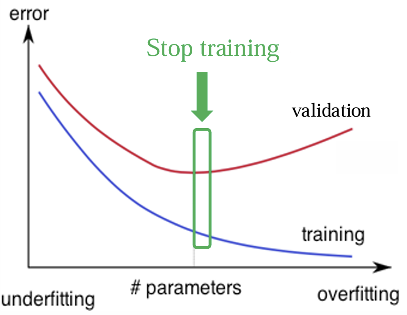

##### Regularization: Weight Decay 正则化: 权重衰减

- $\mathcal{l}_2$ weight decay
   A regularization term that penalizes large weights is added to the loss function  
  在损失函数中加入惩罚大权重的正则化项
  
  $$
  \mathcal{L}_{\text{reg}}(\theta) = \mathcal{L}(\theta) + \lambda \sum_k \theta_k^2
\\ \ \\ 
\text{Data loss} + \text{Regularization loss}
  $$
  
  - For every weight in the network, we add the regularization term to the loss value  
    对于网络中的每个权重，我们将正则项加到损失值中
    
    - During gradient descent parameter update, every weight is decayed linearly toward zero   
      在梯度下降法参数更新过程中，每个权重都呈线性衰减趋于零
  
  - The **weight decay coefficient 𝜆** determines how dominant the regularization is during the gradient computation  
    权衰减系数 λ 决定了在梯度计算过程中正则化的优势程度
    
    - Large weight decay coefficient → penalty for weights with large values  
      大权重衰减系数→大值权重的惩罚

- $\mathcal{l}_1$ weight decay
  The regularization term is based on the $\mathcal{l}_1$ norm of the weights  
  正则化项基于权重的 $\mathcal{ l } _ 1 $范数
  
  $$
  \mathcal{L}_{\text{reg}}(\theta) = \mathcal{L}(\theta) + \lambda \sum_k |\theta_k|
  $$
  
  - $\mathcal{ l } _ 1 $ weight decay is less common with NN   
    这一种方法不常见
    
    - Often performs worse than $\mathcal{ l } _ 2 $ weight decay   
      通常比上一种方法效果不好
  
  - It is also possible to combine $\mathcal{ l } _ 1 $ and $\mathcal{ l } _ 2 $ regularization   
    两种方法可以混合使用
    
    - Called **elastic net regularization**  
      称为弹性网正则化
    
    - $$
      \mathcal{L}_{\text{reg}}(\theta) = \mathcal{L}(\theta) + \lambda_1 \sum_k |\theta_k| + \lambda_2 \sum_k \theta_k^2
      $$

##### Regularization: Dropout

- Randomly drop units (along with their connections) during training   
  在训练期间随机放弃单位(连同他们的连接)

- Each unit is retained with a fixed **dropout rate p**, independent of other units   
  每个单元保留一个固定的dropout概率独立于其它单元

- The hyper-parameter p needs to be chosen (tuned)   
  需要选择(调整)超参数 p
  
  - Often, between 20% and 50% of the units are dropped  
    通常，20% 至50% 的单位被丢弃
  
  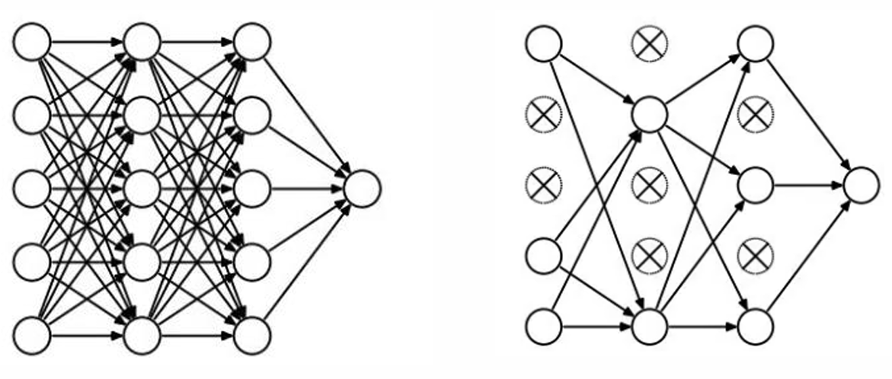

- Dropout is a kind of ensemble learning   
  dropout是一种集成学习
  
  - Using one mini-batch to train one network with a slightly different architecture  
    使用一个小批量培训一个架构略有不同的网络
    
    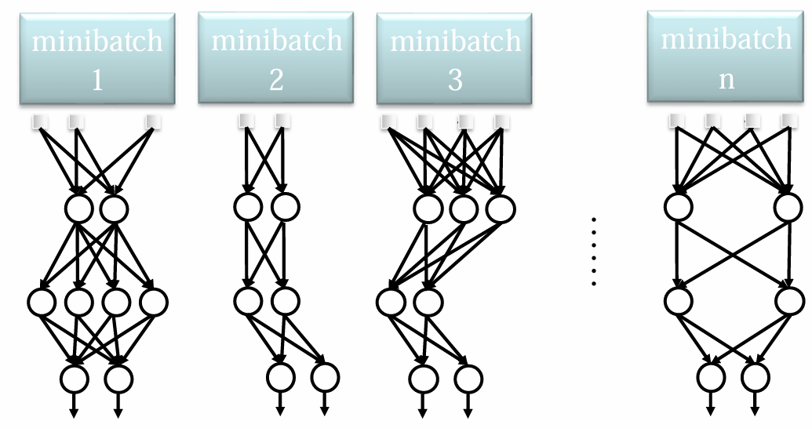

#### NN architectures 神经网络体系结构

##### Batch Normalization 批归一化

- Batch normalization layers act similar to the data preprocessing steps mentioned earlier   
  批量标准化层的作用类似于前面提到的数据预处理步骤
  
  - They calculate the mean μ and variance σ of a batch of input data, and normalize the data x to a zero mean and unit variance  
    他们计算一批输入数据的平均 μ 和方差 σ，并将数据 x 归一化为零均值和单位方差

- **BatchNorm layers** alleviate the problems of proper initialization of the parameters and hyper-parameters BatchNorm 层减轻了正确初始化参数和超参数的问题 
  
  - Result in faster convergence training, allow larger learning rates   
    结果更快的收敛训练，允许更大的学习率
  
  - Reduce the internal covariate shift  
    减小内部协变量移位

- BatchNorm layers are inserted immediately after convolutional layers or fullyconnected layers, and before activation layers  
  BatchNorm 层插入到卷积层或完全连接层之后，以及激活层之前
  
  - They are very common with convolutional NN  
    它们在卷积神经网络中非常常见

##### Deep vs Shallow Networks  深层网络与浅层网络

- Deeper networks perform better than shallow networks   
  深层网络比浅层网络性能更好
  
  - But only up to some limit: after a certain number of layers, the performance of deeper networks plateaus  
    但只是达到了一定的限制: 经过一定数量的层次后，网络的性能进一步停滞不前

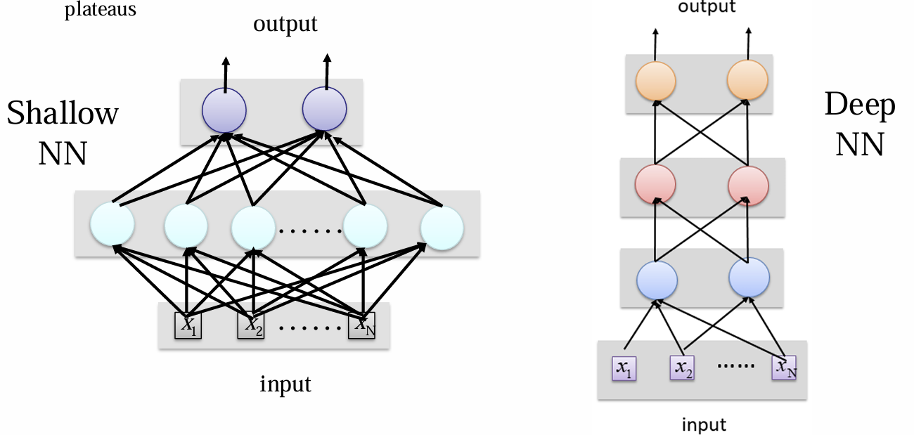

##### Convolutional Neural Networks (CNNs) 卷积神经网络

- Convolutional neural networks (CNNs) were primarily designed for image data  
  卷积神经网络(CNN)主要是为图像数据而设计的

- CNNs use a convolutional operator for extracting data features  
  CNN 使用卷积运算符提取数据特征 
  
  - Allows parameter sharing 
    允许参数共享
  
  - Efficient to train   
    训练效率高
  
  - Have less parameters than NNs with fully-connected layers   
    参数少于具有完全连接层的神经网络

- CNNs are robust to spatial translations of objects in images  
  神经网络对图像中目标的空间转换具有鲁棒性

- A convolutional filter slides (i.e., convolves) across the image  
  一个卷积滤波器幻灯片(即，卷积)横跨图像
  
  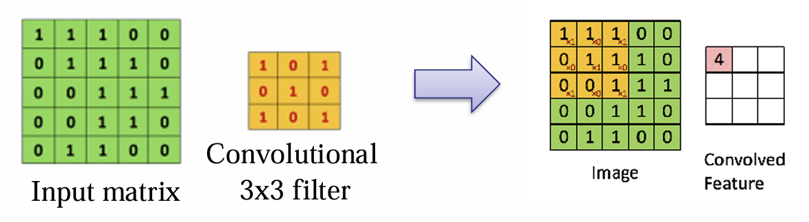
  
  - When the convolutional filters are scanned over the image, they capture useful features  
    当卷积滤波器在图像上扫描时，它们捕获有用的特征

- In CNNs, hidden units in a layer are only connected to a small region of the layer before it (called local **receptive field**)   
  在 CNN 中，一个层中的隐藏单元只连接到该层之前的一个小区域(称为本地接收场)
  
  - The depth of each **feature map** corresponds to the number of convolutional filters used at each layer  
    每个特征图的深度与每一层使用的卷积滤波器数目相对应

- Pooling layer 池化层
  
  - Max pooling: reports the maximum output within a rectangular neighborhood   
    Max pool: 报告矩形邻域内的最大输出
  
  - Average pooling: reports the average output of a rectangular neighborhood  
    Average pooling: 报告一个矩形邻居的平均产出
  
  - Pooling layers reduce the spatial size of the feature maps  
    池层减少了特征映射的空间大小 
    
    - Reduce the number of parameters, prevent overfitting  
      减少参数数目，防止过度配合
    
    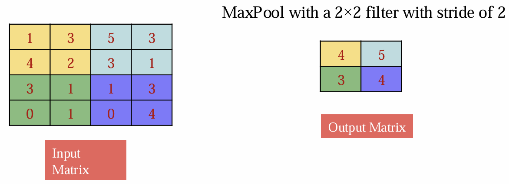

- Feature extraction architecture  特征提取体系结构
  
  - After 2 convolutional layers, a max-pooling layer reduces the size of the feature maps (typically by 2)   
    经过2卷积层，最大池层减少特征映射的大小(通常为2)
  
  - A fully convolutional and a softmax layers are added last to perform classification  
    最后添加一个完全卷积层和一个软最大层来执行分类
  
  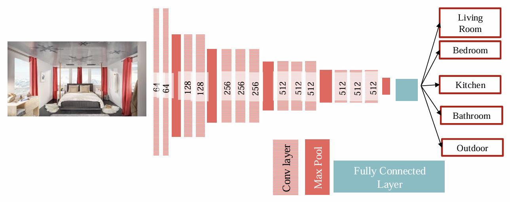

#### Residual CNNs (ResNets) 残差神经网络

- Introduce “identity” **skip connections**  
  引入“标识”跳过连接
  
  - Layer inputs are propagated and added to the layer output   
    层输入被传播并添加到层输出
  
  - Mitigate the problem of vanishing gradients during training  
    缓解培训期间梯度消失的问题
  
  - Allow training very deep NN (with over 1,000 layers)   
    允许训练非常深的神经网络(超过1000层)

- Several ResNet variants exist: 18, 34, 50, 101, 152, and 200 layers   
  存在几种 ResNet 变体: 18、34、50、101、152和200层

- Are used as base models of other state-of-the-art NNs   
  用作其他最先进神经网络的基本模型
  
  - other similar models: ResNeXT, DenseNet  
    其他类似的模型: ResNeXT，DenseNet

- 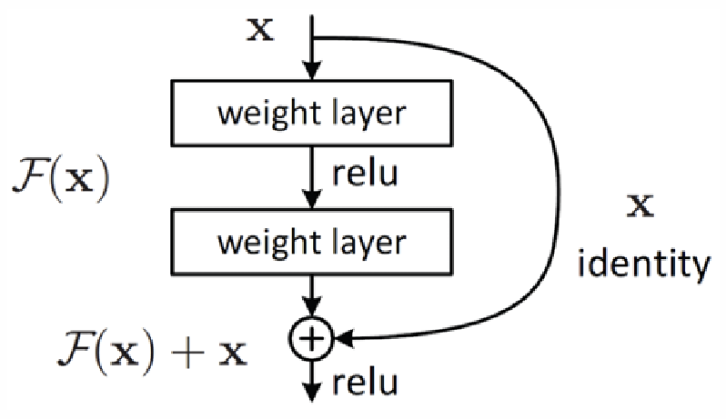

##### Recurrent Neural Networks (RNNs) 回归神经网络

- Recurrent NNs are used for modeling **sequential data** and data with varying length of inputs and outputs  
  递归神经网络用于对 **顺序数据** 和具有不同输入和输出长度的数据进行建模
  
  - Videos, text, speech, DNA sequences, human skeletal data  
    视频，文本，语音 DNA 序列，人体骨骼数据

- RNNs introduce recurrent connections between the neurons   
  递归神经网络在神经元之间引入复发性连接
  
  - This allows processing sequential data one element at a time by selectively passing information across a sequence   
    这允许通过有选择地跨序列传递信息来一次处理一个元素的顺序数据
  
  - Memory of the previous inputs is stored in the model’s internal state and affect the model predictions   
    先前输入的内存存储在模型的内部状态中，并影响模型的预测
  
  - Can capture correlations in sequential data   
    可以捕获序列数据中的相关性

- RNNs use backpropagation-through-time for training   
  递归神经网络使用时间反向传播进行训练

- RNNs are more sensitive to the vanishing gradient problem than CNNs  
  递归神经网络对消失梯度问题比卷积神经网络更敏感

##### Long Short-Term Memory (LSTM) Networks 长短期记忆网络

- Long Short-Term Memory (LSTM) networks are a variant of RNNs  
  长短期记忆网络是递归神经网络的一种变形 

- LSTM mitigates the vanishing/exploding gradient problem  
  LSTM减轻了消失/爆炸梯度
  
  - Solution: **a Memory Cell**, updated at each step in the sequence  
    解决方案:一个存储单元,在每一步更新

- Three gates control the flow of information to and from the Memory Cell   
  三个门控制信息的流动
  
  - **Input Gate**: protects the current step from irrelevant inputs  
    输入门：通过不相关的输入保护目前的步骤
  
  - **Output Gate**: prevents current step from passing irrelevant information to later steps  
    输出门: 防止当前步骤将不相关的信息传递给后面的步骤
  
  - **Forget Gate**: limits information passed from one cell to the next  
    忘记门: 限制信息从一个单元传递到下一个单元

- Most modern RNN models use either LSTM units or other more advanced types of recurrent units (e.g., GRU units)  
  大多数现代 RNN 模型使用 LSTM 单元或其他更先进类型的循环单元(例如 GRU 单元)

- LSTM cell 
  
  - Input gate, output gate, forget gate, memory cell   
    输入门，输出门，忘记门，存储单元
  
  - LSTM can learn long-term correlations within data sequences  
    LSTM 可以学习数据序列中的长期相关性
  
  - $$
    \begin{align*}
\mathbf{i}^{(k)} &= \sigma \left( \mathbf{W}_{oi} \mathbf{o}_m^{(k)} + \mathbf{W}_{hi} \mathbf{h}^{(k-1)} + \mathbf{b}_i \right) \\
\mathbf{f}^{(k)} &= \sigma \left( \mathbf{W}_{of} \mathbf{o}_m^{(k)} + \mathbf{W}_{hf} \mathbf{h}^{(k-1)} + \mathbf{b}_f \right) \\
\mathbf{q}^{(k)} &= \sigma \left( \mathbf{W}_{oq} \mathbf{o}_m^{(k)} + \mathbf{W}_{hq} \mathbf{h}^{(k-1)} + \mathbf{b}_q \right) \\
\mathbf{c}^{(k)} &= \mathbf{f}^{(k)} \mathbf{c}^{(k-1)} + \mathbf{i}^{(k)} \sigma \left( \mathbf{W}_{oc} \mathbf{o}_m^{(k)} + \mathbf{W}_{hc} \mathbf{h}^{(k-1)} + \mathbf{b}_c \right) \\
\mathbf{h}^{(k)} &= \mathbf{q}^{(k)} \tanh \left( \mathbf{c}^{(k)} \right)
\end{align*}

    $$
  
  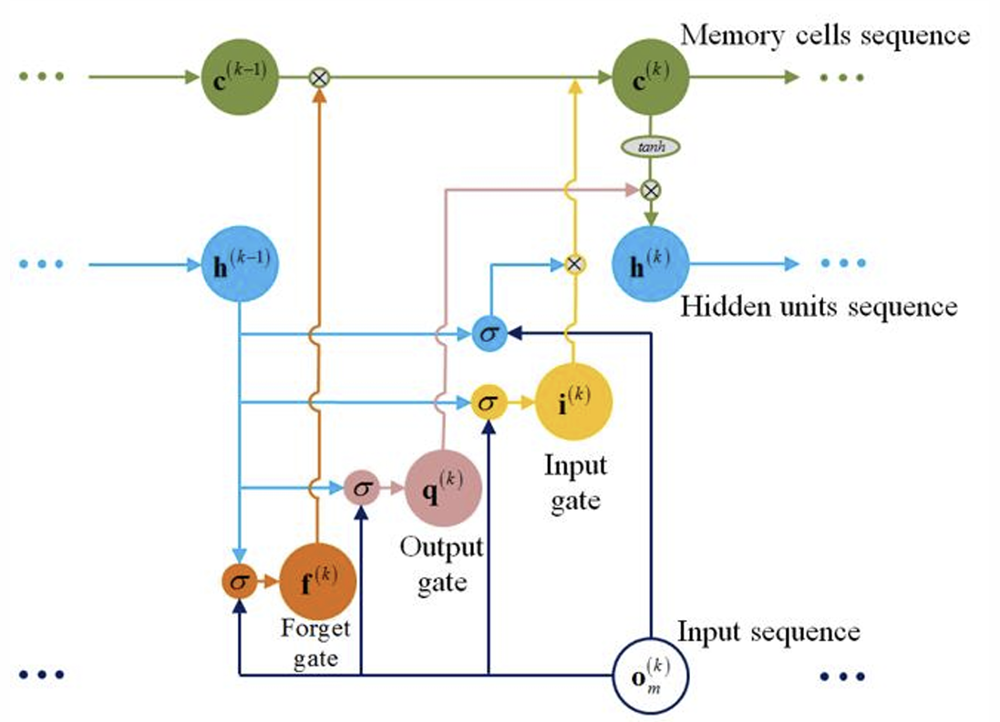

##### Deep learning frameworks 深度学习框架

- Kinds
  
  - Caffe
  
  - torch
  
  - Chainer
  
  - PyTorch
  
  - Caffe2
  
  - DeepLearning4J
  
  - TensorFlow
  
  - theano
  
  - dmlc-mxnet

- Keras is a high-level neural networks API  
  Kera 是一个高级神经网络 API
  
  - we will use TensorFlow as the compute backend  
    我们将使用 TensorFlow 作为计算后端

- PyTorch is
  
  - a GPU-based tensor library  
    一个基于图形处理器的张量库
  
  - an efficient library for dynamic neural networks  
    一个高效的动态神经网络库
  
  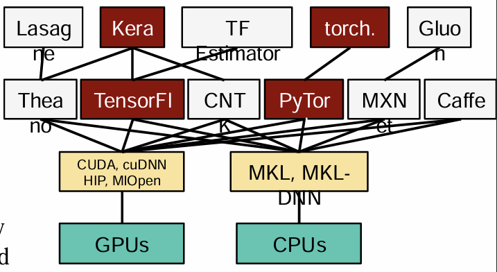

### Part 2: Reinforcement Learning 第二部分: 强化学习

#### Introduction to Reinforcement Learning 强化学习入门

##### 强化学习能解决的问题（和不能解决的问题）

- Idea: An agent (an AI) will learn from the environment by **interacting with it** (through trial and error) and **receiving rewards** (negative or positive) as feedback for performing actions.   
  想法: 一个智能体(人工智能)将通过与环境互动(通过尝试和错误)来学习，并接受奖励(负面或正面)作为执行行动的反馈。

- Goal: **Maximize the reward** by taking right actions 
  目标: 通过采取正确的行动使奖励最大化

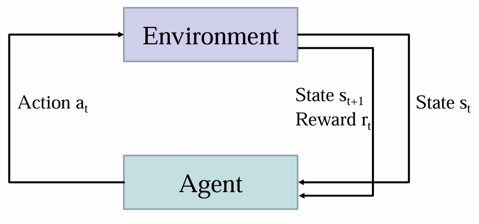

##### Markov Decision Processes (MDPs)  马尔可夫决策过程

#### Markov Process and Markov Chain  马尔可夫过程与马尔可夫链

- A Markov process or Markov chain is a **stochastic model** describing a sequence of possible events where the probability of each event depends only on the state attained in the previous event.  
  马尔可夫过程或马尔可夫链是描述一系列可能事件的随机模型，其中每个事件的概率仅取决于先前事件中所达到的状态。

- Markov property: The state of the system at time $t+1$ depends only on the state of the system at time $t$  
  Markov 性质: 系统在时间 $t + 1 $时的状态仅取决于系统在时间 $t $时的状态
  
  $$
  P\left[ X_{t+1} = x_{t+1} \mid X_1, X_t = x_1, x_t \right] = P\left[ X_{t+1} = x_{t+1} \mid X_t = x_t \right]
  $$

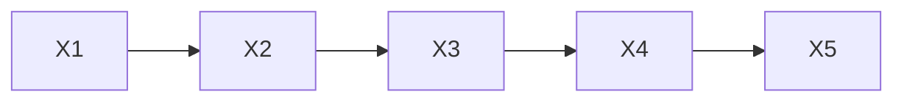
```mermaid
graph LR
    X1 --> X2
    X2 --> X3
    X3 --> X4
    X4 --> X5

```

- Stationary Assumption: State transition probabilities are **independent of time** (𝑡)  
  平稳假设: 状态转移概率与时间(t)无关
  
  $$
  P \left[ X_{t+1} = b / X_t = a \right] = p_{ab}
  $$

---

马尔可夫链的计算

马尔可夫链的核心是转换概率矩阵（Transition Probability Matrix），通常记为 \(P\)。这个矩阵描述了系统在每个状态之间的转换概率。例如，对于一个有三个状态 $(S_1, S_2, S_3)$ 的系统，转换概率矩阵 \(P\) 可能是这样的：

$$
P = \begin{bmatrix} P(S_1 \to S_1) & P(S_1 \to S_2) & P(S_1 \to S_3) \\ P(S_2 \to S_1) & P(S_2 \to S_2) & P(S_2 \to S_3) \\ P(S_3 \to S_1) & P(S_3 \to S_2) & P(S_3 \to S_3) \end{bmatrix}
$$

每个元素 $(P(i \to j))$ 表示系统从状态$i$转换到状态$j$的概率。矩阵的每一行的和为1，因为每行表示从某个状态开始的所有可能转换的概率总和。

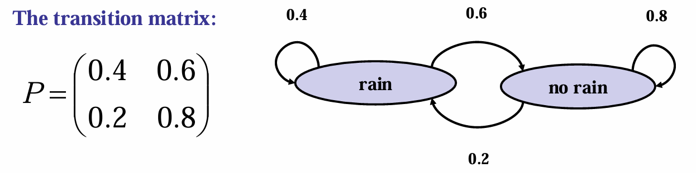

EXP

- Given that a person’s last cola purchase was Coke, there is a 90% chance that his next cola purchase will also be Coke. If a person’s last cola purchase was Pepsi, there is an 80% chance that his next cola purchase will also be Pepsi.  
  鉴于一个人上一次购买可乐是可口可乐，那么他下一次购买可乐也有90% 的可能是可口可乐。如果一个人上一次购买可乐是百事可乐，那么他下一次购买可乐的可能性也有80% 是百事可乐。
  
  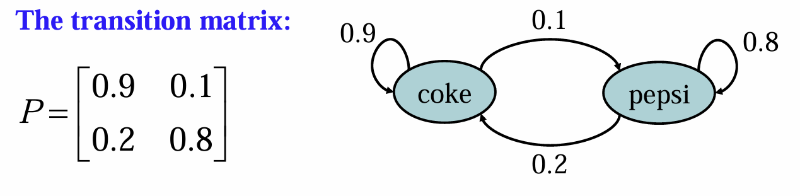

- Given that a person is currently a Pepsi purchaser, what is the probability that he will purchase Coke TWO purchases from now?  
  假设一个人目前是百事可乐的购买者，那么他从现在开始购买可口可乐的可能性有多大？
  
  $$
  P\left[ \text{Pepsi} \rightarrow ? \rightarrow \text{Coke} \right] = P\left[ \text{Pepsi} \rightarrow \text{Coke} \rightarrow \text{Coke} \right] + P\left[ \text{Pepsi} \rightarrow \text{Pepsi} \rightarrow \text{Coke} \right] \\
= 0.2 \times 0.9 + 0.8 \times 0.2 = 0.34 \\ \ \\
P^2 = \begin{bmatrix} 0.9 & 0.1 \\ 0.2 & 0.8 \end{bmatrix} \begin{bmatrix} 0.9 & 0.1 \\ 0.2 & 0.8 \end{bmatrix} = \begin{bmatrix} 0.83 & 0.17 \\ 0.34 & 0.66 \end{bmatrix}
  $$

- Assume each person makes one cola purchase per week;  Suppose 60% of all people now drink Coke, and 40% drink Pepsi; What fraction of people will be drinking Coke three weeks from now?  
  假设每个人每周购买一杯可乐; 假设60% 的人现在喝可口可乐，40% 的人喝百事可乐; 从现在开始的三周内，有多少人会喝可口可乐？
  
  $$
  P = \begin{bmatrix} 0.9 & 0.1 \\ 0.2 & 0.8 \end{bmatrix} \quad P^3 = \begin{bmatrix} 0.781 & 0.219 \\ 0.438 & 0.562 \end{bmatrix} \\P \left[X_3 = \text{Coke}\right] = 0.6 \times 0.781 + 0.4 \times 0.438 = 0.6438
  $$

- * **初始状态分布 initial distribution $Q_0$**：初始状态分布$Q_0$给出了当前选择 Coke 和 Pepsi 的比例。这里是：
    
    $$
    Q_0 = \begin{bmatrix} 0.6 & 0.4 \end{bmatrix}
    $$
    
    表示当前有 60% 的人喝 Coke，40% 的人喝 Pepsi。
  
  * **三周后的分布 $P^3$**：要计算三周后的分布，我们需要计算转移矩阵的三次方$P^3$。根据题目给出的信息，已知：
    
    $$
    P^3 = \begin{bmatrix} 0.781 & 0.219 \\ 0.438 & 0.562 \end{bmatrix}
    $$
    
    这个矩阵表示在经过三次转移后（即三周后），从 Coke 转移到 Coke 的累计概率为 0.781，从 Coke 转移到 Pepsi 的累计概率为 0.219，等等。
  
  * **计算三周后选择 Coke 的比例**：使用初始分布 $Q_0$ 与 $P^3$ 相乘得到三周后的分布 $Q_3$：具体计算为：
    
    $$
    Q_3 = \begin{bmatrix} 0.6 & 0.4 \end{bmatrix} \times \begin{bmatrix} 0.781 & 0.219 \\ 0.438 & 0.562 \end{bmatrix}
    $$
    
    分别计算每一项：
    
    $$
    Q_3(\text{Coke}) = 0.6 \times 0.781 + 0.4 \times 0.438 = 0.6438 \\ Q_3(\text{Pepsi}) = 0.6 \times 0.219 + 0.4 \times 0.562 = 0.3562
    $$
    
    因此，三周后选择 Coke 的比例为 0.6438，而选择 Pepsi 的比例为 0.3562。
  - 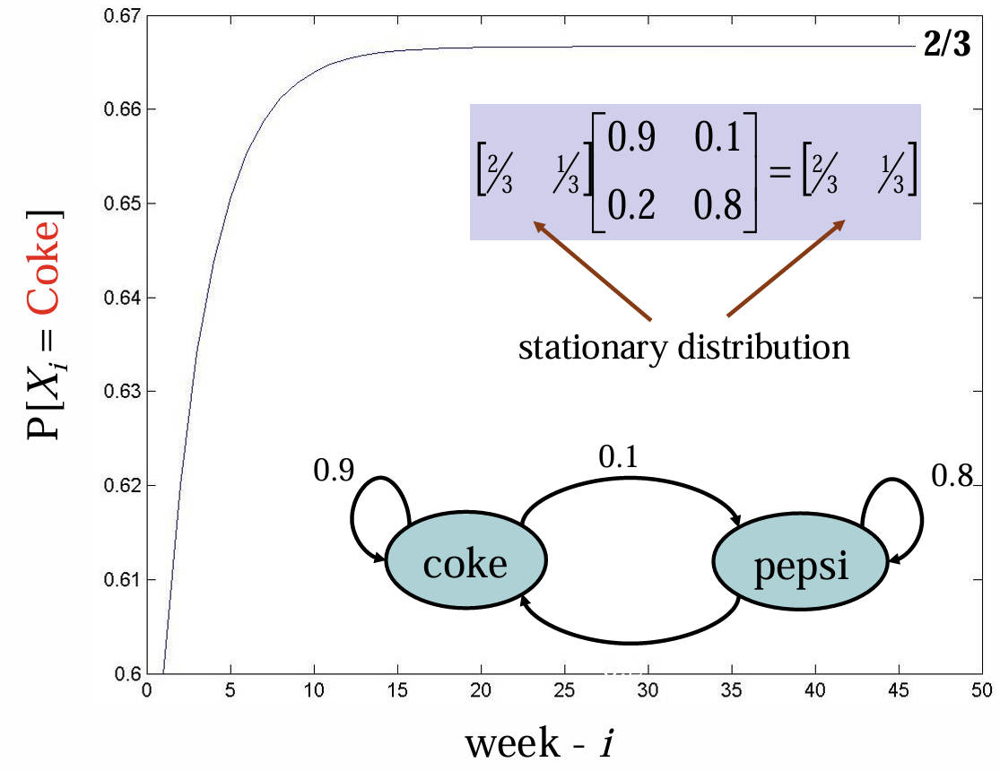

---

##### Markov decision process (MDP) definition   马可夫决策过程定义

- Markov decision process (MDP): The mathematical description of reinforcement learning  
  马可夫决策过程: 强化学习的数学描述
  
  $$
  \langle S, A, R, P, \gamma \rangle
\\ \ \\
\textit{S} \text{ is set of possible \textcolor{red}{states}} \\
\text{一组可能状态的集合}\\
\textit{A} \text{ is set of possible \textcolor{red}{actions}} \\
\text{一组可能作动的集合}\\
\textit{R} \text{ is distribution of \textcolor{red}{reward} given (state, action) pair} \\
\text{给予(状态，行动)对的报酬分配}\\
\textit{P} \text{ is \textcolor{red}{transition probability} } \\
\text{转移概率}\\
\gamma \text{ is reward \textcolor{red}{discount factor} in } [0,1]\\
\text{[0,1]中的奖励折扣因子}\\

  $$
  
  $\gamma $ Lower value encourages shortterm rewards while higher value promises long-term reward  
  较低的值鼓励短期回报，而较高的值承诺长期回报

##### Deterministic vs. Stochastic  确定性与随机性

- **Deterministic**: The next state and the corresponding reward are determined **solely by the current state and the action chosen**.   
  确定性: 下一个状态和相应的奖励完全由当前状态和选择的行动决定。

- Stochastic: The next state and the corresponding reward are **determined by a probability distribution**.  
  随机: 下一个状态和相应的奖励是由概率分布决定的。

##### Markov decision process (MDP) calculate  马可夫决策过程计算

- 计算方法
  
  - Environment initializes a state at time step t=0  
    环境在时间步骤 t = 0初始化状态
  
  - While not done:  
    当下面的步骤未完成
    
    - Agent selects action at $a_t$   
      智能选择一个操作
    
    - Environment returns reward $r_t$   
      环境给出一个奖励
    
    - Environment gives next state $s_{t+1}$   
      环境给出下一状态
    
    - Agent receives reward $r_t$ and next state $s_{t+1}$   
      智能接受奖励和西医状态

- A policy π is a function from S to A that specifies what action to take in each state:  
  策略 π 是一个从 S 到 A 的函数，指定在每个状态下采取什么行动:
  
  $$
  \pi(a | s) = \mathbb{P}[A_t = a | S_t = s]
  $$

- Objective: find optimal policy π* that maximizes accumulative discounted reward:  
  目标: 寻找最优政策 π * ，最大化累计贴现回报:
  
  $$
  \sum_{t \geq 0} \gamma^t r_t
  $$

##### The optimal policy π*  最优策略 π *

- The aim is to **find optimal policy π*** that maximizes the accumulative rewards.   
  目标是找到最优策略 π * ，使累积回报最大化

- How do we **handle the randomness**.   
  我们如何处理随机性。

- Maximize the expected sum of rewards:  
  最大化预期回报总额:
  
  $$
  \pi^* = \arg\max_{\pi} \mathbb{E} \left( \sum_{t \geq 0} \gamma^t r_t \mid \pi \right)
  $$
  
  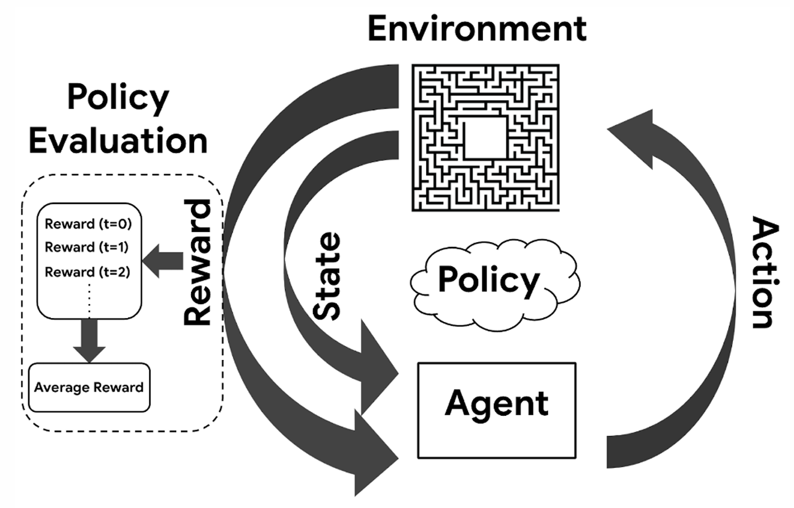

##### Value function  价值函数

- The relationship between state value function and Q-value function:  
  状态值函数与 Q 值函数的关系:
  
  $$
  Q(s, a) = R + \gamma \sum_{s'} P V(s')\\
R \ Reward \\
\gamma \  Discount \ factor \\
P \ Transition \ probability \\
V(s') \ Value \ function \ of \ next \  state s’
  $$

##### The Bellman equation 贝尔曼方程

- Bellman equation helps agent to iterate on value, thus progressively optimizing the policy:  
  贝尔曼方程帮助代理人迭代价值，从而逐步优化政策:

$$
V(s) = \mathbb{E} \left[ R_{t+1} + \gamma V(S_{t+1}) \mid S_t = s \right] \\
s \text{ is the state} \\
R \text{ is reward, } G_{t+1} \text{ is the accumulative reward from } S_{t+1} \\
\gamma \text{ is the reward discount factor in } [0,1] 


$$

- According to the Bellman Equation,**long-term reward in a given action** is equal to **the reward from the current action combined with the expected reward from the future actions** taken at the following time.  
  根据贝尔曼方程，一个给定行为的长期回报等于当前行为的回报和下一时间未来行为的预期回报。

#### RL Techniques: From Q-learning to Actor-Critic RL 技术：从 Q-learning 到 Actor-Critic

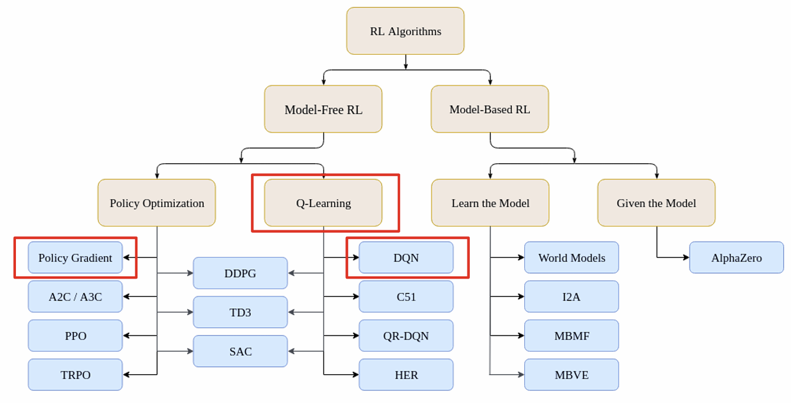

##### Model-Free RL 无模型 RL

- learns strategies directly **without the need for an explicit model of the environment**.  
  直接学习策略而不需要一个明确的环境模型。 

- Agent interacts with the real environment and relies on real environment feedback and reward for learning, and as a result, it may take irreversible and disruptive actions.  
  智能体与真实环境相互作用，依赖真实环境的反馈和学习奖励，因此，它可能采取不可逆转和破坏性的行动。

##### Model-Based RL 基于模型的 RL

- attempts to **model the environment** and plan future actions.  
  试图模拟环境和计划未来的行动。

- Agent constructs a simulated model first. The information an agent receives from the environment for a given state and action is transition probability and reward.  
  Agent 首先构建一个模拟模型。代理从环境中接收到的关于给定状态和行为的信息是转移概率和报酬。

##### Value-Based RL 基于价值的 RL

- selects actions by learning **value functions** and **efficient in finding optimal policies**.   
  通过学习价值函数选择行为，有效地找到最优策略。
  
  - The agent optimises the policy by selecting the action **that has the highest value function in a given state**.  
    代理通过选择在一般状态中具有最高价值函数的操作来优化策略。
  
  - **Advantage**: it can **find the optimal policy** efficiently and have **high sample efficiency**.   
    优点: 能有效地找到最优策略，样本效率高。
  
  - **Disadvantage**: it **cannot solve problem with continuous action space and sensitive to hyperparameters**.  
    缺点: 不能解决动作空间连续且对超参数敏感的问题。

##### Policy-Based RL 基于策略的 RL

- selects actions directly by learning **policy functions** with **efficient convergence** and can **handle continuous action spaces**.  
  通过学习具有高效收敛性的策略函数直接选择动作，并能处理连续动作空间。
  
  - Advantage: it can **deal with continuous action spaces**, and it is **easier to converge** in real-world environments.   
    优点: 它可以处理连续的动作空间，并且在现实环境中更容易收敛。
  
  - Disadvantage: it may require **more training data** due to the direct learning of policies, and often converge to a **local optimum**.  
    缺点: 由于对策略的直接学习，它可能需要更多的训练数据，并且经常收敛到局部最优。

##### On-policy RL

- learns from **the policy that is being currently followed during exploration**.   
  从目前在勘探过程中所遵循的政策中学习。

##### Off-policy RL

- learns from a **different policy** than the one that the agent is currently following.  
  从与代理当前遵循的策略不同的策略中学习。

##### Q-learning

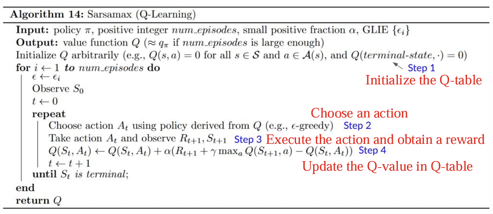

- Q-learning: Use a function approximator to estimate the state-action value function, namely the Q-function:  
  Q 学习: 使用函数逼近器来估计状态作用值函数，即 Q 函数:
  $$
  Q(s, a \mid \omega) \approx Q^*(s, a) \\

\omega \text{ is the parameters of the function (weights)}

  $$

- To train this Q-Function, that given a state and action as input, output the Q-value, we initialize and update a Q-table  
  为了训练这个给定状态和动作作为输入的 Q 函数，输出 Q 值，我们初始化并更新一个 Q 表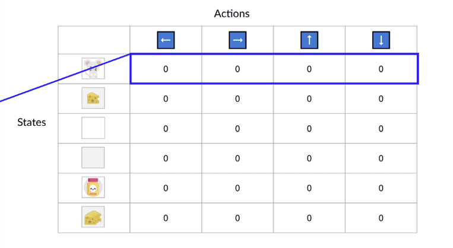

##### From Q-learning to Deep Q-network 从 Q 学习到深度 Q 网络

- If the function approximator is a deep neural network (DNN)   
  如果函数逼近器是深度神经网络(DNN)  
  Deep Q-learning/-network (DQN)  
  深度 Q 学习/-网络(DQN)
  
  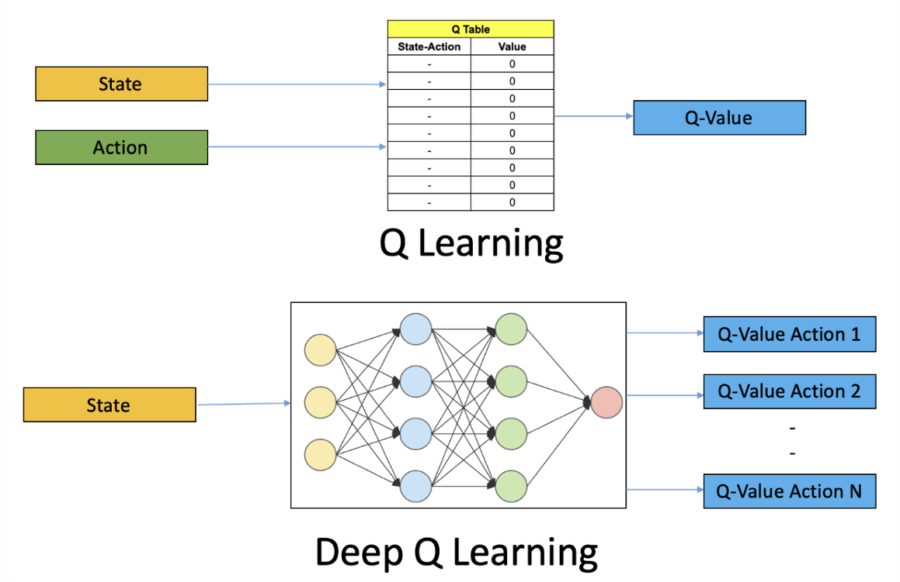

- **Q-value is the expected accumulative reward** from taking action $a$ at state $s$  
  Q 值是在状态$s$下采取行动$a$的预期累积报酬

##### Deep Q-network (DQN)

- Using **deep neural network** to help scale up to making decisions in **extremely large domains**.   
  使用深度神经网络帮助在极大的领域中做出决策。

- For example, when we have **many states** (e.g., every frame of the Atari game) **or even continuous state space**, we **cannot list all** the state-action pair in the Q-table.   
  例如，当我们有许多状态(例如，雅达利游戏的每一帧) ，甚至连续的状态空间，我们不能列出所有的状态-行动对在 Q 表。

- Represent value function by **Q-network with weights ω**  
  用权重为 ω 的 Q 网络表示值函数
  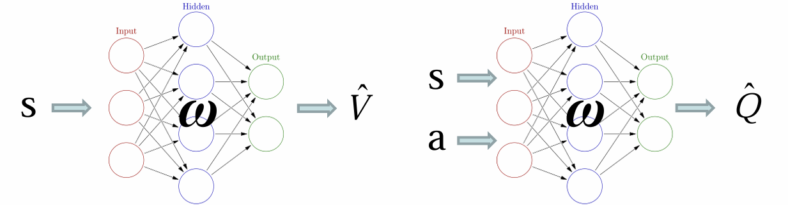

- Optimize loss function by stochastic gradient descent (SGD)  
  按随机梯度下降优化损失函数

##### Train the DQN   训练DQN

###### Experience replay   经验重播

- To help remove correlations of training data, store dataset D (called a replay buffer) from prior experience.  
  为了帮助消除训练数据的相关性，从以前的经验中存储数据集 D (称为重播缓冲区)。
  
  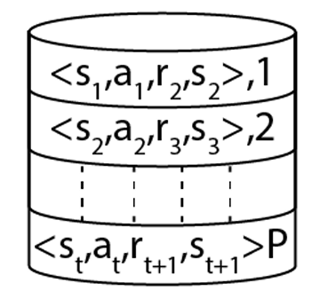

- To perform experience replay, repeat the following:   
  进行经验重播时，请重复以下步骤:
  
  - $(s, a, r, s') \sim \mathcal{D}$: **sample** an experience tuple from the dataset    
    从数据集中抽样一个经验元组
  
  - Compute the **target value** for the sampled state:  
    计算取样状态的目标值:
    
    $$
    y = r + \gamma \max_{a'} \hat{Q}(s', a' \mid \omega)
    $$
  
  - Use SGD to **update** the network weights  
    使用 SGD 更新网络权重

###### Fixed Q-target 修正Q-目标

- To help **improve stability**, **fix the target network weights** used in the target value calculation for multiple updates   
  为了帮助提高稳定性，修改用于多次更新的目标值计算中的目标网络权重

- Use a different set of weights to compute target than is being updated   
  使用一组不同的权重来计算目标，而不是进行更新

- Let parameters $\omega^0$ be the set of **weights used in the target**, and  $\omega$ be the weights that are being updated  
  设参数 $\omega^0$ 是目标中使用的权重集，$\omega$ 是正在更新的权重集

- Slight change to computation of target value:   
   目标值的计算略有变化:
  
  - $(s, a, r, s') \sim \mathcal{D}$: sample an experience tuple from the dataset   
    从数据集中抽样一个经验元组
  
  - Compute the **target value** for the sampled state:  
    计算取样状态的目标值:
    
    $$
    y = r + \gamma \max_{a'} \hat{Q}(s', a' \mid \omega^o)

    $$
  
  - Use SGD to update the network weights  
    使用 SGD 更新网络权重
    
    

##### Policy gradient 策略梯度

- The **Q-function can be very complicated**    
  Q 函数可能非常复杂

- Hence, it is **impossible to learn exact value of every state-action pair**.   
  因此，不可能了解每个状态操作对的确切价值。

- The **policy-based method**  
  基于策略的方法
  
  - e.g., policy gradient, **can learn a policy directly**  
    例如，政策梯度，可以直接学习政策
  
  - e.g., finding the best policy (i.e., **how to choose an action at a state**) from a collection of policies.  
    例如，从一组策略中找到最佳策略(即，如何在一个状态选择一个操作)。

- steps 
  
  1. define a class of parametrized policies:  
     定义一类参数化策略:
     
     $$
     \Pi = \left\{ \pi_{\theta}, \theta \in \mathbb{R}^m \right\}
     $$
  
  2. For each policy, define its value based on the discounted **accumulative reward**:  
     对于每份策略，根据折现的累计报酬确定其价值:
     
     $$
     J(\theta) = \mathbb{E} \left[ \sum_{t \geq 0} \gamma^t r_t \mid \pi_{\theta} \right]
     $$
  
  3. We want to find the optimal policy:  
     我们希望找到最佳政策:
     
     $$
     \theta^* = \arg\max_{\theta} J(\theta)
     $$
  
  4. **Do gradient ascent on policy parameters**  
     在策略参数上进行梯度上升

##### Actor-critic architecture   “行为者-评价者”模型

- The Actor-Critic model consists of both an **Actor network** and a **Critic network**.   
  **Actor-Critic模型结构**：该模型包含一个「Actor网络」和一个「Critic网络」

- The Actor network learns the policy, deciding which action to take in a given state.   
  **Actor网络**：负责学习策略，决定在给定状态下要采取的行动。

- The Critic network estimates the value function, evaluating the value of the action at the state.   
  **Critic网络**：负责评估价值函数，估算在该状态下某一行动的价值。

- Motivation: This combination allows the agent to learn from both policy and value function aspects, making full use of the advantages of both methods.  
  **动机**：这种结合使得智能体能够同时从「策略」和「价值函数」两个方面进行学习，充分利用这两种方法的优势。

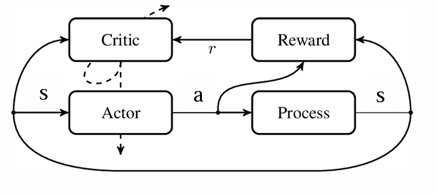

#### Applications of RL  强化学习的应用

- Self-Driving Cars 
  
  - Trajectory optimization, motion planning, and controller optimization.   
    轨迹优化、运动规划和控制器优化。
  
  - Learning policies for parking, lane changing, and overtaking.   
    学习泊车、转线及超车策略。
  
  - AWS DeepRacer uses RL in autonomous racing cars.   
    AWS DeepRacer 在自动赛车中使用 RL。

- Industry Automation 
  
  - Robots performing tasks efficiently and safely.   
    机器人高效安全地执行任务。
  
  - Example: DeepMind cooling Google Data Centers using RL.  
    示例: DeepMind 使用 RL 为 Google 数据中心降温。

- Natural Language Processing (NLP) 
  
  - RL used in question answering, text summarization, and machine translation.   
    RL 用于问答、文本摘要和机器翻译。

- Finance and Trading 
  
  - RL agents making financial decisions (buy, sell, hold).   
    RL 代理人作出财务决策(买入、卖出、持有)。
  
  - IBM's reinforcement learning-based platform for financial trades.  
    IBM 基于强化学习的金融交易平台。

- Healthcare 
  
  - RL systems providing treatment policies for patients.   
    为病人提供治疗政策的 RL 系统。
  
  - RL in dynamic treatment regimes and medical diagnosis.   
    动态治疗制度和医疗诊断中的 RL。

- Engineering 
  
  - Facebook's Horizon - RL platform optimizing large-scale systems.   
    Facebook 的 Horizon-RL 平台优化大规模系统。

- News Recommendation 
  
  - RL tracking user preferences for personalized news recommendations.   
    RL 跟踪个性化新闻推荐的用户偏好。
  
  - Factors considered: news features, reader behavior, and context.  
    考虑因素: 新闻特点、读者行为和上下文。

- Gaming 
  
  - AlphaGo Zero - RL mastering the game of Go through self-play.   
    AlphaGo Zero-RL 通过自玩掌握围棋游戏。

- Bidding and Marketing 
  
  - Multi-agent RL enables real-time bidding to balance the trade-off between the competition and cooperation among advertisers.   
    多代理 RL 实现了实时竞价，平衡了广告商之间的竞争与合作。

- Robotics Manipulation 
  
  - Deep RL enabling robots to grasp various objects unseen during training.   
    深 RL 使机器人能够抓住训练中看不见的各种物体。
  
  - Google AI's approach to robotics grasping using QT-Opt.  


