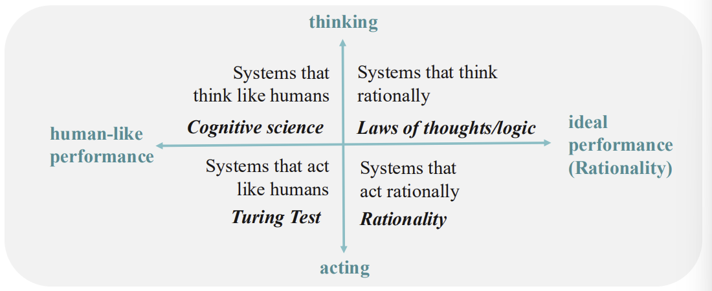
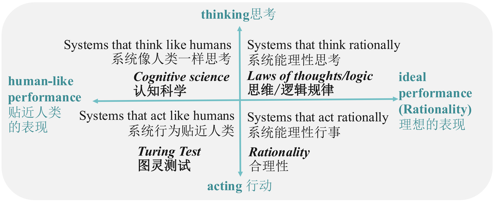
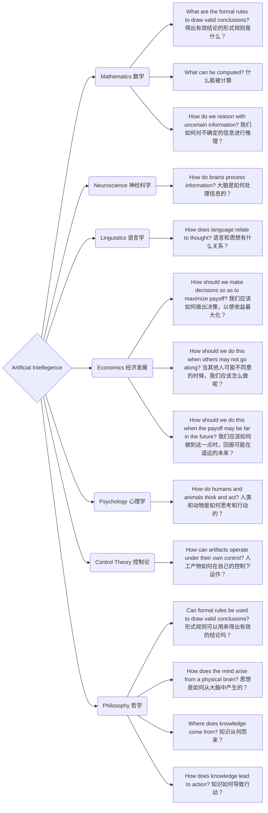
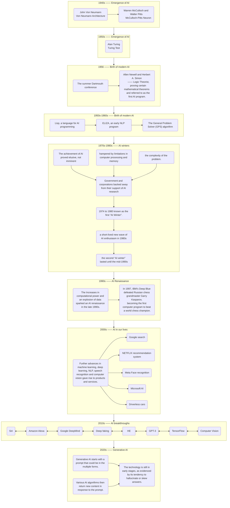
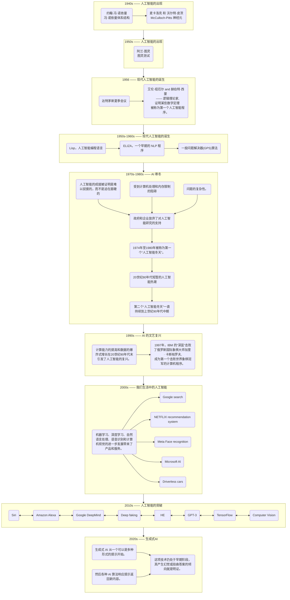
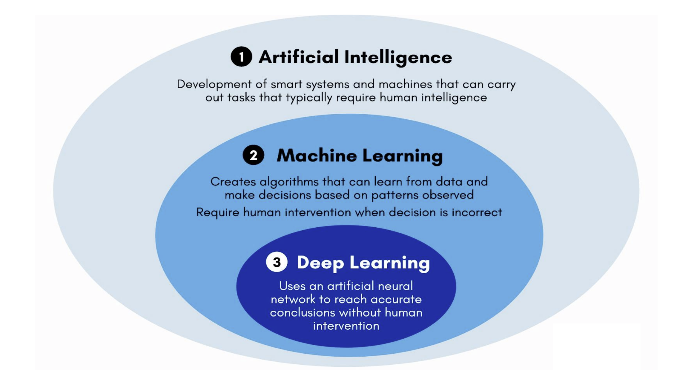
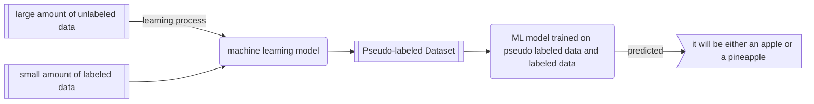
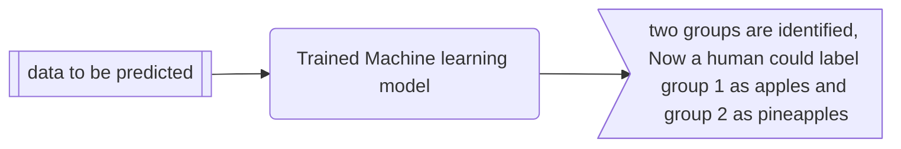
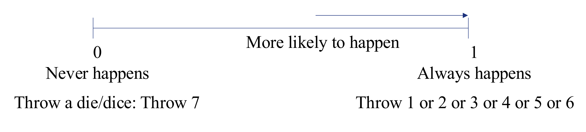

# Introduction to Artificial Intelligence AI导论

**EBU4203**

- TB1: Introduction to AI, uncertainty in decision making, machine learning basics  
  人工智能入门，决策中的不确定性，机器学习基础

- TB2: Deep learning and reinforcement learning  
  深度学习和强化学习

- TB3: Practical AI Applications and Computer Vision  
  实用人工智能应用与计算机视觉

- TB4: Natural Language Processing (NLP) and future trends in AI  
  自然语言处理与人工智能的发展趋势

---

## Introduce 简要介绍

### assessment

- 1 x Class Test  3% 课堂小测
  
  - After teaching block 2

- 2 x Self-revision Online Quizzes 3% 网上自测
  
  - Open for a week

- Laboratory 14% 实验
  
  - Lab reports 实验报告
  
  - 一共三次,第一次不用写

- Final exam 80%
  
  - closed-book written exam 闭卷考试
  
  - Past papers will be put on QMPlus 过去的试卷将放在 QMPlus 上
  
  - Note: A minimum total mark of 40% is required to pass this module  
    注意: 通过本模块最低总分为40%

- Coursework: 
  
  - Note: There is a coursework hurdle of 30% (A minimum total coursework mark of 30% is required to pass this module)  
    注: 有一个30% 的课程作业障碍(通过此模块需要最少30% 的课程作业总分)

### Information

- Course website: 课程网站
  
  - Login to QMPlus
  
  - Course Area: EBU4203 (Introduction to AI)
  
  - <mark>Check it regularly, as it is possible there could be additional information e.g. messages, extra practice exercises, tutorials, etc.  
    定期检查，因为可能会有额外的信息，如信息，额外的练习，教程等。</mark>

- Email
  
  - <mark>You are expected to check your QM email every week at least!   
    你至少应该每周查看一次 QM 邮件！</mark>

### Recommended Text book and references 推荐的教科书和参考资料

- ["1"] Russell, S., & Norvig, P. (2021). Artificial Intelligence: a modern approach, 4th US ed. University of California, Berkeley.  
  ["1"]拉塞尔，S。 & 诺维格，P。(2021)。人工智能: 一种现代方法，美国第四版。加州大学伯克利分校。

- There are plenty of books available on this topic.  
  有很多关于这个主题的书。

### Few tips

- Attend every lecture, tutorial, lab and assessment sessions.  
  参加每一个讲座，辅导，实验室和评估会议。

- Revise your lecture materials after every class.  
  每节课后都要修改讲义。

- Make use of available materials, and read books and online materials.  
  利用现有的资料，阅读书籍和网上资料。

- Be interactive during the class and tutorial sessions.  
  在课堂和辅导课程中保持互动。

- Ask your lecturers/TAs and discuss with your classmates.  
  询问你的讲师/助教，并与你的同学讨论。

### mentimeter

interaction tools

## week 1

- Part 1: Introduction to AI AI引入

- Part 2: Uncertainty in decision making 决策的不确定性

- Part 3: Machine learning basics 机器学习基础

### Part 1: Introduction to AI 第一部分: 人工智能导论

- Definition and scope of AI 人工智能的定义和范围

- Motivation for exploring AI 探索人工智能的动机

- Brief history of AI 人工智能简史

- Branches and applications of AI 人工智能的分支与应用

- Ethical considerations in AI 人工智能的伦理思考

#### What is artificial intelligence？

<u>Definition and scope of AI 人工智能的定义和范围</u>

##### Alan Turing 图灵 —— 图灵测试 Turing Test

- The Turing Test aims to  evaluate **whether a machine  can exhibit intelligence  comparable to that of a human.**  
  图灵测试的目的是评估一台机器能否展现出与人类相当的智力。

- A **text conversation** between a judge, a human, and a machine, where the judge tries to determine whether he is conversing with a human or a machine.  
  一种法官、人类和机器之间的文本对话，法官试图确定他是在与人类还是机器交谈。

- 重要性和局限
  
  - Significance:
    
    - The Turing Test serves as a method for assessing the level of artificial intelligence.  
      图灵测试是评估人工智能水平的一种方法。
    
    - If a machine can pass the Turing Test, it indicates a certain level of intelligence and raises questions about AI capabilities.  
      如果一台机器能够通过图灵测试，它表明了一定程度的智能，并提出了关于人工智能能力的问题。
  
  - Limitations：
    
    - The Turing Test focuses **solely on external behavior** and does not evaluate internal cognitive processes.  
      图灵测试只关注外部行为，不评估内部认知过程。
    
    - It may be influenced by **subjective judgments** from the judge and other factors.  
      它可能受到法官主观判断等因素的影响。

- IBM's Jeopardy Challenge: An intriguing step toward AI passing the Turing Test  
  IBM 的危险挑战: 迈向人工智能通过图灵测试的有趣一步
  
  - In 2011, IBM's **supercomputer "Watson" won the Jeopardy Challenge**, becoming the first robot champion.  
    2011年，IBM 的超级计算机“沃森”赢得了危险挑战赛，成为第一个机器人冠军。
  
  - Watson's performance in the Jeopardy Challenge: **Comprehending questions, analysing information, and selecting the most probable answer**.  
    沃森在危险挑战中的表现: 理解问题，分析信息，选择最可能的答案。
  
  - IBM's Jeopardy Challenge provided a demonstration of **a technological breakthrough related to the Turing Test**, proving the potential of machines to process natural language and reasoning, and driving further development in the field of artificial intelligence.  
    IBM 的 Jeopardy Challenge 展示了与图灵测试相关的技术突破，证明了机器处理自然语言和推理的潜力，并推动了人工智能领域的进一步发展。

##### The Four potential goals or definitions of AI 人工智能的四个潜在目标或定义

- They differentiates computer systems on the basis of rationality and thinking vs. acting  
  他们区分计算机系统的基础是理性和思考与行动:
  
  
  
  

- At its simplest form, artificial intelligence is a field, which **combines computer science and robust datasets**, to enable **problem-solving**.  
  简单来说，人工智能是一个将计算机科学和强大的数据集结合起来的领域，它能够解决问题。

- It also encompasses sub-fields of **machine learning and deep learning**, which are frequently mentioned in conjunction with artificial intelligence.   
  它还包括机器学习和深度学习的子领域，这些领域经常与人工智能一起被提及。

- These disciplines are comprised of AI algorithms which seek to **create expert systems which make predictions or classifications based on input data**.  
  这些学科由人工智能算法组成，该算法寻求创建专家系统，根据输入数据进行预测或分类。

##### The scope of AI 人工智能的范围

- As we begin the new millennium   
  千禧年后开始
  
  - science and technology are changing rapidly   
    科学技术正在迅速变化
  
  - “old” sciences such as physics are relatively well-understood   
    像物理这样的“古老”科学相对来说已经被广为人知了
  
  - computers are ubiquitous  
    电脑无处不在

- Grand Challenges in Science and Technology  
  科学技术面临的重大挑战
  
  - understanding the brain   
    对脑科学的理解与研究
  
  - reasoning, cognition, creativity   
    推理、认知、创造力
  
  - creating intelligent machines  
    创造智能机器

##### The Foundations of AI 人工智能的基础



#### How does AI work?  人工智能是如何工作的？

<u>Motivation for exploring AI</u> 

##### Why AI Matters? 为什么人工智能很重要

1. Potential to Transform
   AI has the potential **to revolutionize various aspects** of our lives, work, and leisure activities.  
   人工智能有可能彻底改变我们生活、工作和休闲活动的各个方面。

2. Business Automation
   AI has been effectively utilized in businesses **to automate tasks** that were previously performed by humans, such as customer service, lead generation, fraud detection, and quality control.  
   人工智能已经被有效地应用于企业中，使以前由人类执行的任务自动化，例如客户服务、引导生成、欺诈检测和质量控制。

3. Superior Performance
   In many areas, **AI outperforms humans** in tasks, especially those that are **repetitive and detail-oriented**. AI tools can **quickly analyse large volumes of legal documents**, ensuring accurate and complete information.  
   在许多领域，人工智能在任务方面胜过人类，尤其是那些重复性和注重细节的任务。人工智能工具可以快速分析大量的法律文件，确保准确和完整的信息

4. Efficiency and Accuracy
   AI tools can **complete tasks quickly and with relatively few errors**, particularly in areas that require analysing extensive data sets. This enables businesses to gain insights into their operations that may have otherwise gone unnoticed.  
   人工智能工具可以快速完成任务，错误相对较少，特别是在需要分析大量数据集的领域。这使得企业能够深入了解他们的业务，否则可能会被忽视。

5. Generative AI Tools
   The growing population of generative AI tools holds great importance in fields like education, marketing, and product design. These tools offer **innovative solutions and creative outputs**.  
   越来越多的生成性人工智能工具在教育、市场营销和产品设计等领域具有重要意义。这些工具提供了创新的解决方案和创造性的产出。

##### AI opens the door to new opportunities 人工智能为新的机会打开了大门

- UBER

- Meta

- Microsoft

- Alphabet

- Apple

##### The advantages of AI 人工智能的优势

1. Good at detail-oriented jobs  
   擅长细节导向的工作

2. Saves labour and increases productivity  
   节省劳动力，提高生产力

3. Delivers consistent results  
   产生一致的结果

4. AI-powered virtual agents are always available  
   人工智能驱动的虚拟代理总是可用的

5. Reduced time for data-heavy tasks  
   减少数据量大的任务的时间

6. Can improve customer satisfaction through personalization  
   可以通过个性化提高客户满意度

##### AI is NOT everything (limitations) 人工智能不是一切(局限性)

1. Expensive  
   昂贵的

2. Requires deep technical expertise  
   需要深厚的专业技术

3. Limited supply of qualified workers to build AI tools  
   人工智能工具的合格工人供应有限

4. Reflects the biases of its  training data, at scale.  
   在规模上反映了其训练数据的偏差。

5. Lack of ability to generalize from one task to another  
   缺乏从一项任务归纳到另一项任务的能力

6. Eliminates human jobs, increasing unemployment rates  
   减少人类工作，增加失业率

#### Brief history of AI 人工智能简史

<u>Ancient Roots of Intelligent Artifacts
智能物品的古老根源</u>

##### From Mythical Servants 来自神话仆人

- The concept of inanimate objects endowed with intelligence has been around since ancient times.  
  被赋予智慧的无生命物体的概念自古以来就存在。
  
  - Greek god Hephaestus and robot-like servants out of gold   
    希腊神赫菲斯托斯和机器人般的仆人用金子做的
  
  - Engineers in ancient Egypt and statues  of gods animated by priests  
    古埃及的工程师和祭司制作的神像

##### To Symbolic Thinkers 对象征思想家的思考

- They used the tools and logic of their times to describe human thought processes as symbols, laying the foundation for AI concepts such as general knowledge representation.  
  他们利用当时的工具和逻辑将人类的思维过程描述为符号，为一般知识表示等人工智能概念奠定了基础。

- Aristotle 亚里士多德
  Ramon Llull 拉蒙·柳利
  René Descartes 勒内 · 笛卡尔
  Thomas Bayes 托马斯·贝叶斯

##### Pioneers of Programmable Machines 可编程机器的先驱

The foundational work that would give rise to the modern computer  
产生现代计算机的基础工作

- the mill with a printing mechanism of the Analytical Engine 带有分析机打印机构的磨坊

- Babbage's difference engine 巴贝奇的差分引擎

##### Milestones in the Journey of AI





#### Branches and applications of AI 人工智能的分支与应用

##### Weak AI vs. Strong AI

- Weak AI
  
  - also called Narrow AI or Artificial Narrow Intelligence (ANI)
  
  - is **AI trained and focused to perform specific tasks.** 
  
  - Weak AI drives most of the AI that surrounds us today. ‘Narrow’ might be a more accurate descriptor for this type of AI as it is anything but weak; it enables some very robust applications.  
    今天我们周围的大部分人工智能都是由弱人工智能驱动的。“窄”可能是一个更准确的描述这种类型的人工智能，因为它是任何东西，但弱，它使一些非常健壮的应用程序。

- Strong AI
  
  - made up of **Artificial General Intelligence (AGI)** and **Artificial Super Intelligence (ASI)**.  
    由人工通用智能(AGI)和人工超级智能(ASI)组成。
  
  - AGI, or general AI, is a theoretical form of AI where a machine would have **an intelligence equal to humans**; it would have a **self-aware consciousness** that has the ability to solve problems, learn, and plan for the future.   
    人工智能(AGI)是人工智能的一种理论形式，在这种形式中，机器拥有与人类相当的智能; 它具有自我意识，能够解决问题、学习和规划未来。
  
  - ASI—also known as superintelligence—would **surpass the intelligence and ability of the human brain**.   
    人工智能ーー也被称为超级智能ーー将超越人类大脑的智力和能力。
  
  - While strong AI is still entirely theoretical with no practical examples in use today, that doesn't mean AI researchers aren't also exploring its development.  
    虽然强大的人工智能仍然完全是理论上的，没有实际应用的例子，但这并不意味着人工智能研究人员没有探索它的发展。

##### Four Types of AI

- <u>Type 1: Reactive machines 类型1: 活性机器</u>
  
  - have no memory 没有记忆
  
  - task-specific 只能执行特定任务
  
  - EXP.
    
    - An example is **Deep Blue**, the IBM chess program that beat Garry Kasparov in the 1990s.  
      一个例子是深蓝(Deep Blue) ，IBM 的国际象棋程序在上世纪90年代击败了加里•卡斯帕罗夫(Garry Kasparov)。
    
    - Deep Blue can identify pieces on a chessboard and make predictions, but because it has no memory, it **cannot use past experiences to inform future ones.**  
      深蓝可以识别棋盘上的棋子并做出预测，但是因为它没有记忆，所以它不能用过去的经历来告诉未来的经历。

- <u>Type 2: Limited memor  第2类: 记忆力有限</u>
  
  - have memory 拥有记忆  
  
  - use past experiences to inform future decisions.   
    利用过去的经验为将来的决策提供依据。  
    Some of the decision-making functions in self-driving cars are designed this way.  
    自动驾驶汽车的一些决策功能就是这样设计的。

- <u>Type 3: Theory of mind 类型3: 心理理论</u>
  
  - have the social intelligence to **understand emotions**  
    具有理解情感的社会智慧
  
  - This type of AI will be able to infer human intentions and predict behavior, a necessary skill for AI systems to become integral members of human teams.  
    这种类型的人工智能将能够推断人类的意图和预测行为，这是人工智能系统成为人类团队不可或缺的成员所必需的技能。

- <u>Type 4: Self-awareness 类型4: 自我意识</u>
  
  - have **a sense of self**, which gives them consciousness.   
    有自我意识，这给了他们意识。
  
  - understand their own current stateThis type of AI does not yet exist.  
    了解自己的现状这种类型的人工智能尚不存在。

##### Relationship between artificial intelligence, machine learning, and deep learning 人工智能、机器学习与深度学习的关系



##### How machine learning works?

- ➢ Models 模型
  
  - Assumptions to be mapped to the learning problem  
    映射到学习问题的假设
  
  - **(problem modelling, defining the assumption space)**   
    (问题建模，定义假设空间)

- ➢ Strategies 策略
  
  - Criteria for learning/selecting the optimal model from the hypothesis space  
    从假设空间学习/选择最优模型的准则
  
  - **(Determine objective function)**  
    (确定目标函数)

- ➢ Algorithm 算法
  
  - Specific calculations for solving the optimal model based on the objective function  
    基于目标函数求解最优模型的具体计算
  
  - **(solving for model parameters)**   
    (模型参数求解)

##### Classification of models by data label

- Data Label
  
  - Supervised learning 监督学习
    Supervised learning samples have labels (output targets); learns labelled interfaces from data (input-output mapping function), suitable for predictive data labelling  
    监督式学习样本有标签(输出目标) ，从数据中学习有标签的界面(输入输出映射功能) ，适用于预测性数据标签
    
    - 分类 classfication
  
  - unsupervised learning 无监督学习
    Unsupervised learning samples have no labelling; learns patterns from data, suitable for describing data  
    非监督式学习样本没有标签，从数据中学习模式，适合描述数据
    
    - 聚类 clustering
  
  - Semi-supervised learning 半监督学习
    
    - Starting point: labelled samples difficult to obtain, unlabelled samples relatively inexpensive.  
      起始点: 标记样品难以获得，未标记样品相对便宜。
    
    - Idea: Assume that unlabelled samples are independently and identically distributed with labelled samples, i.e., contain important information about the distribution of the data  
      想法: 假设未标记的样品与标记的样品分布独立且相同，即含有关于数据分布的重要信息





- Reinforcement Learning 强化学习
  uses unlabelled data but can know whether it is getting closer or further away from the goal (rewarding feedback)  
  使用未标记的数据，但可以知道它是否离目标越来越近或越来越远(奖励反馈)

- ##### Use cases of AI technology  人工智能技术的用例
1. Automation: AI technologies paired with automation tools like robotic process automation (RPA) **automate repetitive, rules-based tasks, expanding task volume and types**.  
     自动化: 人工智能技术配合自动化工具，如机器人过程自动化(RPA)自动化重复，基于规则的任务，扩大任务量和类型。

2. Machine Learning: Enables computers to **act without explicit programming**. Deep learning automates **predictive analytics**.  
   机器学习: 使计算机不需要编程就能运行。深度学习使预测分析自动化。  

3. Computer Vision (CV): Gives machines the ability to **see and analyse visual information** using cameras and digital signal processing.  
   计算机视觉(CV) : 使机器能够看到和分析视觉信息使用相机和数字信号处理。

4. Natural Language Processing (NLP): **Processes human language by computer programs**, including tasks like translation, sentiment analysis, and speech recognition.   
   自然语言处理(NLP) : 通过计算机程序处理人类语言，包括翻译、情感分析和语音识别等任务。

5. Robotics: Engineering field focused on designing and manufacturing robots for tasks challenging for humans or requiring consistent performance.  
   机器人学: 工程领域专注于设计和制造机器人来完成对人类具有挑战性或需要一致性能的任务。  

6. Self-Driving Cars: Utilize computer vision, image recognition, and deep learning to navigate roads and avoid obstacles.   
   自动驾驶汽车: 利用计算机视觉、图像识别和深度学习来驾驶道路和避开障碍物。

7. Text, Image, and Audio Generation: Generative AI techniques create various media types based on text prompts, applied extensively across businesses for content creation.  
   文本、图像和音频生成: 生成式人工智能技术基于文本提示创建各种媒体类型，广泛应用于企业内容创建。

##### AI applications

1. Healthcare: AI is used to improve diagnoses, mine patient data, and assist with administrative tasks like scheduling appointments.  
   医疗保健: 人工智能用于改善诊断，挖掘患者数据，并协助行政任务，如安排预约。

2. Business: Machine learning and chatbots enhance customer service, while generative AI has the potential to revolutionize product design and disrupt business models.  
   业务: 机器学习和聊天机器人提高了客户服务，而生成性人工智能有可能彻底改革产品设计和颠覆商业模式。

3. Education: AI automates grading, adapts to student needs, and provides additional support. It also aids in crafting course materials and changing the learning process.  
   教育: 人工智能自动评分，适应学生的需要，并提供额外的支持。它还有助于精心制作课程材料和改变学习过程。

4. Finance: AI disrupts the financial industry through personal finance applications, automated trading, and the buying process for homes.  
   金融: 人工智能通过个人理财应用、自动交易和购房过程扰乱了金融业。

5. Law: AI assists with legal processes such as document classification, data description, and outcome prediction.  
   法律: 人工智能协助法律程序，如文档分类，数据描述和结果预测。

6. Entertainment and Media: AI is used for targeted advertising, content recommendation, script creation, automated journalism, and movie production.  
   娱乐和媒体: 人工智能用于定向广告、内容推荐、剧本创作、自动化新闻和电影制作。

7. Software Coding and IT Processes: Generative AI tools aid in code generation, while AI automates IT processes like data entry and security measures.  
   软件编码和 IT 过程: 生成 AI 工具帮助代码生成，而 AI 自动化 IT 过程，如数据输入和安全措施。

8. Security: AI is applied to cybersecurity for threat detection, anomaly detection, and behavior analytics.  
   安全性: 人工智能应用于网络安全，用于威胁检测、异常检测和行为分析。

9. Manufacturing: Robots collaborate with human workers in tasks previously done separately, increasing efficiency and multitasking capabilities.  
   制造业: 机器人与人类工人协作完成以前单独完成的任务，提高效率和多任务处理能力。

10. Banking: Chatbots and virtual assistants improve customer service and compliance with regulations, while AI aids in decision-making for loans and investments.  
    银行业务: 聊天机器人和虚拟助理改善客户服务和遵守规定，而人工智能协助贷款和投资决策。

11. Transportation: AI manages traffic, predicts flight delays, enhances supply chain management, and promotes safer and more efficient transportation methods.  
    运输: 人工智能管理交通，预测航班延误，加强供应链管理，促进更安全和更有效的运输方法。

#### Ethical considerations in AI  人工智能的伦理思考

##### Training Bias 含有歧视的训练

- AI systems can **perpetuate biases present in the training data**, which can lead to **unfair or discriminatory outcomes**.  
  人工智能系统可能使培训数据中存在的偏见长期存在，从而导致不公平或歧视性的结果。  

- Monitoring and addressing bias in machine learning algorithms is crucial to ensure fairness and avoid reinforcing existing inequalities.  
  监测和处理机器学习算法中的偏差对于确保公平性和避免加剧现有的不平等是至关重要的。

##### Misuse 误用，滥用

- AI technology can be misused for malicious purposes  
  人工智能技术可能被滥用于恶意目的
  
  - creating deepfakes 
  
  - engaging in phishing attacks. 进行网络钓鱼攻击。

- Safeguarding against misuse requires careful regulation and security measures.  
  防止滥用需要认真的监管和安全措施。

##### Interpretability 可解释性

- AI algorithms can be **difficult to interpret**. AI算法难以被数学解释  
  
  - deep learning 深度学习
  
  - generative adversarial network (GAN)  生成式对抗网络

- This poses challenges in industries with regulatory compliance requirements, where **interpretability is necessary to meet legal obligations**.  
  这对有守规要求的行业提出了挑战，因为在这些行业，解释性对于履行法律义务是必要的。

##### Job Displacement 工作被替代

- The automation enabled by AI can lead **to job losses and significant disruptions in the workforce.**   
  人工智能带来的自动化可能导致失业和劳动力大量中断。 

- Preparing for the impact on employment and addressing the need for upskilling and reskilling becomes crucial.  
  为对就业的影响做好准备以及解决提高技能和重新提高技能的需要变得至关重要。

##### Legal Concerns 法律问题

- AI raises legal issues, including potential cases of **AI-generated libel and copyright infringement**.   
  AI 提出了法律问题，包括可能出现的由AI引发的诽谤和盗版案件 。

- Developing appropriate legal frameworks and regulations to address these concerns is essential.  
  必须制定适当的法律框架和条例来解决这些问题。

##### Data Privacy 数据隐私

- AI applications often **rely on vast amounts of sensitive data**, particularly in fields like banking, healthcare, and law.  
  人工智能应用程序通常依赖于大量的敏感数据，特别是在银行、医疗保健和法律等领域。

- Ensuring proper data privacy protections and adhering to relevant regulations is crucial to safeguard individuals’ privacy.  
  确保适当的数据隐私保护和遵守相关法规对于保护个人隐私至关重要。

##### Address 解决方法

- responsible AI development 负责任的人工智能开发

- robust regulations 强有力的监管

- transparency 透明，透明性

- ongoing monitoring 持续监测

- stakeholder engagement 利益相关者参与

- <u>Ethical considerations must be an integral part of the AI development process.</u>
  <u>道德考虑必须是人工智能开发过程的一个部分。</u>

---

### Part 2: Uncertainty in decision making 决策的不确定性

- Logic and uncertainty 逻辑和不确定性

- Probability theory 概率论

- Random Variables 随机变量

- Bayes rule and conditional independence 贝叶斯规则和条件独立

- Bayes (belief) network 贝叶斯(信念)网络

#### Logic and uncertainty 逻辑和不确定性

```
- Aim 
  - To familiarise with uncertainty quantifications
  - To understand probabilistic reasoning and Bayes rule
- Outcome
  - Appreciate uncertainties
  - Quantification and reasoning using Probability
  - Probabilistic reasoning
  - Brief uncertain reasoning using 
  - Bayes Network
```

##### Major problem with logical-agent approaches 用逻辑去应用智能的主要问题

1. Agents almost never have access to the whole truth about theirenvironments  
   智能几乎永远无法了解他们所处环境的全部真相

2. There are important questions for which there is no yes/no answer (even in simple terms)  
   有些重要的问题没有是非回答(即使是简单的回答)

3. Therefore, an agent must reason under uncertainty.  
   因此，智能必须在不确定条件下进行推理。

4. Uncertainty also arises because of an agent’s incomplete or incorrect understanding of itsenvironment.  
   不确定性的产生也是由于智能对其环境的不完全或不正确的理解。

##### Why application fails? 实际应用为何失败

1. <u>**LAZINESS**:</u> **too much work** to list the complete set ofantecedents or consequents needed to ensure an **exceptionless rule** and **too hard** to use such rules.  
   懒惰: 为了确保一个无例外的规则和太难使用这样的规则，需要列出一整套完整的前因后果，工作量太大。

2. <u>**THEORETICAL** ignorance:</u> Medical science has no completetheory for the domain.  
   理论上的无知: 医学在这个领域没有完整的理论。

3. <u>**PRACTICAL** ignorance:</u> Even if we **know all the rules**,we might be **uncertain** about a particular patient because not **all the necessary tests** have **been or can be run**.  
   实际无知: 即使我们知道所有的规则，我们也可能对某个特定的病人不确定，因为并非所有必要的检查都已经或可以运行。

##### Reasoning under uncertainty 不确定性推理

- A rational agent is one that makes rational decisions — to maximize its performance measure  
  理性代理人是做出理性决策的人ーー为了最大限度地提高其绩效指标

- A rational decision depends on  
  理性的决定取决于
  
  - the **relative** importance of various goals  
    不同目标的相对重要性
  
  - the **likelihood** they will be achieved  
    实现这些目标的可能性  
  
  - the **degree** to which they will be achieved  
    达到的程度

##### Types of uncertainty 不确定性类型

- Uncertainty in **prior knowledge**  
  先验知识的不确定性

- Uncertainty in **actions**  
  行动的不确定性

- Uncertainty in **perception**  
  感知的不确定性

Uncertainty is a summary of all that is not explicitly considered in the agent’s knowledge base.  
不确定性是代理的知识库中没有明确考虑的所有不确定性的总结。

##### Handling uncertainty 不确定性处理

- **Default reasoning [Optimistic]**   
  **正向推理〔乐观〕**  
  an agent assumes normality, until there is evidence of thecontrary.  
  除非有相反的证据，否则智能就会假装一切正常。

- **Worst-case reasoning [Pessimistic]**  
  **最坏情况推理〔悲观者〕**  
  The agent assumes the **worst case**, and chooses the actions that maximizes a **utility function** in this case.  
  智能假设最坏的情况，并在这种情况下选择使效用函数最大化的操作。  
  <u>Disadvantages: </u>  
  ❑ not **worth the effort** to develop or explore such a scenario; 不值得努力发展或探索这种情况  
  ❑ may **waste resources** preparing for highly unlikelycontingencies; 可能会浪费资源，为极不可能发生的突发事件做准备  
  ❑ **restricted** way of handling an emergency. 处理紧急事件的有限方式  

- **Probabilistic reasoning [Realist]**  
  **概率性推理 [现实]**

#### Probability theory 概率论

##### Probabilistic reasoning 概率性推理

- The agent has **probabilistic beliefs**  
  
  - pieces of knowledge with associated probabilities (**strengths**)  
    具有相关概率(优势)的知识片段
  
  - chooses its actions to maximize the expected value of some **utility function**  
    选择自己的行为来使某种效用函数的期望值最大化

- Rationale: The world is not divided between “normal” and“abnormal”, nor is it adversarial. Possible situations have various **likelihoods/chance** (probabilities)  
  理由: 这个世界没有“正常”和“不正常”之分，也没有对抗。可能的情况有各种各样的可能性/机会(概率)

##### Probabilistic reasoning and degrees of belief 概率推理和信任度

- The agent’s knowledge can only provide a **degree of belief** in the relevant sentences  
  代理人的知识只能提供对相关句子的一定程度的信任

- The agent cannot say whether a sentence is true, but only that is **true 𝒙%** of the times  
  代理不能说出一个句子是否为真，但只能说出真的 x% 的次数

- The main tool for handling degrees of belief is **Probability Theory**   
  处理信任度的主要工具是概率论

- The use of probability **summarizes** the **uncertainty** that stems from human’s **laziness or ignorance** about the domain  
  概率的使用概括了由于人类的懒惰或对领域的无知而产生的不确定性

##### Probability theory & facts 概率论与事实

- Probability Theory makes the same ontological commitments as First-order Logic:  
  概率论作出与一阶逻辑相同的本体论承诺:  
  Every sentence 𝜑 is either true or false  
  每个句子 φ 不是真就是假

- The **degree** of belief that 𝜑 is true is a number P between 0 and 1
  
  - P(𝜑) = 1 → 𝜑 is certainly true
  
  - P(𝜑) = 0 → 𝜑 is certainly not true
  
  - P(𝜑) = 0.65 → 𝜑 is true with a 65% chance

##### Probability facts 概率事实

- Let 𝑨 be a propositional variable, a symbol denoting aproposition that is either true or false.  
  设 a 是一个命题变量，一个表示命题是真或假的符号。

- 𝑷(𝑨) denotes the probability that 𝑨 is true in the absence of any other information.  
  P (A)表示在没有任何其他信息的情况下 A 为真的概率。

- Similarly:
  
  - 𝑃(¬𝐴) = probability that 𝐴 is false (~ or NOT)
    𝑃(¬𝐴) = A 为假(或非假)的概率
  
  - 𝑷(𝑨 ∩ 𝑩) = probability that both 𝑨 and 𝑩 are true
    P (A ∩ B) = A 和 B 都为真的概率
  
  - 𝑷(𝑨 ∪ 𝑩) = probability that either 𝑨 or 𝑩 (or both) are true
    P (A ∪ B) = A 或 B (或两者)为真的概率

- Interpretation
  
  - If P is the probability of an event:𝟎 ≤ 𝑷 ≤ 𝟏
  
  - P = 0 means the event **cannot** occur
  
  - P = 1 means the event is **certain** to occur
  
  - The closer to 1, the **more likely** the event
    
    
    - A priori 先前信息
    
    - Relative frequency 相对频率
    
    - Subjective 主观

##### Recap: axioms of probability 概述: 概率公理

- Complementary events 互补事件
  
  - 𝑃(𝐴)+ 𝑃(¬𝐴) = 1
    Hence, 𝑃(𝐴) = 1 − 𝑃(¬𝐴)

- Combining events 复合事件
  
  - 𝐴 or 𝐵; 𝑃(𝐴∪𝐵) = 𝑃(𝐴)+𝑃(𝐵)−𝑃(𝐴∩𝐵) [Union (dark blue and yellow)]  
  
  - 𝐴 and 𝐵; 𝑃(𝐴∩𝐵) = 𝑃(𝐴) × 𝑃(𝐵) [Intersection]

##### Subjective/Bayesian Probability 主观/贝叶斯概率

1. Probabilities relate propositions to one’s own state of knowledge  
   概率将命题与自己的知识状态联系起来

2. Probabilities of propositions change with new evidence  
   命题的概率随着新证据的出现而改变

3. This is analogous to logical entailment status KB |= 𝜑(which changes with more knowledge), NOT truth!  
   这类似于逻辑蕴含状态 KB | = φ (随着知识的增加而改变) ，不是真理！
- Therefore, Probability is an important reasoning for decisionmaking analysis!  
   因此，概率论是决策分析的一个重要推理方法！

##### Unconditional & conditional probability 无条件及无条件概率

1. 𝑷(𝑨) is the **unconditional (or prior) probability** of fact 𝑨  
   P (A)是事实 A 的无条件(或优先)概率

2. An agent can use the unconditional probability of 𝑨 to reason about 𝑨 in theabsence of further information  
   在没有进一步信息的情况下，智能可以使用 A 的无条件概率来推理 A

3. If further evidence 𝑩 becomes available, the agent must use the **conditional (or posterior) probability**: $P(𝑨 | 𝑩)$      
   如果进一步的证据 B 变得可用，智能必须使用条件(或后验)概率: $P (A | B)$

4. the probability of 𝐴 **given that (all) the agent knows (is)** 𝑩  
   给定智能知道 B 的可能性

Note: 𝑷(𝑨) can be thought as the conditional probability of 𝑨 with respect to the empty evidence: $P(A) = P(A |B)$  
注: 对于空证据，P (A)可以被认为是 A 的条件概率: $P (A) = P (A | B)$

##### Conditional probability 条件概率

- Definition：
  
  $$
  𝑷(𝑨 ∩ 𝑩) = 𝑷(𝑨|𝑩) 𝑷(𝑩)
  $$
  
  - **Read $P(A|B)$: Probability of 𝑨 given that we know 𝑩**
    $P(A)$ is called the **prior probability** of 𝑨  
    $P(A)$被称为A的先验概率
    $P(A|B)$ is called the **posterior or conditional probability** of 𝑨 given 𝑩 
    $P(A|B)$被称为 a 给定的 b 的后面或条件概率

- Definition:
  
  $$
  𝑷(𝑩 | 𝑨)= 𝑷(𝑨 ∩ 𝑩) / 𝑷(𝑨)
  $$
  
  - “𝐵 | 𝐴” means “𝐵 given 𝐴”
    $P (B | A)$ is the probability that 𝐵 will happen if 𝐴 has already happened.
    $P (B | A)$是当 A 已经发生时 B 将发生的概率。

- Conditional probabilities are defined in terms of unconditional ones
  条件概率是用无条件概率来定义的

- Whenever $𝑷(𝑩) > 𝟎,$
  
  $$
  𝑷(𝑨 | 𝑩) = 𝑷(𝑨 ∩ 𝑩) / 𝑷(𝑩)
  $$
  
  $$
  𝑷(𝑨 ∩ 𝑩)= 𝑷(𝑨 | 𝑩) 𝑷(𝑩) = 𝑷(𝑩 | 𝑨) 𝑷(𝑨)
  $$

- 𝐴 and 𝐵 are independent,then A 和 B 是独立的，则
  
  $$
  𝑃(𝐴 | 𝐵) = 𝑃(𝐴)
  $$
  
  $$
  𝑃(𝐵 | 𝐴) = 𝑃(𝐵)
  $$
  
  $$
  𝑃(𝐴 ∩ 𝐵) = 𝑃(𝐴)𝑃(𝐵)
  $$

- Another generalisation：另一个概括是:
  
  $$
  P(A∩ B ∩ C) = P(A|B,C) P(B|C) P(C)
  $$

##### Frequency Interpretation 频率解释

- Draw a ball from a bag containing n balls of the same size, red and s yellow.
  从装有红色和黄色等大小的 n 个球的袋子中抽出一个球。

- The probability that the proposition A = “the ball is red” is true corresponds to the relative frequency with which we expect to draw a red ball
  命题 A = “球是红色的”是真的的概率对应于我们期望画一个红色球的相对频率

$$
P(𝐴) = \frac{r}{n}
$$

#### Random Variables 随机变量

##### Random Variables Definition

---

- A random variable is a variable rangingover a certain domain of 𝑽𝒂𝒍𝒖𝒆𝒔
  一个随机变量是一个变量范围超过一定的值域

- It is discrete if it ranges over a discrete (that is,countable) domain
  如果它的范围超过一个离散(即可数)域，则它是离散的

- continuous if it ranges over the real numbers
  在实数范围内是连续的

- We will only consider discrete randomvariables with finite domains
  我们只考虑有限域的离散随机变量

> Note: Propositional variables can be seen as randomvariables over the Boolean domain
>            命题变量可以看作是布尔域上的随机变量

---

- A proposition that takes the value True with probability 𝑝 and False with probability $1 − p$ is a random variable with distribution $(p, 1 − p)$

- If a bag contains balls having 3 possible colors – red, yellow, and blue – the color of a ball picked at random from the bag is a random variable with 3 possible values
  一个取概率为 p 的 True 和概率为1-p 的 False 值的命题是一个具有分布的随机变量

- The (probability) distribution of a random variable $X$ with n values $x_1,x_2,...,x_n$ is:
  随机变量 $X $与 n 值 $x _ 1,x _ 2,... ,x _ n $的(概率)分布是:
  
  $$
  (p_1,p_2,...,p_n)
  $$
  
  $$
  P(X = x_i)=p_i
  $$
  
  $$
  \sum_{i=i,...,n}p_n=1
  $$

---

| Variable | Domain                           |
| -------- | -------------------------------- |
| Age      | {1, 2, . . . , 120}              |
| Weather  | {sunnt, dry, cloudy, rain, snow} |
| Size     | {amsll, medium, large}           |
| Blonde   | {true, false}                    |

- The probability that a random variable 𝑋 has value 𝑣𝑎𝑙 is written as
  随机变量 X 具有值 val 的概率写为
  
  $$
  P(X=val)
  $$

> Note 1: 𝑃(𝐴 = 𝑡𝑟𝑢𝑒) is written shortly as 𝑃(𝑎) while 𝑃(𝐴 = 𝑓𝑎𝑙𝑠𝑒) iswritten as 𝑃(¬𝑎)
>               P (A = true)简写为 P (a) ，而 P (A = false)简写为 P (a)
> Note 2: Traditionally, in ProbabilityTheory variables are capitalized andconstant values are NOT.
>               传统上，在概率论中，变量是大写的，而常数值不是。

---

##### Probability distribution 概率分布

- If 𝑿 is a random variable, we use the bold case 𝑷(𝑿) to denote a vector ofvalues for the probabilities of each individual element that 𝑿 can take.
  如果 X 是一个随机变量，我们使用粗体大小写 P (X)来表示 X 可以接受的每个单独元素的概率的值向量。

- Example
  
  $$
  𝑃(𝑊𝑒𝑎𝑡ℎ𝑒𝑟 = 𝑠𝑢𝑛𝑛𝑦) = 0.6\\
𝑃(𝑊𝑒𝑎𝑡ℎ𝑒𝑟 = 𝑟𝑎𝑖𝑛) = 0.2\\
𝑃(𝑊𝑒𝑎𝑡ℎ𝑒𝑟 = 𝑐𝑙𝑜𝑢𝑑𝑦) = 0.18\\
𝑃(𝑊𝑒𝑎𝑡ℎ𝑒𝑟 = 𝑠𝑛𝑜𝑤) = 0.02\\
Then \ 𝑃(𝑊𝑒𝑎𝑡ℎ𝑒𝑟) = \{ 0.6,0.2,0.18,0.02\}
  $$

- 𝑷(𝑾𝒆𝒂𝒕𝒉𝒆𝒓) is called a **probability distribution** for the random variable
  𝑷(𝑾𝒆𝒂𝒕𝒉𝒆𝒓) 被称为随机变量的**概率分布**

##### Expected value 期望值

- Random variable $X$ with $n$ values $x_1,x_2,...,x_n$ and distribution $(p _1,p_2,...,p_n)$      
  随机变量 $X $with $n $值 $x _ 1,x _ 2,... ,x _ n $和分布 $(p _ 1,p _ 2,... ,p _ n) $     

- Function $U$ of  $X$       
  函数 $U $对于 $X $   

- The **expected value** of $𝑈$ after doing $𝐴$ is   
  在完成 $A $之后，$U $的**预期值**是
  
  $$
  E[U]=\sum_{i=1,...,n}p_iU(x_i)
  $$

##### Joint Probability Distribution (JPD) 联合概率分布

- If $X_1,...,X_n$ are random variables,
  
  $$
  P(X_1,...,X_n)
  $$
  
  denotes their **joint probability distribution (JPD)**, an 𝑛-dimensional matrix specifying the probability of every possible combination of values for $X_1,...,X_n$   
  
  > 即多个随机变量的概率分布组合成一个概率分布

- All relevant probabilities about a vector $\{X_1,...,X_n\}$ of random variables can becomputed from $P(X_1,...,X_n)$   
  关于随机变量向量 ${ X _ 1，... ，X _ n } $的所有相关概率都可以从 $P (X _ 1，... ，X _ n) $中计算出来
  
  > 单个随机变量中各个事件概率和仍为1，矩阵中的概率要同时满足两个轴

- A JPD $P(X_1,...,X_n)$ **provides complete information** about the probabilities of its random variables.   
  联合概率分布 $P (X _ 1,... ,X _ n) $提供关于其随机变量概率的完整信息。

---

- EXP
  
  |        | Sky=sunny | Sky=cloudy | Sky=rain | Sky=snow | P(Wind) |
  | ------ | --------- | ---------- | -------- | -------- | ------- |
  | W      | 0.3       | 0.15       | 0.17     | 0.01     | 0.63    |
  | -W     | 0.3       | 0.05       | 0.01     | 0.01     | 0.37    |
  | P(Sky) | 0.6       | 0.20       | 0.18     | 0.02     | 1.00    |
  
  |                 | $Toothache$ | $\neg \ Toothache$ |
  | --------------- | ----------- | ------------------ |
  | $Cavity$        | 0.04        | 0.06               |
  | $\neg \ Cavity$ | 0.01        | 0.89               |

---

- Limitation of Joint Probability Distribution 联合概率分布的局限
  
  - However, JPD’s are often **hard to create** (incomplete knowledge of thedomain).   
    然而，联合概率分布通常很难创建(不完整的领域知识)。
  
  - Even when available,  JPD **tables are very expensive**, or **impossible**, to store because of **their size**.    
    即使在可用的情况下，由于联合概率分布表的大小，存储它们也是非常昂贵的，甚至是不可能的。  
  
  - A JPD table for $n$ random variables, each ranging over $k $ distinct values, has $k^n$ entries!     
    用于 $n $随机变量的 联合概率分布表(每个变量的范围都超过 $k $不同的值)具有 $k ^ n $条目！   
  
  - A better approach is to come up with conditional probabilities as needed and compute the others from them.     
    一个更好的方法是根据需要提出条件概率，然后从中计算其他概率。

#### Bayes rule and conditional independence 贝叶斯规则和条件独立

##### Bayes Rule 贝叶斯规则

$$
𝑃(𝐴 ∩ 𝐵) = 𝑃(𝐴 | 𝐵)𝑃(𝐵) = 𝑃(𝐵 | 𝐴)𝑃(𝐴)\\ 
\ \\
𝑃(𝐵 | 𝐴) = \frac{𝑃(𝐴 | 𝐵) 𝑃(𝐵)}{𝑃(𝐴)}

$$

- 通常是知道在B发生的情况下A发生的概率有多少，反过来难求

- 两个事件发生的各自概率也能被很好的统计


