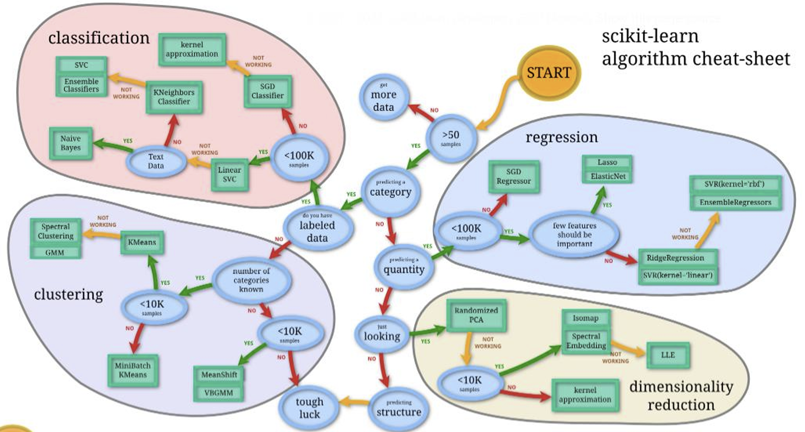

## Week 3 : Practical AI Applications & Computer Vision 第三周: 实用人工智能应用与计算机视觉

* Part 1: Practical AI Applications  
  第1部分: 实际人工智能应用
  * AI tools and frameworks: scikit-learn, TensorFlow, PyTorchAI   
    工具和框架: scikit-learn，TensorFlow，PyTorch
* Part 2: Computer Vision  
  第二部分: 计算机视觉

### Part 1: Practical AI Applications 第1部分: 实际人工智能应用

AI tools and frameworks: scikit-learn,TensorFlow, PyTorch

#### scikit-learn

##### use 使用

* Simple and efficient tools for predictive data analysis简单有效的预测性数据分析工具
  
  * Machine Learning methods机器学习方法
  * Data processing数据处理
  * Visualization可视化

* Accessible to everybody, and reusable in various contexts人人均可使用，并可在不同情况下重复使用
  
  * Documented API with lot’s of examples附有大量例子的 API 文件
  * Not bound to Training frameworks (e.g. Tensorflow, Pytorch)不受训练框架(例如 Tensorflow、 Pytch)约束
  * Building blocks for your data analysis数据分析的构建块

* Built on NumPy, SciPy, and matplotlib 基于 NumPy SciPy 和 matplotlib
  
  * No own data types (unlike Pandas)没有自己的数据类型(不像熊猫)
  * Benefit from NumPy and SciPy optimizations从 NumPy 和 SciPy 优化中获益
  * Extends the most common visualisation tool扩展最常用的可视化工具

* Open source, commercially usable开源，商用

##### Tools of scikit-learn 科学的工具

* Classification: 分类
  
  * Support Vector Machines (SVM) 支持向量机
  * Nearest Neighbors 近邻
  * Random Forest 随机森林

* Regression: 回归
  
  * Support Vector Regression (SVR)  支持向量回归
  * Nearest Neighbors  最近邻
  * Random Forest  随机森林

* Clustering: 聚类
  
  * k-Means
  * Spectral Clustering 谱聚类
  * Mean-Shift

* Dimensionality reduction: 降维
  
  * Principal Component Analysis (PCA)  主成分分析
  * Feature Selection  特征选择
  * non-Negative Matrix Factorization  非负矩阵分解

* Model selection: 模型选择
  
  * Grid Search  网格搜索
  * Cross Validation  交叉验证

* Pre-Processing: 预处理
  
  * Conversion 转换
  * Normalization  正则化
  * Feature Extraction  特征提取

##### User Guid  使用说明

The User Guide can be found https://scikit-learn.org/stable/user_guide.html

##### Choosing the Right Estimator  选择正确的评估者

##### Programming Model

* Builds on NumPy, SciPy and matplotlib:  
  基于 NumPy，SciPy 和 matplotlib:
  
  * Avoids conversion of data types  
    避免转换数据类型
  
  * Can be integrated seamlessly, even with TensorFlow and PyTorch  
    可以无缝集成，甚至与 TensorFlow 和 PyTorch
  
  * Benefits from performance optimizations of BLAS, FFT, etc. optimizations  
     BLAS、 FFT 等性能优化的好处

* scikit-learn available as Python module  
  Scikit-learn 作为 Python 模块提供

* Typical input (n samples, n features), but others are also possible  
  典型的输入(n 个示例，n 个特性) ，但也可能有其他的输入

##### Regression Example: Random Forest  回归示例: 随机森林

- Ensemble of decision trees   
  决策树集合

- Perturb-and-combine technique applied to trees   
  干扰与组合技术在树木上的应用

- Considers diverse set of classifiers   
  考虑不同的分类器集合

- Randomization is achieved by selection of different classifiers  
  随机化是通过选择不同的分类器来实现的

- Prediction is majority vote or average over all trees  
  预测是所有树木的多数票或平均数

- Easily extends to multi-output problems  
  容易扩展到多输出问题

##### Dimensionality Reduction Example: PCA  降维例子: PCA

- Principal Component Analysis (PCA):   
  主成分分析
  
  - Batched PCA   
    批量 PCA
  
  - Mini-batch like Incremental PCA   
    像增量 PCA 这样的小批量生产
  
  - PCA with randomized Singular Value   
    具有随机奇异值的主成分分析
  
  - Decomposition (svd solver=’randomized’)   
    分解(svd 解 =’随机’)
  
  - Kernel based PCA Kernel PCA   
    基于核的主成分分析

- For some methods PCA might be a pre-requisite, e.g. SVM, K-Means  
  对于某些方法，主成分分析(PCA)可能是先决条件，例如支持向量机(SVM)、 K 均值(K-Means)

- Note that PCA looses information!  
  注意 PCA 会丢失信息！

#### How do we express machine learning models?  我们如何表达机器学习模型？

##### New data structure: Tensor  新的数据结构: 张量

**In deep learning frameworks, they use specialized data structure called Tensor.**  
**在深度学习框架中，他们使用名为 Tensor 的专用数据结构。**

##### GPU is important!

**Deep learning relies on GPUs  深度学习依赖于 GPU** 

| Category                   | CPU (Central Processing Unit)                                                                              | GPU (Graphics Processing Unit)                                                                                             |
| -------------------------- | ---------------------------------------------------------------------------------------------------------- | -------------------------------------------------------------------------------------------------------------------------- |
| **Composition unit**       | Arithmetic logic unit, control unit, cache                                                                 | Arithmetic logic unit, control unit, cache                                                                                 |
| **Composition proportion** | 25% arithmetic logic unit                                                                                  | 90% arithmetic logic unit                                                                                                  |
|                            | 25% control unit                                                                                           | 5% control unit                                                                                                            |
|                            | 50% cache                                                                                                  | 5% cache                                                                                                                   |
| **Applicable scenarios**   | Occasions requiring complex logic control such as weapons, equipment, and information technology           | Cryptography, mining, graphics and other occasions that require parallel computing, no dependency, and mutual independence |
| **Energy consumption**     | Less, because there are only a few computing units (4 in the figure), no separate computer fan is required | More, a large number of computing units often need separate fans                                                           |

| 类别       | CPU（中央处理器）                         | GPU（图形处理器）                     |
| -------- | ---------------------------------- | ------------------------------ |
| **组成单元** | 算术逻辑单元、控制单元、缓存                     | 算术逻辑单元、控制单元、缓存                 |
| **组成比例** | 25% 算术逻辑单元                         | 90% 算术逻辑单元                     |
|          | 25% 控制单元                           | 5% 控制单元                        |
|          | 50% 缓存                             | 5% 缓存                          |
| **适用场景** | 需要复杂逻辑控制的场景，如武器、设备和信息技术            | 密码学、挖矿、图形处理等需要并行计算的场景，无依赖和相互独立 |
| **能耗**   | 较低，因为计算单元较少（如图中显示为 4 个），无需单独的计算机风扇 | 较高，因为大量的计算单元通常需要单独的风扇          |

#### TensorFlow 1.x/2.x

- An open-source Deep Learning library:   
  一个开源的深度学习图书馆:
  
  - 1,800 contributors worldwide   
    全世界1800名捐助者
  
  - Apache 2.0 license   
    Apache 2.0许可证
  
  - Released by Google in 2015   
    谷歌于2015年发布

- TensorFlow 2.0 
  
  - Easier to learn and use   
    更容易学习和使用
  
  - For beginners and experts  
    适合初学者和专家

##### Training Workflow

1. **Data Ingestion and Transformation  数据摄取和转换**
   
   * tf.data
   * Feature Columns  

2. **Model Building**
   
   * Keras
   * Premade Estimators
   * Custom

3. **Training**
   
   * Eager Execution
   * Autograph
   * Distribution Strategy
   * Tensorboard

4. **Saving**
   
   * SavedModel
     
     

1. **数据摄取与转换** 
   
   * tf.data
   * 特征列

2. **模型构建**
   
   * Keras
   * 预制估算器
   * 自定义

3. **训练**
   
   * 即时执行
   * 自动图（Autograph）
   * 分布式策略
   * Tensorboard

4. **保存**
   
   * SavedModel

##### Programming Model  规划模型

- Express a numeric computation as a graph:   
  以图形表示数值计算:
  
  - Graph nodes are operations which have any number of inputs and outputs  
    图形节点是具有任意数量的输入和输出的操作
  
  - Graph edges are tensors which flow between nodes  
    图的边是在节点之间流动的张量
  
  $$
  * h_i = \text{ReLU}(Wx + b)\\

\textbf{\textcolor{red}{Variables 变量}} \text{ are stateful nodes which output their current value.}\\

\textbf{\textcolor{red}{Placeholders 占位符}} \text{ are nodes whose value is fed in at execution time.}\\

\textbf{\textcolor{red}{Mathematical operations 数学操作符}} \text{ : MatMul, Add, ReLU}
  $$

- Differences between static graph and dynamic graph   
  静态图与动态图的区别
  
  - TensorFlow 1.x: static computation graph (Session)   
    TensorFlow 1.x: 静态计算图(Session)
  
  - TensorFlow 2.x: Dynamic graph  
    TensorFlow 2.x: 动态图
  
  | Features                     | Static Graph                                     | Dynamic Graph                                                 |
  | ---------------------------- | ------------------------------------------------ | ------------------------------------------------------------- |
  | **Get intermediate results** | No                                               | Yes                                                           |
  | **Code debugging**           | Hard                                             | Easy                                                          |
  | **Control Method**           | Specific syntax                                  | Front-end language syntax                                     |
  | **Performance**              | More optimization strategies, better performance | The graph optimization is limited and the performance is poor |
  | **Memory usage**             | Low                                              | Large                                                         |
  | **Direct deployment**        | Yes                                              | No                                                            |
  
  | 特性         | 静态图          | 动态图        |
  | ---------- | ------------ | ---------- |
  | **获取中间结果** | 否            | 是          |
  | **代码调试**   | 困难           | 简单         |
  | **控制方法**   | 特定语法         | 前端语言语法     |
  | **性能**     | 更多的优化策略，性能更好 | 图优化有限，性能较差 |
  | **内存使用**   | 低            | 高          |
  | **直接部署**   | 是            | 否          |

#### Pytorch

- Open-source machine learning library   
  开源机器学习库

- Developed by Facebook's AI Research lab   
  由 Facebook 的人工智能研究实验室开发

- It leverages the power of GPUs   
  它利用了 GPU 的力量

- Automatic computation of gradients   
  自动计算梯度

- Makes it easier to test and develop new ideas.  
  更容易测试和开发新想法

##### Why PyTorch?

- It is pythonic - concise, close to Python conventions   
  它是 pythonic 式的简洁，接近于 Python 约定

- Autograd - automatic differentiation   
  Autograd 自动微分

- Many algorithms and components are already implemented  
  已经实现了许多算法和组件

#### TensorFlow vs PyTorch

| Feature          | TensorFlow                                                                                                                                                                                                                             | PyTorch                                                                                                                                                                                                         |
| ---------------- | -------------------------------------------------------------------------------------------------------------------------------------------------------------------------------------------------------------------------------------- | --------------------------------------------------------------------------------------------------------------------------------------------------------------------------------------------------------------- |
| Description      | Written in C++ and is, as a result, very fast and efficient.  用C++编写，因此非常快速和高效。                                                                                                                                                    | Written in Python making it more accessible and flattening the learning curve. However, the C++ core means PyTorch is still quite fast.   用Python编写，使其更易于访问并降低学习曲线。然而，C++内核确保了PyTorch仍然非常快。                 |
| Feature Rich     | Feature rich; TensorFlow can be used for training data as well as for inference. 功能丰富；TensorFlow可以用于训练数据和推理。                                                                                                                       | Very flexible; as data size can also be changed during data training.   非常灵活；数据大小在训练过程中也可以改变。                                                                                                               |
| Documentation    | Very good documentation; TensorFlow has many users and a big community which has led to strong documentation.   文档质量很好；TensorFlow拥有许多用户和一个庞大的社区，这使得文档内容非常完善。                                                                       | Popular at research level; PyTorch was by far the most talked about ML library at CVPR, one of the most important computer vision conferences. 在研究领域中非常受欢迎；PyTorch是CVPR上讨论最多的机器学习库之一，而CVPR是最重要的计算机视觉会议之一。   |
| Popularity       | High popularity; TensorFlow has established itself as the most used ML library over a number of years now.   高人气；多年来，TensorFlow已成为使用最广泛的机器学习库。                                                                                     | Rapid growth in popularity in both business and research use cases.   在商业和研究场景中都迅速增长的受欢迎程度。                                                                                                                 |
| APIs             | Many APIs available; TensorFlow is a library with a rich choice of easy-to-use APIs.   提供许多API；TensorFlow是一个提供丰富且易于使用的API库。                                                                                                        | Many libraries available; PyTorch is composed of multiple libraries and platforms.   提供许多库；PyTorch由多个库和平台组成。                                                                                                |
| Language Support | Supports JavaScript; TensorFlow supports JavaScript, C++ and Java in addition to Python.   支持JavaScript；除了Python之外，TensorFlow还支持JavaScript、C++和Java。                                                                               | Python-based; PyTorch allows developers to write code in Python.   基于Python；PyTorch允许开发者使用Python编写代码。                                                                                                       |
| Mobile & IoT     | For Mobile & IoT, inferences can be performed with TensorFlow Lite on mobile devices such as Android or iOS, as well as on Edge TPU or Raspberry Pi.   对于移动和物联网设备，可以使用TensorFlow Lite在诸如Android或iOS的移动设备上进行推理，也可以在Edge TPU或树莓派上运行。 | PyTorch API; the PyTorch API is often preferred as it is better designed - plus TensorFlow has historically changed their API frequently.   PyTorch API；PyTorch的API通常更受欢迎，因为它设计更合理，而TensorFlow的API在历史上频繁变更。 |

### Part 2: Computer Vision

- Computer Vision Basics   
  计算机视觉基础

- Basic Operations & Concepts   
  基本操作及概念

- Image Classification  
  图像分类

- Semantic Segmentation  
  语义分割

- Object Recognition  
  物体识别

#### Computer Vision Basics

##### Brief History of Computer Vision  计算机视觉简史

- 1966: Minsky assigns computer vision as an undergrad summer project  
  1966年，明斯基将计算机视觉作为本科生的暑期课题 

- 1960’s: interpretation of synthetic worlds   
  20世纪60年代: 对合成世界的诠释

- 1970’s: some progress on interpreting selected images  
  1970年代: 在解释选定图像方面取得的一些进展

- 1980’s: ANNs come and go; shift toward geometry mathematical rigor and increased   
  20世纪80年代: 人工神经网络来了又去; 转向几何数学的严格性和增加

- 1990’s: face recognition; statistical analysis in vogue   
  20世纪90年代: 人脸识别; 流行的统计分析

- 2000’s: broader recognition; large annotated datasets available; video processing starts  
  2000年代: 更广泛的认知; 提供大型注释数据集; 开始视频处理

- 2010’s: resurgence of deep learning  
  2010年: 深度学习的复苏
  
  - [AlexNet NIPS2012]
  
  - [DeepFace CVPR2014]
  
  - [DeepPose CVPR2014]
  
  - [Show, Attend and Tell ICML 2015]

- 2030’s: robot uprising?  
  2030年: 机器人起义？

##### Human Vision

##### Computer Vision

##### Computer Vision-Image  计算机视觉-图像
