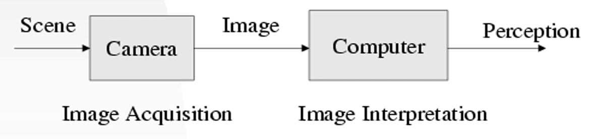
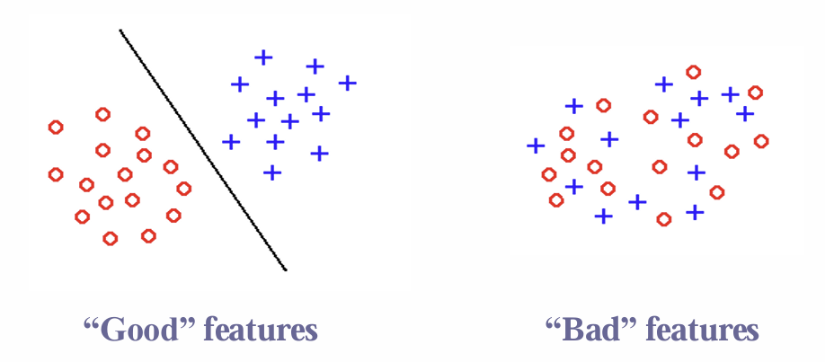
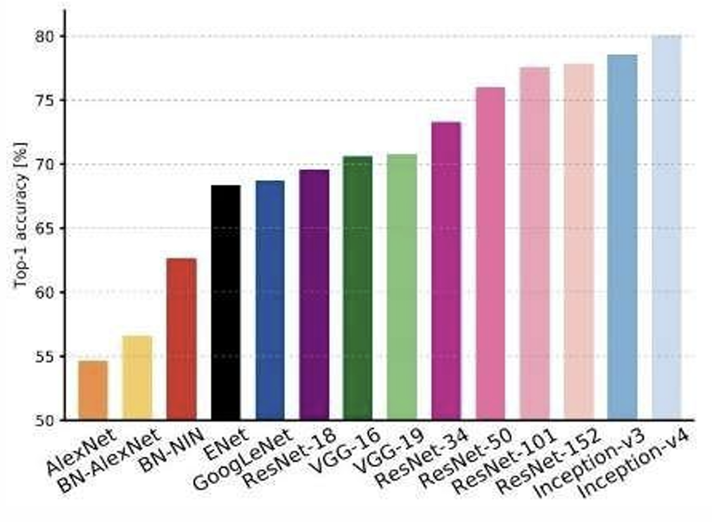
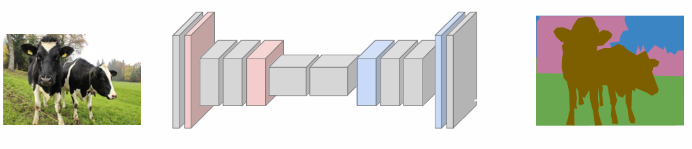
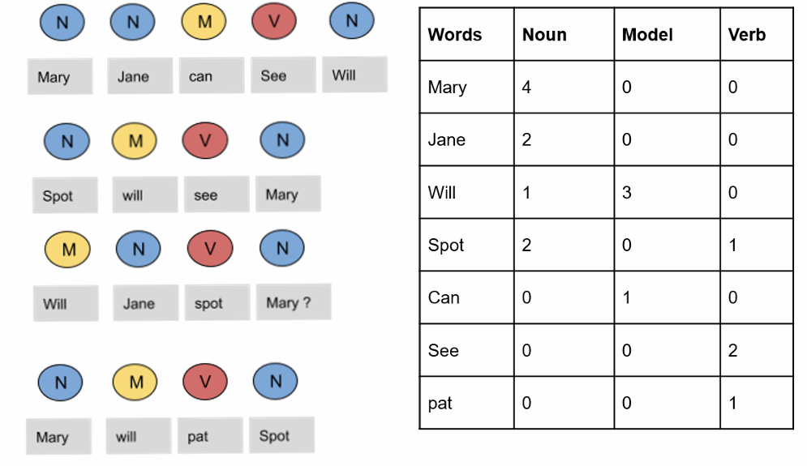
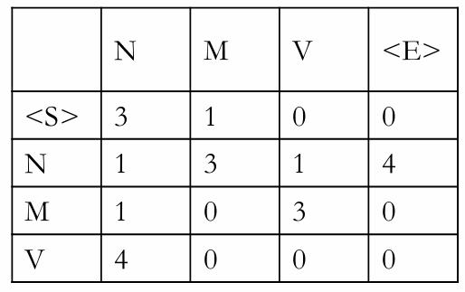
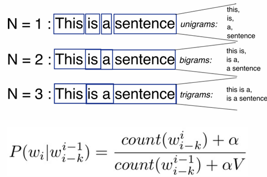

## Week 3 : Practical AI Applications & Computer Vision 第三周: 实用人工智能应用与计算机视觉

* Part 1: Practical AI Applications  
  第1部分: 实际人工智能应用
  * AI tools and frameworks: scikit-learn, TensorFlow, PyTorchAI   
    工具和框架: scikit-learn，TensorFlow，PyTorch
* Part 2: Computer Vision  
  第二部分: 计算机视觉

### Part 1: Practical AI Applications 第1部分: 实际人工智能应用

AI tools and frameworks: scikit-learn,TensorFlow, PyTorch

#### scikit-learn

##### use 使用

* Simple and efficient tools for predictive data analysis简单有效的预测性数据分析工具
  
  * Machine Learning methods机器学习方法
  * Data processing数据处理
  * Visualization可视化

* Accessible to everybody, and reusable in various contexts人人均可使用，并可在不同情况下重复使用
  
  * Documented API with lot’s of examples附有大量例子的 API 文件
  * Not bound to Training frameworks (e.g. Tensorflow, Pytorch)不受训练框架(例如 Tensorflow、 Pytch)约束
  * Building blocks for your data analysis数据分析的构建块

* Built on NumPy, SciPy, and matplotlib 基于 NumPy SciPy 和 matplotlib
  
  * No own data types (unlike Pandas)没有自己的数据类型(不像熊猫)
  * Benefit from NumPy and SciPy optimizations从 NumPy 和 SciPy 优化中获益
  * Extends the most common visualisation tool扩展最常用的可视化工具

* Open source, commercially usable开源，商用

##### Tools of scikit-learn 科学的工具

* Classification: 分类
  
  * Support Vector Machines (SVM) 支持向量机
  * Nearest Neighbors 近邻
  * Random Forest 随机森林

* Regression: 回归
  
  * Support Vector Regression (SVR)  支持向量回归
  * Nearest Neighbors  最近邻
  * Random Forest  随机森林

* Clustering: 聚类
  
  * k-Means
  * Spectral Clustering 谱聚类
  * Mean-Shift

* Dimensionality reduction: 降维
  
  * Principal Component Analysis (PCA)  主成分分析
  * Feature Selection  特征选择
  * non-Negative Matrix Factorization  非负矩阵分解

* Model selection: 模型选择
  
  * Grid Search  网格搜索
  * Cross Validation  交叉验证

* Pre-Processing: 预处理
  
  * Conversion 转换
  * Normalization  正则化
  * Feature Extraction  特征提取

##### User Guid  使用说明

The User Guide can be found https://scikit-learn.org/stable/user_guide.html

##### Choosing the Right Estimator  选择正确的评估者


##### Programming Model

* Builds on NumPy, SciPy and matplotlib:  
  基于 NumPy，SciPy 和 matplotlib:
  
  * Avoids conversion of data types  
    避免转换数据类型
  
  * Can be integrated seamlessly, even with TensorFlow and PyTorch  
    可以无缝集成，甚至与 TensorFlow 和 PyTorch
  
  * Benefits from performance optimizations of BLAS, FFT, etc. optimizations  
     BLAS、 FFT 等性能优化的好处

* scikit-learn available as Python module  
  Scikit-learn 作为 Python 模块提供

* Typical input (n samples, n features), but others are also possible  
  典型的输入(n 个示例，n 个特性) ，但也可能有其他的输入

##### Regression Example: Random Forest  回归示例: 随机森林

- Ensemble of decision trees   
  决策树集合

- Perturb-and-combine technique applied to trees   
  干扰与组合技术在树木上的应用

- Considers diverse set of classifiers   
  考虑不同的分类器集合

- Randomization is achieved by selection of different classifiers  
  随机化是通过选择不同的分类器来实现的

- Prediction is majority vote or average over all trees  
  预测是所有树木的多数票或平均数

- Easily extends to multi-output problems  
  容易扩展到多输出问题

##### Dimensionality Reduction Example: PCA  降维例子: PCA

- Principal Component Analysis (PCA):   
  主成分分析
  
  - Batched PCA   
    批量 PCA
  
  - Mini-batch like Incremental PCA   
    像增量 PCA 这样的小批量生产
  
  - PCA with randomized Singular Value   
    具有随机奇异值的主成分分析
  
  - Decomposition (svd solver=’randomized’)   
    分解(svd 解 =’随机’)
  
  - Kernel based PCA Kernel PCA   
    基于核的主成分分析

- For some methods PCA might be a pre-requisite, e.g. SVM, K-Means  
  对于某些方法，主成分分析(PCA)可能是先决条件，例如支持向量机(SVM)、 K 均值(K-Means)

- Note that PCA looses information!  
  注意 PCA 会丢失信息！

#### How do we express machine learning models?  我们如何表达机器学习模型？


##### New data structure: Tensor  新的数据结构: 张量

**In deep learning frameworks, they use specialized data structure called Tensor.**  
**在深度学习框架中，他们使用名为 Tensor 的专用数据结构。**


##### GPU is important!

**Deep learning relies on GPUs  深度学习依赖于 GPU** 

| Category                   | CPU (Central Processing Unit)                                                                              | GPU (Graphics Processing Unit)                                                                                             |
| -------------------------- | ---------------------------------------------------------------------------------------------------------- | -------------------------------------------------------------------------------------------------------------------------- |
| **Composition unit**       | Arithmetic logic unit, control unit, cache                                                                 | Arithmetic logic unit, control unit, cache                                                                                 |
| **Composition proportion** | 25% arithmetic logic unit                                                                                  | 90% arithmetic logic unit                                                                                                  |
|                            | 25% control unit                                                                                           | 5% control unit                                                                                                            |
|                            | 50% cache                                                                                                  | 5% cache                                                                                                                   |
| **Applicable scenarios**   | Occasions requiring complex logic control such as weapons, equipment, and information technology           | Cryptography, mining, graphics and other occasions that require parallel computing, no dependency, and mutual independence |
| **Energy consumption**     | Less, because there are only a few computing units (4 in the figure), no separate computer fan is required | More, a large number of computing units often need separate fans                                                           |

| 类别       | CPU（中央处理器）                         | GPU（图形处理器）                     |
| -------- | ---------------------------------- | ------------------------------ |
| **组成单元** | 算术逻辑单元、控制单元、缓存                     | 算术逻辑单元、控制单元、缓存                 |
| **组成比例** | 25% 算术逻辑单元                         | 90% 算术逻辑单元                     |
|          | 25% 控制单元                           | 5% 控制单元                        |
|          | 50% 缓存                             | 5% 缓存                          |
| **适用场景** | 需要复杂逻辑控制的场景，如武器、设备和信息技术            | 密码学、挖矿、图形处理等需要并行计算的场景，无依赖和相互独立 |
| **能耗**   | 较低，因为计算单元较少（如图中显示为 4 个），无需单独的计算机风扇 | 较高，因为大量的计算单元通常需要单独的风扇          |

#### TensorFlow 1.x/2.x

- An open-source Deep Learning library:   
  一个开源的深度学习图书馆:
  
  - 1,800 contributors worldwide   
    全世界1800名捐助者
  
  - Apache 2.0 license   
    Apache 2.0许可证
  
  - Released by Google in 2015   
    谷歌于2015年发布

- TensorFlow 2.0 
  
  - Easier to learn and use   
    更容易学习和使用
  
  - For beginners and experts  
    适合初学者和专家


##### Training Workflow

1. **Data Ingestion and Transformation  数据摄取和转换**
   
   * tf.data
   * Feature Columns  

2. **Model Building**
   
   * Keras
   * Premade Estimators
   * Custom

3. **Training**
   
   * Eager Execution
   * Autograph
   * Distribution Strategy
   * Tensorboard

4. **Saving**
   
   * SavedModel
     
     

1. **数据摄取与转换** 
   
   * tf.data
   * 特征列

2. **模型构建**
   
   * Keras
   * 预制估算器
   * 自定义

3. **训练**
   
   * 即时执行
   * 自动图（Autograph）
   * 分布式策略
   * Tensorboard

4. **保存**
   
   * SavedModel

##### Programming Model  规划模型

- Express a numeric computation as a graph:   
  以图形表示数值计算:
  
  - Graph nodes are operations which have any number of inputs and outputs  
    图形节点是具有任意数量的输入和输出的操作
  
  - Graph edges are tensors which flow between nodes  
    图的边是在节点之间流动的张量
  
  $$
  * h_i = \text{ReLU}(Wx + b)\\
  
  \textbf{\textcolor{red}{Variables 变量}} \text{ are stateful nodes which output their current value.}\\
  
  \textbf{\textcolor{red}{Placeholders 占位符}} \text{ are nodes whose value is fed in at execution time.}\\
  
  \textbf{\textcolor{red}{Mathematical operations 数学操作符}} \text{ :    MatMul, Add, ReLU}
  $$
  
- Differences between static graph and dynamic graph   
  静态图与动态图的区别
  
  - TensorFlow 1.x: static computation graph (Session)   
    TensorFlow 1.x: 静态计算图(Session)
  
  - TensorFlow 2.x: Dynamic graph  
    TensorFlow 2.x: 动态图
  
  | Features                     | Static Graph                                     | Dynamic Graph                                                 |
  | ---------------------------- | ------------------------------------------------ | ------------------------------------------------------------- |
  | **Get intermediate results** | No                                               | Yes                                                           |
  | **Code debugging**           | Hard                                             | Easy                                                          |
  | **Control Method**           | Specific syntax                                  | Front-end language syntax                                     |
  | **Performance**              | More optimization strategies, better performance | The graph optimization is limited and the performance is poor |
  | **Memory usage**             | Low                                              | Large                                                         |
  | **Direct deployment**        | Yes                                              | No                                                            |
  
  | 特性         | 静态图          | 动态图        |
  | ---------- | ------------ | ---------- |
  | **获取中间结果** | 否            | 是          |
  | **代码调试**   | 困难           | 简单         |
  | **控制方法**   | 特定语法         | 前端语言语法     |
  | **性能**     | 更多的优化策略，性能更好 | 图优化有限，性能较差 |
  | **内存使用**   | 低            | 高          |
  | **直接部署**   | 是            | 否          |

#### Pytorch

- Open-source machine learning library   
  开源机器学习库

- Developed by Facebook's AI Research lab   
  由 Facebook 的人工智能研究实验室开发

- It leverages the power of GPUs   
  它利用了 GPU 的力量

- Automatic computation of gradients   
  自动计算梯度

- Makes it easier to test and develop new ideas.  
  更容易测试和开发新想法

##### Why PyTorch?

- It is pythonic - concise, close to Python conventions   
  它是 pythonic 式的简洁，接近于 Python 约定

- Autograd - automatic differentiation   
  Autograd 自动微分

- Many algorithms and components are already implemented  
  已经实现了许多算法和组件

#### TensorFlow vs PyTorch

| Feature          | TensorFlow                                                                                                                                                                                                                             | PyTorch                                                                                                                                                                                                         |
| ---------------- | -------------------------------------------------------------------------------------------------------------------------------------------------------------------------------------------------------------------------------------- | --------------------------------------------------------------------------------------------------------------------------------------------------------------------------------------------------------------- |
| Description      | Written in C++ and is, as a result, very fast and efficient. <br/>用C++编写，因此非常快速和高效。                                                                                                                                                    | Written in Python making it more accessible and flattening the learning curve. However, the C++ core means PyTorch is still quite fast.  <br/>用Python编写，使其更易于访问并降低学习曲线。然而，C++内核确保了PyTorch仍然非常快。                 |
| Feature Rich     | Feature rich; TensorFlow can be used for training data as well as for inference.<br/>功能丰富；TensorFlow可以用于训练数据和推理。                                                                                                                       | Very flexible; as data size can also be changed during data training.  <br/>非常灵活；数据大小在训练过程中也可以改变。                                                                                                               |
| Documentation    | Very good documentation; TensorFlow has many users and a big community which has led to strong documentation.  <br/>文档质量很好；TensorFlow拥有许多用户和一个庞大的社区，这使得文档内容非常完善。                                                                       | Popular at research level; PyTorch was by far the most talked about ML library at CVPR, one of the most important computer vision conferences.<br/>在研究领域中非常受欢迎；PyTorch是CVPR上讨论最多的机器学习库之一，而CVPR是最重要的计算机视觉会议之一。   |
| Popularity       | High popularity; TensorFlow has established itself as the most used ML library over a number of years now.  <br/>高人气；多年来，TensorFlow已成为使用最广泛的机器学习库。                                                                                     | Rapid growth in popularity in both business and research use cases.  <br/>在商业和研究场景中都迅速增长的受欢迎程度。                                                                                                                 |
| APIs             | Many APIs available; TensorFlow is a library with a rich choice of easy-to-use APIs.  <br/>提供许多API；TensorFlow是一个提供丰富且易于使用的API库。                                                                                                        | Many libraries available; PyTorch is composed of multiple libraries and platforms.  <br/>提供许多库；PyTorch由多个库和平台组成。                                                                                                |
| Language Support | Supports JavaScript; TensorFlow supports JavaScript, C++ and Java in addition to Python.  <br/>支持JavaScript；除了Python之外，TensorFlow还支持JavaScript、C++和Java。                                                                               | Python-based; PyTorch allows developers to write code in Python.  <br/>基于Python；PyTorch允许开发者使用Python编写代码。                                                                                                       |
| Mobile & IoT     | For Mobile & IoT, inferences can be performed with TensorFlow Lite on mobile devices such as Android or iOS, as well as on Edge TPU or Raspberry Pi.  <br/>对于移动和物联网设备，可以使用TensorFlow Lite在诸如Android或iOS的移动设备上进行推理，也可以在Edge TPU或树莓派上运行。 | PyTorch API; the PyTorch API is often preferred as it is better designed - plus TensorFlow has historically changed their API frequently.  <br/>PyTorch API；PyTorch的API通常更受欢迎，因为它设计更合理，而TensorFlow的API在历史上频繁变更。 |

### Part 2: Computer Vision

- Computer Vision Basics   
  计算机视觉基础

- Basic Operations & Concepts   
  基本操作及概念

- Image Classification  
  图像分类

- Semantic Segmentation  
  语义分割

- Object Recognition  
  物体识别

#### Computer Vision Basics

##### Brief History of Computer Vision  计算机视觉简史

- 1966: Minsky assigns computer vision as an undergrad summer project  
  1966年，明斯基将计算机视觉作为本科生的暑期课题 

- 1960’s: interpretation of synthetic worlds   
  20世纪60年代: 对合成世界的诠释

- 1970’s: some progress on interpreting selected images  
  1970年代: 在解释选定图像方面取得的一些进展

- 1980’s: ANNs come and go; shift toward geometry mathematical rigor and increased   
  20世纪80年代: 人工神经网络来了又去; 转向几何数学的严格性和增加

- 1990’s: face recognition; statistical analysis in vogue   
  20世纪90年代: 人脸识别; 流行的统计分析

- 2000’s: broader recognition; large annotated datasets available; video processing starts  
  2000年代: 更广泛的认知; 提供大型注释数据集; 开始视频处理

- 2010’s: resurgence of deep learning  
  2010年: 深度学习的复苏
  
  - [AlexNet NIPS2012]
  
  - [DeepFace CVPR2014]
  
  - [DeepPose CVPR2014]
  
  - [Show, Attend and Tell ICML 2015]

- 2030’s: robot uprising?  
  2030年: 机器人起义？

##### Human Vision


##### Computer Vision



##### Computer Vision-Image  计算机视觉-图像

-   An image is a **rectangular grid** of data of **light values**  
    图像是一个矩形的网格数据的光值
    -   Some small square boxes are know as **pixels**  
        一些小的正方形盒子被称为像素
    -   The dimension of the image is $X \times Y$ means  the number of pixels across the image’s  height(x) and width(y).   
        图像的维度是 $X \times Y $表示图像高度(x)和宽度(y)的像素数。
    -   **Pixel Values** denote the intensity of the pixels.  
        像素值表示像素的强度。
-   Colored Images Stored on a  Computer  
    存储在计算机上的彩色图像 
    -   Almost all colors can be generated  from the three primary colors – Red,  Green, and Blue.   
        几乎所有的颜色都可以从三原色-红色，绿色和蓝色产生。
    -   The computer reads this image as  $X \times Y \times Z$  
        计算机将该图像读取为 $X \times Y \times Z $ 
-   Pixel values can be…  
    像素值可以是...
    -   Binary  二进制的
    -   Gray scale  灰度值
    -   Color  颜色空间 (HDR using 32-bit floating-point values HDR使用32位浮点值 )
    -   Multimodal  多模式的  (Many different wavelengths (IR, UV, SAR, etc) 许多不同的波长(红外线、紫外线、合成孔径雷达等))

##### Main Goal of Computer Vision  计算机视觉的主要目标 

 Every picture tells a story!! **write computer programs that can interpret images**  
每张图片都讲述了一个故事! ! 编写可以解释图像的计算机程序

-   Make computers understand images and video.  
    使计算机理解图像和视频。
-   Create a training model  
    创建一个训练模型

-   Need for an algorithm that  can write the rules for us so  that  we don’t have to write it  by hand.  
    需要一个算法，可以为我们写的规则，使我们不必手写它。
-   Instead of creating object  models, hundreds of  thousands of  pictures were  collected from the internet  and an algorithm  was used.  
    没有创建物体模型，而是从互联网上收集了数十万张图片，并使用了一种算法。
    -   Convolutional Neural Network  
        卷积神经网络

##### Significance of Computer Vision  计算机视觉的重要性

-   Safety 安全
-   Content Creation  内容创作
-   Health  卫生
-   Augmented and  Virtual Reality  增强/虚拟现实
-   Security  安防
-   Search Engines  搜索引擎

##### Connections to other Disciplines  与其他学科的联系


##### Computer Vision Techniques  计算机视觉技术

-   No spatial extent  
    没有空间范围

    -   Classification  
        分类

        

-   No objects, just pixels  
    没有对象，只有像素 

    -   Semantic Segmentation  
        语义分割

        

-   Multiple Object  
    多目标

    -   Object Detection  
        目标检测

        

    -   Instance Segmentation  
        实例分割

        

#### Basic Operations & Concepts  基本操作及概念

##### Convolution 卷积

-   Problems in processing images with fully connected networks：  
    使用完全连接的网络处理图像时遇到的问题:
    -   Too many parameters in the weight matrix -> overfitting    
        权重矩阵中的参数太多-> 过度拟合
-   Convolutional neural network solution    
    卷积神经网络解决了
    -   Local correlation, parameter sharing  
        局部相关，参数共享

###### Basic properties of convolution  卷积的基本性质

-   **Kernel**: also known as receptive field, the sense of convolution  operation, intuitively understood as a filter matrix, commonly  used convolution kernel size of 3 × 3, 5 × 5 and so on;    
    内核: 又称接受域、感卷积运算，直观地理解为一个滤波器矩阵，常用的卷积内核大小为3 × 3、5 × 5等;
-   **Stride**: the pixels moved by the convolution kernel at each step  when traversing the feature map   
    步长: 在遍历特征映射时，卷积内核在每一步移动的像素
-   **Padding**: the way to deal with the boundary of the feature map.To fill the boundary (generally filled with 0), and then perform  the convolution operation, which will make the size of the  output feature map the same as the size of the input feature map;    
    填充: 处理特征映射边界的方法。填充边界(一般填充0) ，然后进行卷积运算，使输出特征映射的大小与输入特征映射的大小相同;
-   **Channel**: the number of channels (layers) of the convolution layer.  
    通道数: 卷积层的通道数(层数)。

###### Sliding window computation:  滑动窗口计算:


$$
a_{i,j} = w * x_{i,j} = \sum_{p=1}^{K} \sum_{q=1}^{K} w_{p,q} \cdot x_{i+p,j+q}
\\
w - \text{Filter kernel of size } K \times K \\
x - \text{Input}
$$

###### Zero padding 零填充

-   fix the problem of the output size does  not match the input size  
    解决输出大小与输入大小不匹配的问题

    

-   can change the output size  
    可以改变输出大小

    

-    No padding:  

    -   output size =$\frac{N-F}{stride+1} $

-   Padding： 

    -   output size =$\frac{N+padding^2-F}{stride+1}$

-   

######  Various types of convolution  各种类型的卷积

1.  The standard convolution   
    标准卷积

    1.  2D Convolution: the single channel version  
        2 D 卷积: 单通道版本

        

    2.  2D Convolution: the multi channel version  
        2D 卷积: 多通道版本

        The results of the convolution of the  three channels are then combined  (generally using element-wise  summation  
        然后将三个通道的卷积结果进行组合(一般采用元素求和法)

        

    3.  3D Convolution  
        3D 卷积

        Convolution has three dimensions  (height, width, and channel) and slides  along the 3 directions of the input  image and finally outputs a 3D result  
        卷积有三个维度(高度、宽度和通道) ，并沿着输入图像的三个方向滑动，最终输出三维结果

        

    4.  1 x 1 Convolution  
        1 x 1卷积

        Convolution when the size of the  convolution kernel is 1x1, i.e., the  convolution kernel becomes only one  number  
        当卷积内核的大小为1x1时，即卷积内核只变成一个数

        

2.   Deconvolution / Transposed Convolution (上采样)  
    反卷积/转位卷积

    Equivalent to a transposition computation after converting a  convolution kernel to a sparse matrix  
    等效于将卷积核转换为稀疏矩阵后的换位计算 

    1.   a 3x3 convolution kernel with a  step size of 1 and fully 0-filled  boundaries is applied to a 2x2  input image to perform the  transposed convolution  computation  
        将步长为1且充满0边界的3x3卷积核应用于2x2输入图像以进行转置卷积计算
    2.   the size of the output image after  up-sampling is 4x4  
        上采样后的输出图像尺寸为4x4

    

3.  Dilated Convolution / Atrous Convolution  扩张卷积/心房卷积

    1.  To expand the receptive field, the kernel is "inflated" by inserting spaces  between elements inside the convolutional kernel to form a "null  convolution" (or inflated convolution), and the kernel to be expanded is  indicated by the expansion rate parameter L, i.e., L-1 spaces are inserted  between the kernel elements .   
        为了扩展接受域，内核通过在卷积内核中的元素之间插入空格来“膨胀”，形成一个“零卷积”(或者膨胀卷积) ，并且要扩展的内核由扩展速率参数 L 表示，也就是说，在内核元素之间插入 L-1空格。
    2.  When L=1, then no spaces  are  inserted  between  kernel  elements, and it becomes a  standard convolution.  
        当 L = 1时，内核元素之间没有插入空格，它就成为标准卷积。

    

##### Pool 池化层

Pooling is used for regions of the image that do not overlap  (this is different from the convolution operation)  
池用于图像中不重叠的区域(这与卷积操作不同)


-   average & Max

##### Flatten 铺平层（扁平化）

Flatten refers to the process of taking the two-dimensional  feature maps produced by the convolution and pooling  layers and transforming them into a one-dimensional vector.  
扁平化是指将卷积层和汇聚层生成的二维特征映射转化为一维矢量的过程。

    

-   后面继续有 Fully Connected & Dropout

##### Normalization 正则化

Normalization techniques in Convolutional Neural  Networks (CNNs) are crucial for improving training  stability, accelerating convergence, and achieving better  generalization.   
卷积神经网络中的归一化技术对于提高训练稳定性、加速收敛和实现更好的泛化是至关重要的。


##### Feature extraction  特征提取

-    Task: to extract features which are good for classification.  
    任务: 提取有利于分类的特征。

    -   Good features:    
        好的特征

        -   Objects from the same class have similar feature values.  
            来自同一类的对象具有相似的特征值。

        -   Objects from different classes have different values.  
            来自不同类的对象具有不同的值。

            

-  The general process 整体过程

   ```mermaid
   flowchart LR
       A[Object] -->|Feature extraction| B[Pattern]
       B -->|Classification| C[Class / Category]
       B --> C2[Class / Category]
       B --> C3[Class / Category]
       B --> C4[...]
   ```
   
    
   
   ```mermaid
   flowchart LR
       A[对象] -->|特征提取| B[模式]
       B -->|分类| C[类别 / 类]
       B --> C2[类别 / 类]
       B --> C3[类别 / 类]
       B --> C4[...]
   ```
   
   -   Feature is a scalar x which is quantitatively describes a property of the Object.   
       特征是一个标量 x，它定量描述对象的一个属性。
   -   A pattern is represented by a set of N features,  or attributes, viewed as a N dimensional  feature vector.   
       模式由一组 N 个特征或属性表示，这些特征或属性被视为 N 维特征向量。
   -   Class is a set of patterns that share some common properties.  
       类是一组共享某些公共属性的模式。
   -   Classification is a mathematical function or  algorithm which assigns a feature to  one  of the classes.  
       分类是一种数学函数或算法，它为一个类赋予一个特征。
   

#### Image Classification 图像分类

Given a set of pixels determine the category of image  
给定一组像素确定图像的类别

-   Steps to build a computer vision model  
    建立计算机视觉模型的步骤

    1.  Data collection  
        数据收集

        Collect all possible data that is related to the goal of the model  
        收集与模型目标相关的所有可能的数据

    2.  Data cleaning  
        数据清理

        Filter the collected data and remove unclear pictures  
        筛选收集的数据并删除不清晰的图片

    3.   Data preparation   
        数据准备

        Resize all the pictures to one common size  
        将所有图片调整到同一大小

    4.  Build and train the model   
        建立和训练模型

        Start coding  
        开始编码

##### Traditional Pattern Recognition  传统模式识别


##### Deep Learning based Image Classification  基于深度学习的图像分类


-   Cascade of non-linear transformations     
    非线性变换级联
-   End to end learning    
    端对端
-   General framework (any hierarchical model is deep)  
    普适性框架(任何层次模型都是深层次的)

##### Deep Learning Network 深度学习网络


-   Why do we need many layers ?  
    为什么我们需要很多层？
-   When input has hierarchical structure, the use of a hierarchical architecture is potentially more efficient because   intermediate computations can be re-used. DL architectures are efficient also because they use **distributed representations** which are shared across classes.  
    当输入具有层次结构时，层次结构的使用可能更有效，因为可以重用中间计算。DL 体系结构之所以高效，还因为它们使用跨类共享的分布式表示。


-   distributed representations  分布式表示
-   feature sharing  特征共享
-   compositionality  组合性

##### The popular networks  流行网络

-   Classification
    -    LeNetModel 
    -   AlexNet Model 
    -   VGGModel 
    -   ResNet
    -   YOLO9000
    -   DenseNet

###### ImageNet 

-   ImageNet Classification error

    

-   Performance: Imagenet Data

    

-   Size Chart

    

###### AlexNet 2012


| What was the state before? <br />以前是什么状态？ | What was novel? <br />什么是新奇的                           | What was the state after? <br />之后呢？                     | What were the lessons learned? <br />从中学到了什么？        |
| :------------------------------------------------ | ------------------------------------------------------------ | ------------------------------------------------------------ | ------------------------------------------------------------ |
| Small networks <br />小型网络                     | ReLU for non-linearity ReLU  <br />激活对于非线性数据        | It worked well! <br />效果很好                               | Neural Networks were now ready for prime time. <br />神经网络已经准备好进入黄金时段 |
| Few applications <br />很少的应用                 | Local Response Normalization <br />局部响应归一化            | Shot heard around the world <br />全世界都听到了枪声         | Could do useful tasks. <br />可以做些有用的工作              |
|                                                   | Dropout regularization <br />丢弃正则化                      | A revolution was underway <br />革命正在进行                 |                                                              |
|                                                   | Max-pooling as an alternative to average pooling <br />作为平均池的替代方案的最大池 | CNNs had arrived <br />CNN 来了                              |                                                              |
|                                                   | GPU training <br />GPU 培训                                  | Specialized hardware use <br />专用硬件                      |                                                              |
|                                                   | Much larger network <br />更大的网络                         | Many more applications <br />还有更多应用                    |                                                              |
|                                                   |                                                              | “Deep Learning” interest rapidly increased <br /> “深度学习”的兴趣迅速增加 |                                                              |

######  VGGNET -2014


| What was the state before? 以前是什么状态？                  | What was novel? 什么是新奇的                                 | What was the state after? 之后呢？                           | What were the lessons learned? 从中学到了什么？              |
| ------------------------------------------------------------ | ------------------------------------------------------------ | ------------------------------------------------------------ | ------------------------------------------------------------ |
| AlexNet “deep” CNN not deep enough nor wide enough <br />AlexNet 的“深”CNN不够深也不够宽 | Much smaller 3x3 filters <br />更小的 3x3 滤波器             | Worked extremely well! <br />效果极佳                        | The depth of a network is a critical component to accuracy. <br />网络深度对精度至关重要 |
|                                                              | Multiple 3x3 filters within each layer <br />每层内多个 3x3 滤波器 | Pushed the envelope on model size <br />推动了模型规模的极限 | But, big networks are expensive to train and slow to evaluate. <br />大型网络训练成本高，评估速度慢 |
|                                                              | Resulted in a huge network <br />导致了一个庞大的网络        |                                                              |                                                              |

###### ResNet - 2015

-   Vanishing/Exploding Gradients  消失/爆炸梯度

    -   Operation --- multiplying n of these small / large numbers to compute  gradients of the “front”  layers in an n-layer network   
        运算——-将这些小/大数乘以 n，以计算 n 层网络中“前”层的梯度

    -   When the network is deep, multiplying n of these small numbers will  become zero (vanished).     
        当网络很深时，这些小数的 n 乘以将变为零(消失)。

    -   When the network is deep, multiplying n of these large numbers will  become too large (exploded).  
        当网络很深时，这些大数乘以 n 会变得太大(爆炸)。


-   ResNet


| What was the state before? <br />以前是什么状态？            | What was novel? <br />什么是新奇的                           | What was the state after? <br />之后呢？             | What were the lessons learned? <br />从中学到了什么？        |
| ------------------------------------------------------------ | ------------------------------------------------------------ | ---------------------------------------------------- | ------------------------------------------------------------ |
| Ultra-Deep networks still suffered from vanishing gradient problem <br />超深网络仍然存在梯度消失问题 | Fewer filters reduce computational complexity & number of parameters for the same depth <br />较少的滤波器降低了相同深度的计算复杂性和参数数量 | Sizeable jump in number of layers <br />层数显著增加 | Behaves like an ensemble of shallow networks <br />表现得像浅层网络的集合 |
|                                                              | "The Residual Block" adds bypass to avoid dead units <br />“残差块”添加旁路以避免死单元 | Prize-winner...again <br />再次获奖                  | Plausible model for biological visual cortex <br />生物视觉皮层的合理模型 |
|                                                              | Bypassed TWO layers! <br />绕过了两层！                      |                                                      |                                                              |
|                                                              | Combine serial & parallel units <br />结合串行和并行单元     |                                                      |                                                              |

##### Performance Metrics   表现度量标准

-   True Positive--- Number of observations that model  correctly  predicts the positive class   
    真正的正值——-模型正确预测正值类的观察值的数量
-   False Positive --- Number of observations where  model incorrectly predicts the positive class.  
    假正值——-模型错误地预测正值类的观察值的数目。
-   False Negatives --- Number of observations  where model  incorrectly predicts the negative  class.  
    错误的否定——模型错误地预测否定类的观察数量。
-   True Negatives --- Number of observations  where model  correctly predicts the negative  class  
    真正的负数——模型正确预测负数类的观测数量


-   **Precision** : TP/(TP+FP) --- what percentage of the  positive class is actually positive?  
    精确度: TP/(TP + FP)——正类实际上是正类的百分比是多少？
    $$
    \text{Precision: } \frac{TP}{TP+FP}
    $$
    
-   **Recall** : TP/(TP+FN) --- what percentage of the  positive class gets captured by the model?  
    Recall: TP/(TP + FN)——-模型捕获正类的百分比是多少？
    $$
    \text{Recall: } \frac{TP}{TP+FN}
    $$
    
-   **Accuracy**: (TP+TN)/(TP+FP+TN+FN) --- what  percentage of  predictions are correct?  
    准确度: (TP + TN)/(TP + FP + TN + FN)——预测正确率是多少？
    $$
    \text{Precision: } \frac{TP + TN}{TP + FP + TN + FN}
    $$
    

---

| 实际状态\预测状态                  | 预测为垃圾邮件 (Predicted Spam) | 预测为非垃圾邮件 (Predicted Not Spam) |
| ---------------------------------- | ------------------------------- | ------------------------------------- |
| 实际为垃圾邮件 (Actual Spam)       | 真正例 (TP)                     | 假负例 (FN)                           |
| 实际为非垃圾邮件 (Actual Not Spam) | 假正例 (FP)                     | 真负例 (TN)                           |

---

##### Confusion Matrix  混淆矩阵

在机器学习和统计学中，用于评估分类模型性能的矩阵。它显示了模型预测结果与实际标签之间的对应关系，可以用于计算准确率、召回率、精确率等指标。

-   Good for checking where  your  model is incorrect    
    有助于检查你的模型哪里不正确
-   For multi-class classification  it  reflects which classes are correlated  
    对于多类分类，它反映了哪些类是相关的

##### Thresholding  阈值转换法

-   In a binary classification if you choose randomly the probability  of belonging to a class is 0.5  
    在二进制分类中，如果你随机选择属于一个类的概率是0.5


以覆盖率为代价提高正确结果的百分比是可能的。

##### Summary

-   Enormous advances have been made in   Computer Vision in the past decade  using  Deep Learning.  
    在过去的十年中，利用深度学习在计算机视觉方面取得了巨大的进步。
-   State of the art pre-trained DL models  are best  suited for most projects.  
    最先进的预先训练的 DL 模型最适合大多数项目。
    -   Easy to use Codes are readily available    
        易于使用的代码随时可用
    -   High Performance models can be built  with **good Training Data.**  
        高性能模型可以建立良好的培训数据。
-   Success of a project is related to  measuring  defining and measuring  metrics correctly.  
    项目的成功与度量定义和度量指标的正确性有关。
-   Programing frameworks such as  Pytorch and  Keras abstract details and  are useful to build  models fast.  
    编程框架(如 Pytorch 和 Kera)抽象细节，对于快速构建模型非常有用。

#### Semantic Segmentation  语义分割

##### Image segmentation  图像分割

-   Do stereoscopic processing, detect motion, or recognize objects   
    进行立体处理、检测运动或识别物体
-   Segmentation is the process of breaking an image into groups, based on  similarities of the pixels  
    分割是根据像素的相似性将图像分成几组的过程


##### Sliding Window  滑动窗口


-   **problem: Impossible to classify without context.  
    没有上下文就无法分类。**

##### Convolution  卷积


-   An intuitive idea: encode the entire image with conv net, and do semantic segmentation ontop.  
    一个直观的想法: 用 conv 网络对整个图像进行编码，然后在上面进行语义分割。
-   **Problem: classification architectures often reduce feature spatial sizes to go deeper, but semantic segmentation requires the output size to be the same as inputsize.  
    问题: 分类体系结构通常会降低特征空间大小以进一步深入，但语义分割要求输出大小与输入大小相同。** 

##### Fully Convolutional  全卷积神经网络



-   Design network as a bunch of convolutional layers,with  **downsampling and upsampling** inside the network!  
    将网络设计为一组卷积层，在网络内部设置下采样和上采样！
-   Downsampling: Pooling, strided convolution  
    下采样: 池，大步卷积
-   Upsampling: Unpooling or strided transposed convolution   
    向上抽样: 取消合并或跨位移位卷积
-    **Problem: convolutions at original image resolution will be very expensive...  
    问题: 在原始图像分辨率卷积将是非常昂贵的..。** 

##### Summary 总结

-   Label eachpixel in the  image with a category  label   
    用类别标签标记图像中的每个像素
-   **Don’t differentiate instances, only care about pixels  
    不要区分实例，只关心像素**

##### The popular networks  流行网络

-    FCN8
-   SegNet
-   U-Net
-   E-Net
-   ResNetFCN
-   PSPNet
-   Mask RCNN

#### Object Recognition 物体识别

##### The popular networks  流行网络

-   Faster RCNN
-   SSD
-   YOLOv2
-   R-FCN

##### Definition 定义

-   It is the task of finding and identifying objects in an image or video sequence   
    它是在图像或视频序列中寻找和识别对象的任务
-   Like human understanding, it includes :   
    与人类的理解力一样，它包括:
    -   Detection – of separate objects   
        探测-分离的物体
    -   Description – of their geometry and positions in 3D   
        描述-它们的几何形状和三维位置
    -   Classification – as being one of a known class   
        分类-作为已知类别之一
    -   Identification – of the particular instance  
        特定实例的识别
    -   Understanding – of spatial relationships between objects  
        理解物体之间的空间关系

##### Object Detection: Single Object (Classification + Localization)  目标检测: 单个对象(分类 + 本地化)


把定位问题当作回归问题来处理！

#####  Object Detection: Multiple Objects  目标检测: 多目标

-   Each image needs a  different  number of outputs!  
    每个图像需要不同数量的输出！
-    Find “blobby” image regions that are likely to contain objects   
    查找可能包含对象的“块状”图像区域
-   Relatively fast to run; e.g. Selective Search gives 2000 region proposals in a few seconds on CPU  
    运行速度相对较快; 例如，在 CPU 上，选择性搜索在几秒钟内提供2000个区域建议

##### The popular networks 流行网络

###### R-CNN 


###### Fast R-CNN


## Week 4 : Natural Language Processing  &  The Future of AI  

-   Introduction to NLP   
    自然语言处理入门
-   Deep learning (DL) for NLP   
    自然语言处理中的深度学习
-   NLP Application: ChatGPT and Generative AI  Landscape  
    自然语言处理应用: ChatGPT 与生成式人工智能景观
-   The limitations of current AI approaches   
    当前人工智能方法的局限性
-   Future directions of AI developments  
    人工智能发展的未来方向

### Introduction to NLP  自然语言处理入门

#### Basic concepts

##### Basic concepts-Communication  基本概念-沟通

-   Communication: intentional exchange of information brought about by the  production and perception of signs drawn from shared system of convention.  
    沟通: 通过制作和感知来自共同公约制度的标志而有意交流信息。
-   Language:    
    语言:
    -   Enables us to communicate    
        让我们能够交流
    -   Intimately tied to thinking  
        与思考密切相关

#####  Basic concepts -Turing Test  基本概念-图灵测试

-    Can a computer **fool** a human to think that it is communicating with  another human?  
    计算机能否愚弄人类，让他们认为自己正在与另一个人进行交流？
-   A **human evaluator** would judge natural language  conversations between a **human** and a **machine**  designed to generate **human-like responses**.  
    一个人类评估员会判断一个人类和一个机器之间的自然语言对话，这个机器被设计用来产生类似人类的反应。

##### Basic concepts -Speech  基本概念-语音

Speech: communication act  沟通行为

 Talking+Writing+Facial expression+Gesture --> utterances  
谈话 + 写作 + 面部表情 + 手势—— > 话语

-   Speech acts achieve the speaker's goals  
    言语行为达到演讲者的目的
    -    Inform  通知
    -    Query  询问；质疑
    -    Command  命令
    -    Promise 承诺
    -   Acknowledge  认可
-   Speech act planning requires knowledge of  
    言语行为规划需要了解
    -   Situation 情况，形势
    -   Semantic and syntactic conventions   语义和句法惯例
    -   Hearer's goals, knowledge base, and rationality  听者的目标、知识基础与理性

#####  Basic concepts -Components of communication  基本概念-交流的组成部分

-   Intention 意图
    -   Speaker 𝑺 decides that there is some proposition 𝑷 worth saying to hearer 𝑯.   
        说话人 S 决定有一个命题 P 值得说给听话人 H。
-   Generation  生成
    -   Speaker plans how to turn proposition 𝑷 into an utterance (i.e. a sequence of  words 𝑾)   
        说话人计划如何将命题 P 转换成话语(即一系列单词 W)
-   Synthesis 综合
    -   Speaker produces the physical realization 𝑾’ of the words 𝑾 (i.e., vibration in air, ink  on paper)   
        说话者产生词语 W 的物理实现 W’(即，空气中的振动，纸上的墨水)
-   Perception  看法
    -   Hearer perceives physical realization 𝑾’ as 𝑾𝟐 and decodes it as the words 𝑾𝟐(i.e., speech recognition, optical character recognition)  
        听者感知物理实现 W’为 W2，并将其解码为词 W2(即语音识别、光学字符识别)
-    Analysis  分析
    -   Hearer infers 𝑾𝟐 has possible meanings 𝑷𝟏, 𝑷𝟐, …, 𝑷n Three parts:   
        听者推断 W2有可能的意思 𝑷𝟏, 𝑷𝟐, …, 𝑷n 三部分:
        -   Syntactic interpretation   
            句法解释
        -   Semantic interpretation   
            语义解释
        -   Pragmatic interpretation   
            实用解释
-   Disambiguation 消除歧义
    -   Hearer infers that speaker intended to convey 𝑷𝒊 (where ideally 𝑷𝒊 = 𝑷).   
        听者推断说话者意图传达𝑷𝒊(理想情况下是 𝑷𝒊 = 𝑷)。 
-   Incorporation  合并
    -   Hearer decides to believe 𝑷𝒊 (or not)  
        听众决定相信 𝑷𝒊 (或不相信) 

##### Basic concepts - Stage in communication  基本概念.-交流的阶段

| Step                    | Description (English)                       | Description (中文)                 |
| ----------------------- | ------------------------------------------- | ---------------------------------- |
| **Intention** 意图      | S wants to inform H that P                  | S 想要告诉 H 关于 P 的信息         |
| **Generation** 生成     | S selects words W to express P in context C | S 在上下文 C 中选择词语 W 来表达 P |
| **Synthesis** 合成      | S utters (makes) words W                    | S 发出（说出）词语 W               |
| **Perception** 感知     | H perceives W' in context C'                | H 在上下文 C' 中感知到 W'          |
| **Analysis** 分析       | H infers possible meanings $P_1...P_n$      | H 推导出可能的含义 P1...Pn         |
| **Disambiguation** 消歧 | H infers intended meaning $P_i$             | H 推导出期望的含义 $P_i$           |
| **Incorporation** 整合  | H incorporates $P_i$ into KB                | H 将 $P_i$ 纳入知识库（KB）        |

-   How could communication go wrong  
    沟通怎么会出错呢
    -    Insincerity  不真诚
    -   Speech recognition errors   语音识别错误
    -   Ambiguous utterance  模棱两可的表达
    -   Different contexts  不同的语境

##### Basic concepts - Grammer  基本概念-语法

-   Grammar specifies the compositional  structure of complex messages  
    语法规定了复杂消息的组合结构 
-   A formal language is a set of strings of terminal symbols   
    形式语言是一组终端符号字符串 
-   Each string in the language can be analyzed/generated by the grammar  
    语言中的每个字符串都可以通过语法进行分析/生成

| Feature        | Formal Language (形式语言)                                   | Natural Language (自然语言)                          |
| -------------- | ------------------------------------------------------------ | ---------------------------------------------------- |
| **Definition** | Set of strings of terminal symbols (words)  终端符号（单词）的字符串集合 | No strict definition  没有严格定义                   |
| **Rules**      | Strict rules  严格的规则                                     | No strict rules  没有严格的规则                      |
| **Examples**   | E.g., first order logic, Java  例如：一阶逻辑，Java          | Chinese, Danish, English, etc.  中文、丹麦语、英语等 |

-   Wumpus lexicon  Wumpus 词典

    -   $$
        \textbf{Noun} \to \text{stench} \mid \text{breeze} \mid \text{glitter} \mid \text{nothing} \mid \text{wumpus} \mid \text{pit} \mid \text{pits} \mid \text{gold} \mid \text{east} \mid \ldots \\
        \textbf{Verb} \to \text{is} \mid \text{see} \mid \text{smell} \mid \text{shoot} \mid \text{feel} 
        \mid \text{stinks} \mid \text{go} \mid \text{grab} \mid \text{carry} \mid \text{kill} \mid  \text{turn} \mid \ldots \\
        
        \textbf{Adjective} \to \text{right} \mid \text{left} \mid \text{east} \mid \text{south} \mid   \text{back} \mid \text{smelly} \mid \ldots \\ 
        
        \textbf{Adverb} \to \text{here} \mid \text{there} \mid \text{nearby} \mid \text{ahead} \mid  \text{right} \mid \text{left} \mid \text{east} \mid \text{south} \mid \text{back} \mid \ldots \\
        
        
        \textbf{Pronoun} \to \text{me} \mid \text{you} \mid \text{I} \mid \text{it} \mid \ldots \\
        
        \textbf{Name} \to \text{John} \mid \text{Mary} \mid \text{Boston} \mid \text{UCB} \mid \text{PAJC} \mid \ldots \\
        
        \textbf{Article} \to \text{the} \mid \text{a} \mid \text{an} \mid \ldots \\
        
        \textbf{Preposition} \to \text{to} \mid \text{in} \mid \text{on} \mid \text{near} \mid \ldots \\
        
        \textbf{Conjunction} \to \text{and} \mid \text{or} \mid \text{but} \mid \ldots \\
        
        \textbf{Digit} \to 0 \mid 1 \mid 2 \mid 3 \mid 4 \mid 5 \mid 6 \mid 7 \mid 8 \mid 9 \\
        $$

    -   $$
        S \to NP \ VP \mid S \ \text{Conjunction} \ S
        \\
        NP \to \text{Pronoun} \mid \text{Noun} \mid \text{Article Noun} \mid \text{Digit Digit} \mid NP \ PP \mid NP \ \text{RelClause}
        \\
        VP \to \text{Verb} \mid VP \ NP \mid VP \ \text{Adjective} \mid VP \ PP \mid VP \ \text{Adverb}
        \\
        
        PP \to \text{Preposition NP}
        
        
        \text{RelClause} \to \text{that VP}
        $$

        

#####  Basic concepts  - Grammatically judgements  基本概念-语法判断

-   Formal language 𝐿1 may differ from natural language 𝐿2  
    形式语言 L1可能不同于自然语言 L2

    -   Goal: design grammar to match natural language  
        目标: 设计与自然语言相匹配的语法

    

##### Basic concepts  - Parse Trees  基本概念-解析树


-   Formal language 𝐿1 may differ from natural  language 𝐿2   
    正式语言 L1可能不同于自然语言 L2
-   Parsing: process of  finding a parse tree  for a given input string   
    解析: 为给定的输入字符串查找解析树的过程
-   Start with 𝑆 and search  for a tree that strings of  leaves  
    从 S 开始，搜索一棵由叶子组成的树

#####  Basic concepts  - Logical grammars  基本概念-逻辑语法

$$
X \to YZ \quad \text{becomes} \quad Y(s_1) \land Z(s_2) \implies X(\text{Append}(s_1, s_2))\\
X \to \text{word} \quad \text{becomes} \quad X([\text{``word''}])\\
X \to Y \mid Z \quad \text{becomes} \quad Y(s) \implies X(s) \quad Z(s) \implies X(s)
$$

Here $X(s)$ means that string $s$ can be interpreted as an $X$.   
这里 $X (s) $意味着字符串 $s $可以解释为 $X $。

Now it's easy to augment the rules  
现在很容易扩大规则
$$
NP(s_1) \land \text{Number}(s_1, n) \land VP(s_2) \land \text{Number}(s_2, n) \implies S(\text{Append}(s_1, s_2))
$$
Parsing is reduced to logical inference:  
语法分析简化为逻辑推理:
$$
\text{ASK}(KB, S([\text{``I''}, \text{``am''}, \text{``a''}, \text{``wumpus''}]))
$$
Generation simply requires a query with uninstantiated variables:  
生成只需要带有未实例化变量的查询:
$$
\text{ASK}(KB, S(x))
$$

##### Basic concepts  - Real language  基本概念-真实语言

-    Real human languages provide many problems  
    真正的人类语言提供了许多问题
    -    Ambiguity: can be lexical (polysemy), syntactic, semantic, referential  
        歧义: 可以是词汇(多义)、句法、语义、指称

-   Real human languages provide many problems for NLP:  
    真正的人类语言为 NLP 提供了许多问题:
    -   ambiguity  歧义性
        -   phenomenon that in natural languages a single utterance can have multiple readings  
            在自然语言中，一个单独的话语可以有多种解读的现象
    -   anaphora   指代性
        -    using pronouns to refer back to entities already introduced in the text  
            使用代词指代文本中已经引入的实体
    -   indexicality  索引性
        -    indexical sentences refer to utterance situation (place, time, etc…)  
            索引句是指话语情境(地点、时间等)
    -   vagueness   模糊性
    -   discourse structure  话语结构
    -   metonymy  借代性
        -   using one noun phrase to stand for another  
            用一个名词短语代表另一个名词短语
    -   metaphor  隐喻性
        -    Non-literal” usage of words and phrases  
            单词和短语的“非字面”用法
    -   noncompositionality  非组合性
-    Conclusion  结论
    -   Interpreting natural language using computer agents is challenging and still an open problem  (but we are doing better)  
        使用计算机代理解释自然语言是具有挑战性的，而且仍然是一个开放性的问题(但我们正在做得更好)
    -   Application – Hidden Markov’s Chain Model (HMM)  
        应用-隐马尔可夫链模型(HMM)

##### Basic concepts  -Application  基本概念-应用

-   HMM - Part of Speech (POS)  tagging  
    HMM-词性(POS)标签

    



 In the above figure, we can see that the < S > tag is  followed by the N tag three times, thus the first entry is  3.The model tag follows the < S > just once, thus the  second entry is 1. In a similar manner, the rest of the  table is filled     
在上图中，我们可以看到 < S > 标记后面跟着 N 标记三次，因此第一个条目是3。Model 标记只跟随 < S > 一次，因此第二个条目是1。以类似的方式填充表的其余部分

Next, we divide each term in a row of the table by the total number of co occurrences of the tag in consideration, for example, The Model tag is followed by  any other tag four times as shown below, thus we divide each element in the third  row by four.  
接下来，我们将表中一行中的每个术语除以考虑到的标记共同出现的总次数，例如，如下所示，Model 标记后面跟随任何其他标记四次，因此我们将第三行中的每个元素除以四。


#### Background

##### Background  - What is NLP?  背景-什么是 自然语言处理？

-   Study of interaction between computers and human languages     
    计算机与人类语言交互的研究
-   NLP = Computer Science + AI + Computational Linguistics   
    计算机科学 + 人工智能 + 计算语言学


##### Background  - NLP

-    Natural language processing (NLP)  
    自然语言处理(NLP)
    -    a field of computer science … concerned with the  interactions  
        计算机科学的一个领域... 关注交互作用
    -    “between computers and human (natural)  languages”  
         “在计算机和人类(自然)语言之间”
-   NLP trend   
    NLP 趋势
    -   Internet is huge and easily accessible resource  of information.  
        互联网是一个巨大的、容易获取的信息资源。
    -   BUT -information is mainly unstructured    
        但是——信息主要是非结构化的
    -   usually simple scraping (scrapy) is sufficient, but  sometimes it is not    
         通常简单的刮(刮)是足够的，但有时不是
    -   NLP solves or helps in converting free text  (unstructured information) to structural form  
         NLP 解决或帮助将自由文本(非结构化信息)转换为结构化形式

##### Background  - Common NLP Tasks  背景-常见的 NLP 任务

| Easy                                   | Medium                              | Hard                                |
| -------------------------------------- | ----------------------------------- | ----------------------------------- |
| Chunking  组块                         | Syntactic Parsing  语法分析         | Machine Translation  机器翻译       |
| Part-of-Speech Tagging  词性标注       | Word Sense Disambiguation  词义消歧 | Text Generation  文本生成           |
| Named Entity Recognition  命名实体识别 | Sentiment Analysis  情感分析        | Automatic Summarization  自动摘要   |
| Spam Detection  垃圾邮件检测           | Topic Modeling  主题建模            | Question Answering  问答系统        |
| Thesaurus  辞典                        | Information Retrieval  信息检索     | Conversational Interfaces  语音接口 |

#### NLP is hard

##### NLP is hard-Interdisciplinary Tasks  跨学科任务

-   Image Captioning  自动图像描述

##### NLP is hard-Ambiguity  自然语言处理是困难的-模糊性

-   Lexical Ambiguity  
    词汇歧义
    -   The presence of two or more possiblemeanings within a single word.  
        在一个单词中有两个或多个可能的意思。
-   Syntactic Ambiguity  
    句法歧义
    -   The presence of two or more possiblemeanings within a single sentence orsequence of words.  
        在一个句子或一系列单词中出现两个或两个以上可能的意思。

##### NLP is hard-Non-Standard Language  自然语言处理是困难的 - 非标准语言

-   Also: neologisms, complex entity names, phrasal verbs/idioms  
    还有: 新词，复杂实体名称，短语动词/成语

##### More Complex Languages Than English  比英语更复杂的语言

-   German: Donaudampfschiffahrtsgesellschaftskapitän (5 “words”)   
    德语: Donaudampfschiffartsgesellschaftskapitän (5个“词”)
-   Chinese: 50,000 different characters (2-3k to read a newspaper)   
    中文: 50,000个不同的汉字(读一份报纸需要2-3000个汉字)
-   Japanese: 3 writing systems   
    日语: 三种书写系统
-   Thai: Ambiguous word boundaries and sentence concepts  
    泰语: 模糊的词语界限和句子概念 
-   Slavic: Different word forms depending on gender, case, tense  
    斯拉夫语: 根据性别、大小写、时态的不同，有不同的词形

##### Write Traditional “If-Then-Else” Rules?  写传统的“如果-然后-否则”规则？

-   BIG NOPE!   
    大错特错
-   Leads to very large and complex codebases.   
    导致非常大和复杂的代码库。
-   Still struggles to capture trivial cases (for a human).  
    (对于人类)仍然难以捕获琐碎的案例。

#####  Commonly Used Approaches  常用方法

Better Approach: Machine Learning   更好的方法: 机器学习

### Deep learning (DL) for NLP  自然语言处理的深度学习

#### NLP Challenges  NLP 挑战

##### “Classical” NLP Pipeline   “经典”自然语言处理流水线

1.   Tokenization:  Break text into sentences and words,lemmatize   
     标记化: 将文本分解成句子和单词，引理化
2.   Morphology:  Part of speech (POS) tagging, stemming, NER   
     词法: 词性(POS)标签，词干，NER
3.   Syntax: Constituency/dependency parsing  
     语法: 组成部分/依赖项解析
4.   Semantics: Coreference resolution, wordsense disambiguation  
     语义学: 指称消解，词义消歧
5.   Discourse:  Task-dependent (sentiment, …)  
     话语: 任务依赖(情绪，...)

##### Often Relies on Language Banks  经常依赖语言库

-   WordNet (ontology, semantic similarity tree)   
    本体，语义相似树
-   Penn Treebank (POS, grammar rules)   
    (POS，语法规则)
-   PropBank (semantic propositions)   
    PropBank (语义命题)
-   …Dozens of them!  
    几十个！

#####  Text preprocessing  文本预处理

Text preprocessing is essential in NLP to clean and transform raw text  data into a format suitable for analysis  
文本预处理是自然语言处理中必不可少的清理和转换原始文本数据到一个适合分析的格式

######  Tokenization   标记化

Tokenization is the process of breaking down the given text in natural language  processing into the smallest unit in a sentence called a token.  
标记化是将自然语言处理过程中给定的文本分解为一个句子中的最小单元的过程，这个单元被称为标记。


###### Word Frequency  词频

Word Frequency measures how many times that word appears in the entire  corpus.  
词频测量该词在整个语料库中出现的次数。

###### Stemming & Lemmatization  词干和词形

-   Stemming is the process of finding  the root of words.  
    词干是寻找词根的过程。
-   Lemmatization is the process of finding  the form of the related word in the dictionary.
    It is different from Stemming. It involves  longer processes to calculate than Stemming.  
    词形化是在词典中寻找相关词语形式的过程。它不同于 Stemming，它需要比 Stemming 更长的计算过程。

###### POS/NER Tagging  POS/NER 标签

Part of Speech Tagging (POS-Tag) is the labeling of the words in a text according to their word types (noun, adjective, adverb, verb, etc.).   
词性标注(POS-Tag)是根据词的类型(名词、形容词、副词、动词等)对文本中的词进行标注。

###### Parsing (Lexicalized Probabilistic Context-Free Grammar, or LPCFG)  解析 (词汇化概率上下文无关文法，或 LPCfG)

examines whether or not a document makes sense by comparing its contents to  the principles of formal grammar.   
通过将文档内容与形式语法原则进行比较，来检查文档是否有意义。

-   A Parser is What You Need to Report Any Errors with the Syntax    
    语法分析器是用来报告语法错误的工具
-   A Parser is Used to Assist in the Generation of a Parse Tree  
    解析器用于协助生成解析树

#### NLP Approaches  自然语言处理实现

#####  “Classical” way: Training a Named Entity Recognition (NER) Tagger  “经典”方法: 训练一个命名实体识别(NER)标签

-    Task: Predict whether the word is a PERSON, LOCATION, DATE or  OTHER.  Could be more than 3 NER tags (e.g. MUC-7 contains 7tags).  
    任务: 预测单词是人、位置、日期还是其他。可能超过3个 NER 标签(例如 MUC-7包含7个标签)。
-   Features: that we can use to predict the task    
    特点: 我们可以用来预测任务
     -   Current word.  
         现在的说法。
     -   Previous, next word (context).  
         上下文。
     -   POS tags of current word and nearbywords.  
         当前词和附近词的词性标签。
     -   NER label for previous word.  
         前面单词的 NER 标签。
     -   Word substrings (e.g. ends in “burg”, contains “oxa” etc.)    
         单词子串(例如，以“ burg”结尾，包含“ oxa”等)
     -   Word shape (internal capitalization, numerals, dashes etc.).  
         单词形状(内部大写，数字，破折号等)。
     -   …on and on and on…  
         不断地..

##### Feature Representation: Bag of Words  特征表示: 文字袋

for now on, A single word is a one-hot encoding vector with the size of the dictionary :(  
现在，单个单词是一个字典大小的一次性编码向量: (


-   Problem  问题
    -   Manually designed features are often over-specified, incomplete,  take a long time to design  and validate.  
        手工设计的特性往往是过度指定的，不完整的，需要很长的时间来设计和验证。
    -   Often requires PhD-level knowledge of the domain.  
        通常需要该领域的博士水平的知识。
    -   Researchers spend literally decades hand-crafting features.  
        研究人员花了几十年的时间手工制作特征。
    -   Bag of words model is very high-dimensional and sparse,  cannot capture semantics or  morphology.  
        词袋模型维度非常高且稀疏，不能捕捉语义或词法。

#### Deep Learning for NLP  自然语言处理的深度学习

-   Core enabling idea: represent words as dense vectors  
    核心启动理念: 将单词表示为密集向量

     ~~[0 1 0 0 0 0 0 0 0]~~ [0.315 0.136 0.831]

-   Try to capture semantic and morphologic similarity so that the features   for “similar” words are “similar”  (e.g. closer in Euclidean space).  
    尝试捕捉语义和形态上的相似性，使“相似”词的特征是“相似”的(例如，在欧几里得空间中更接近)。

-   Natural language is context dependent: use context for learning.  
    自然语言是依赖语境的: 利用语境学习。

-   Straightforward (but slow) way: build a co-occurrence matrix and SVD it.  
    直接(但缓慢)的方法: 建立一个共现矩阵和奇异值分解它。

##### Why vector space  为什么是向量空间

Vector space models enable the  computation of similarity between words,  sentences, or documents using measures  like cosine similarity.   
向量空间模型可以使用类似余弦距离的度量方法来计算单词、句子或文档之间的相似度。

##### Vector space: word embeddings   向量空间: 单词嵌入


 A technique to turn **words into numbers** to use by many of the machinelearning algorithms  
一种将单词转换成数字的技术，许多机器学习算法都使用这种技术

##### Word Analog  单词模拟

【【官方双语】GPT是什么？直观解释Transformer | 深度学习第5章】 【精准空降到 03:17】 https://www.bilibili.com/video/BV13z421U7cs/?share_source=copy_web&vd_source=34564dc36c8c43f2199e17b243d621cf&t=197

【【官方双语】直观解释注意力机制，Transformer的核心 | 【深度学习第6章】】 【精准空降到 00:44】 https://www.bilibili.com/video/BV1TZ421j7Ke/?share_source=copy_web&vd_source=34564dc36c8c43f2199e17b243d621cf&t=44

1.   Step 1: Understand the Relationship  
     第一步: 理解关系
2.   Step 2: Apply the Relationship  
     第二步: 应用关系
3.   Step 3: Perform the Analogy  
     第三步: 进行类比

##### Measuring Similarity:  测量相似度:

To determine how similar two words are in their meanings, we can calculate the  cosine similarity between their respective word vectors. The cosine similarity formula  is as follows:  
为了确定这两个词的意思有多相似，我们可以计算出它们各自的词向量之间的余弦距离。余弦距离公式如下:

-   Cosine Similarity (cosθ) = (A · B) / (||A|| * ||B||)  
    余弦距离(cosθ) = (a · B)/(| | a | | * | | b | |)
-   A and B are the word vectors of the two words being compared.  
    A 和 B 是被比较的两个单词的词向量。
-   (A · B) is the dot product of the vectors A and B.  
    (A · B)是向量 A 和 B 的点乘。
-   ||A|| and ||B|| are the Euclidean norms (magnitudes) of vectors A and B.  
    A 和 B 是向量 A 和 B 的欧氏范数(量级)。

1.   **Step 1: Dot Product (K · Q):  
     第一步: 点积(K · Q) :**
2.   **Step 2: Calculate Vector Magnitudes (||K|| and ||Q||):  
     第二步: 计算向量星等(| | K | | 和 | | Q | |) :**
3.   **Step 3: Calculate Cosine Similarity (cosθ):  
     第三步: 计算余弦距离(cosθ) :**

##### Learned vectors  学习矢量


Syntactic relationships are preserved with relative positioning  
句法关系通过相对定位得以保留

##### Embedding Methods: Word2Vec  嵌入方法: Word2Vec

这张图片比较了 **Word2Vec** 中两种常用的词嵌入方法：**CBOW（Continuous Bag of Words，连续词袋模型）** 和 **Skip-gram（跳元模型）**，并展示了它们的架构和用途。


------

-   CBOW (Continuous Bag of words)（连续词袋模型）

    -   架构：
        -   **输入**：目标词周围的上下文词语（如 $W(t−2),W(t−1),W(t+1),W(t+2)$）。
        -   **投影（Projection）**：将这些上下文词语结合，通过一个共享的投影层，预测目标词 $W(t)$。
        -   **输出**：模型最终预测出目标词 $W(t)$。

    -   **目的**： 
        -   CBoW version: predict center word from context  
            从上下文词语中预测当前目标词。

    -   优点：
        -   计算效率高。
        -   能捕获**句法关系 Syntactic relation** （如单词的语序和语法）。

    -   **应用场景**：适用于需要分析单词在句子中结构和安排的任务。

------

-   Skip-gram（跳元模型）

    -   架构：
        -   **输入**：目标词 $W(t)$。
        -   **投影（Projection）**：处理目标词，并预测其周围的上下文词语 $W(t−2),W(t−1),W(t+1),W(t+2)$。
        -   **输出**：模型输出多个上下文词语。

    -   **目的**：
        -   Skip-gram version: predict context from center word  
            从目标词预测其周围的上下文词语。  
    -   优点：
        -   能捕获**语义关系 Semantic relation**（如单词间的意义关联）。
        -   对低频词或小数据集表现更优。

    -   **应用场景**：适用于分析单词之间语义关联或研究单词含义的任务。

------

-   关键区别

    -   输入与输出：

        -   CBoW model predicts a target word based on its surrounding context words  
            **CBOW** 从上下文预测目标词。
        -    Skip-Gram model predicts context words given a target word.   
            **Skip-gram** 从目标词预测上下文。

        -   侧重点：
            -   **CBOW** 擅长捕获**句法关系**（例如单词的语序和语法）。
            -   **Skip-gram** 更倾向于捕获**语义关系**（例如单词的含义和关联）。

    -   效率：
        -   CBoWis generally faster to train and works well when you have a large amount of  data and frequent words .  
            **CBOW** 速度较快，适用于大规模数据集。
        -   Skip gram is better suited for capturing semantic relationships between words and  works well with a smaller amount of data.  
            **Skip-gram** 速度稍慢，更倾向于捕获**语义关系**，但在小数据集或处理低频词时效果更佳。


-   共同点
    -    Both models try to capture the semantic meaning of words by representing them  as dense vectors in the vector space.  
        这两种模型都试图通过在向量空间中将词表示为密集向量来捕获词的语义。

##### Embedding matrix  嵌入矩阵

$X \times W = \vec{v}$ 


#####  Training Samples By sliding window  通过滑动窗口训练样本

 The window size $W$: Consider an array of words $W$, if $W_i$ is the input (center  word), then $W_{i-2}, W_{i-1}, W_{i+1}, W_{i+2}$ are the context words if the sliding window size is 2. The training samples are the word-pairs generated as $[ (W_i, W_{i-2}), (W_i, W_{i-1}), (W_i, W_{i+1}), (W_i, W_{i+2}) ]$.  
窗口大小 $W $: 考虑一个单词数组 $W $，如果 $W _ i $是输入(中心单词) ，那么 $W _ { i-2} ，W _ { i-1} ，W _ { i + 1} ，W _ { i + 2} $是上下文单词，如果滑动窗口大小为2。训练样本为 $[(W _ i，W _ { i-2}) ，(W _ i，W _ { i-1}) ，(W _ i，W _ { i + 1}) ，(W _ i，W _ { i + 2})] $。


 The step size 𝑆: the stride or shift size, determines how much the window moves  after processing one training sample.   
步长 S: 步长或移位大小，决定处理一个训练样本后窗口移动的幅度。


##### Benefits  效果

-   Learns features of each word on its own, given a text corpus.   
    在给定的文本语料库中，单独学习每个单词的特征。
-   No heavy preprocessing is required, just a corpus.   
    不需要大量的预处理，只需要一个语料库。
-   Word vectors can be used as features for lots of supervised  learning applications:  POS, NER, chunking, semantic role labeling.  All with pretty much the same  network architecture.   
    词向量可以作为许多监督式学习应用程序的特征: POS、 NER、分块、语义角色标注。它们的网络架构几乎相同。
-   **Similarities and linear relationships between word vectors.   
    词向量之间的相似性和线性关系。**
-   A bit more modern representation: GloVe, but requires more RAM.  
    一个更现代的表示: 手套，但需要更多的内存。

##### Training a NER Tagger: Deep Learning  训练一个 NER 标签者: 深度学习


##### Language Modeling 语言模型

Assign high probabilities to well-formed sentences (crucial for text generation, speech recognition, machine translation)  
给结构良好的句子赋予高概率(对文本生成、语音识别和机器翻译至关重要)

##### “Classical” Way: N-Grams  “古典”方式: N-克



Problem: doesn’t scale well to bigger N. N = 5 is pretty much the limit.  
问题: 不能很好地扩展到更大 N = 5几乎是极限。

##### Deep Learning Way: Recurrent NN (RNN)  深度学习方法: 递归神经网络(RNN)

-   Can use past information without restricting the size of the context.     
    可以在不限制上下文大小的情况下使用过去的信息。
-   But: in practice, can’t recall information that came in a long time ago.  
    但是: 在实践中，不能回忆起很久以前进来的信息。


##### Long Short Term Memory Network (LSTM)  长短期记忆网络


-   Contains gates that control forgetting, adding, updating and outputting information.   
    包含控制遗忘、添加、更新和输出信息的门。
-   Surprisingly  amazing performance at language tasks compared to vanilla RNN.  
    与普通的 RNN 相比，在语言任务中的表现令人惊讶。

##### LSTM vs RNN

-   **Vanishing Gradient Problem**: LSTM were introduced to mitigate vanishing  gradient problem as they incorporate specialized memory cells amd gating  mechanisms which allow them to learn and store information over long sequences    
    消失梯度问题: LSTM 的引入，以减轻消失梯度问题，因为他们结合专门的记忆细胞和门控机制，使他们能够学习和存储长序列的信息
-   **Handling Long Term Dependencies**: LSTM are better at capturing long term  dependencies because of their ability to maintain and update cell states over time    
    处理长期依赖项: LSTM 能够更好地捕获长期依赖项，因为它们能够随时间维护和更新单元状态
-   **Gating Mechanism**: LSTM have gating mechanism (input gate, forget gate and  output gate) that regulate the flow of information, allowing them to selectively  update and use information from previous time steps    
    门机制: LSTM 具有门机制(输入门、忘记门和输出门)来调节信息的流动，允许它们有选择地更新和使用来自以前时间步骤的信息
-   **Memory and Information Retention**: LSTM have an explicit memory cell that  allows them to store and retrieve information over long sequences, making them  better suited for tasks that require maintaining context.  
    内存和信息保留: LSTM 有一个显式的内存单元，允许它们存储和检索长序列的信息，使它们更适合于需要维护上下文的任务。

##### Tackling Hard Tasks  解决困难的任务

-   Deep Learning enables end-to-end Machine learning for Image Translation,  Captioning, Text Generation, Summarization:   
    深度学习支持端到端的机器学习，用于图像翻译，字幕，文本生成，摘要:
-   NLP tasks which are inherently very hard!  
    自然语言处理任务本身是非常困难的！

##### Hottest Current Research  最新最热门的研究

-   Attention Networks   
    注意力网络
-   Dynamic Memory Networks  
    动态记忆网络

##### Tools Used 使用的工具

-    NLTK (Python) 
-   Gensim(Python) 
-   Stanford CoreNLP (Java with bindings) 
-   Apache OpenNLP (Java with bindings)

#####  Deep Learning Frameworks with GPU Support: 支持 GPU 的深度学习框架:

-    Torch (Torch-RNN) (Lua) 
-   TensorFlow, Theano, Keras (Python)

### NLP Application：ChatGPT and Generative AI  Landscape  自然语言处理应用: ChatGPT 与生成式人工智能景观

#### “[Self] Attention is all you need”  “[自我]注意力是你所需要的一切”

-   2017 breakthrough paper titled“Attentionis  all you  need”  introduced the Transformer  model architecture.   
    2017年题为“注意力是你所需要的一切”的突破性论文介绍了Transformer模型架构。
-   Key idea: Focus on “positional encodings”,   “attention”and“self attention” for the tokens (integers) representing the words/sub-words  
    关键思想: 集中在“位置编码”，“注意力”和“自我关注”的标记(整数)代表的单词/子词


-   Capture a sense of “nearness” by similarity of  use,  numerical distance, etc. and relate to  other words  (aka tokens) for ordering and  deep understanding  of the language model to  compute the probability  of the next token in  sequence. (Its just Math)  
    通过使用的相似性、数字距离等获取“接近”的感觉，并与其他单词(又名标记)相关联，以便对语言模型进行排序和深入理解，从而按顺序计算下一个标记的概率。(这只是数学) 

-   Core Components  核心组件
    -   Encoder-Decoder Structure  
        编解码器结构
        -   The Transformer model is based on  an encoder-decoder structure   
            Transformer模型基于编解码结构
        -   Encoder processes input sequences  into continuous representations   
            编码器将输入序列处理成连续表示
        -   Decoder generates output sequences  from these representations  
            译码器根据这些表示生成输出序列
    -   Self-Attention Mechanism   
        自我注意机制
        -   A key innovation in the Transformer model   
            Transformer模型的一个关键创新
        -   Self-attention allows the model to  weigh the importance of different  words in a sequence relative to each  other   
            自我关注使模型能够权衡不同单词在一个相对于彼此的序列中的重要性
        -   Can focus on relationships between  words that are far apart in the  sequence  
            可以集中在词之间的关系，远离序列

-   Unsupervised pre-training techniques   
    无监督预训练技术

    -   The key technique of ChatGPT to achieve dialogue generation, which can automatically learn the laws and features of the language from a large amount of unlabeled data, so as to improve the model's  generalization ability and expressiveness.  
        ChatGPT 的关键技术是实现对话生成，从大量未标记的数据中自动学习语言的规律和特征，从而提高模型的泛化能力和表达能力。

    

    


#### Transformer Models vs RNNs in Processing Sequences of Natural Language Data  自然语言数据序列处理中的Transformer模对比 RNN

1.  **Processing Method  加工方法**
    -   RNNs: Process sequences word by word in a linear fashion   
        RNNs: 以线性方式逐字处理序列
    -   Transformers: Process the entire sequence simultaneously   
        Transformer: 同时处理整个序列
2.  **Handling Dependencies  处理依赖性**
    -   RNNs:Struggle with long-term dependencies due to vanishing  gradients   
        RNNs: 与长期依赖的斗争，由于消失的梯度
    -   Transformers: Overcome this issue effectively   
        Transformer: 有效地克服这个问题
3.  **Order Information  序列信息**
    -   RNNs:Inherently retain order information due to sequential processing   
        RNNs: 由于顺序处理而固有地保留顺序信息
    -   Transformers: Use positional encodings to explicitly model order  
        Transformers: 使用位置编码显式建模顺序
4.  **Parallelization  并行处理**
    -   The Transformer model allows parallel processing of entire sequences   
        transformer模型允许对整个序列进行并行处理
    -   This significantly speeds up training compared to RNNs, which  process data sequentially.   
        这显著加快了训练相比 RNN，其中处理数据顺序。
5.  **Handling Long-Range Dependencies  处理远程依赖**
    -   Transformers handle long-range dependencies more effectively   
        Transformer可以更有效地处理远程依赖
    -   The attention mechanism allows the model to consider distant  words, while RNNs struggle with this due to vanishing gradients.  
        注意机制允许模型考虑远距离的单词，而 RNN 由于渐变的消失而挣扎于此。 
6.  **Better Contextual Understanding  更好地理解上下文**
    -   Transformers offer better contextual understanding of words.   
        Transformer能更好地理解单词的上下文。
    -   The self-attention mechanism enables the model to analyze relationships between all words in the sequence, unlike RNNs,  which rely on prior tokens.  
        自我注意机制使模型能够分析序列中所有单词之间的关系，这与依赖于先前标记的 RNN 不同。
7.  **Efficiency  效率**
    -   Transformers are more efficient in learning long sequences.   
        Transformer在学习长序列时更有效率。
    -   They use positional encodings to capture word order without  needing a recurrent structure, which reduces computational  complexity.  
        它们使用位置编码来捕获词序，而不需要循环结构，从而降低了计算复杂度。
8.  **Flexibility in Handling Variable-Length Sequences   处理可变长度序列的灵活性**
    -   Transformers handle variable-length sequences more flexibly   
        Transformer处理可变长度序列更灵活
    -   They process all words simultaneously and use attention to  capture relationships, regardless of sequence length   
        它们同时处理所有单词，并利用注意力捕捉关系，而不管序列长度如何
9.  **Reduced Training Time  减少训练时间**
    -   Training time is reduced with Transformers   
        使用Transformer可以减少训练时间
    -   Due to parallelization or transfer learning, Transformers train  faster than RNNs, which process sequences token by token  
        由于并行或转移学习，Transformer训练快于 RNN，其中处理序列令牌令牌

#### The Tech

Adoption landscape and trade-offs  采用前景和权衡


大语言模型（LLM）在不同应用场景中的采用方式、取舍与流程。

1.   Usage（使用方式）：

     -   从左到右，使用方式逐渐复杂化：
         -   **Prompted: Zero or One-shot**：通过简单提示（零次或一次示例）完成任务，适用于无需模型调整的快速场景。
         -   **Prompted: Multiple-shot**：通过多次示例进行提示以提高性能。
         -   **Finetuned**：对模型进行微调以专门解决某类问题。
         -   **DIY（Do It Yourself）**：用户完全自定义开发模型用于特定任务。


     -   使用复杂性从简单到复杂变化，同时适配的任务也从广泛到专注逐渐收敛。


2. Scope（范围）：

    -   **General/Broad task（广泛任务）**：零次或一次提示时，通常用于解决通用问题。

    -   **Narrow task（狭窄任务）**：通过微调或专门模型处理特定任务。

    -   任务范围从左到右逐渐从通用问题转向高度定制化、狭窄的应用。


3. Composition（模型组合）：

    -   **LLM**：大语言模型在零次、一次或多次提示任务中起主要作用。

    -   **Specialized**：通过微调或自定义开发，将模型转为更专注于特定领域的工具。

    -   构成上，从单一LLM演变到专注的、精细化的模型组合。


4. Lifecycle（生命周期）：

    -   具体步骤包括：
        -   **Synthetic data generation（生成合成数据）**：用于训练和测试模型。
        -   **AI Quality Evaluation（AI质量评估）**：通过指标或实验评估模型性能。
        -   **Inferencing in production（生产中的推理）**：在实际应用中使用模型。

    -   强调了**迭代基准测试和回归测试**在整个生命周期中的重要性，以确保模型稳定性和性能。


-   总结

    -   **简单提示**适合广泛应用，但效果可能受限。

    -   **复杂微调或专门开发**适合特定任务，但需要更多资源和时间。

    -   生命周期的每个阶段都需要关注质量和性能，尤其在模型部署后。

#### The Race

-   AI models were getting larger quickly…  
    人工智能模型越来越大..

    -   As AI models have gotten progressively larger they have begun to surpass major human performance benchmarks.  
        随着人工智能模型越来越大，它们已经开始超越主要的人类性能基准。

    

-   Recall the Tech Adoption ‘S’ Curves  召回技术采用“ S”曲线

    

    -   Transitioning from one S-curve to another is the tricky part for companies. The bridges go over  choppy waters.   
        从一条 S 型曲线过渡到另一条 S 型曲线对公司来说是一个棘手的部分。
    -   The transitions between innovations can span months and years.    
        创新之间的转换可以跨越数月甚至数年。
    -   Therefore, you need bridges in form of hybrid systems, handovers of  technology and customers, and managing of resources  and investment as the landscape shifts.  
        因此，您需要以混合系统、技术和客户的交接以及随着景观的变化对资源和投资进行管理的形式建立桥梁。

-   The race in a nutshell  简而言之就是比赛

    

-    First mover(s) pros & cons  先行者的利与弊

    -   Winner(s) take(s) all  赢家通吃

        -   赢家（成功的企业或技术）通过占据主导地位，获得以下关键优势：
        
            1.  品牌放大与用户忠诚（Brand amplification and loyalty）
        
            2.  技术领导地位（Technological leadership）
        
            3.  先发制人的资源占有（Preemption of scarce assets）
        
            4.  利用用户切换成本（Exploitation of buyer switching costs）
        -   赢家并非没有成本，需要克服以下关键问题：
        
            -   研发费用（Research and development expenses）
        
            -   未开发的供应链和分销渠道（Undeveloped supply and distribution channels）
        
            -   不成熟的支持技术和补充产品（Immature enabling technologies and complements）
        
            -   客户需求的不确定性（Uncertainty of customer requirements）
        

#### Customers

#####  Generative AI  Application Landscape

##### Generative AI  Application Landscape

##### Generative AI projected timeline view

##### Advanced Use Cases by Industry

-    “Generative AI has already been used to design drugs for various uses within months,  offering pharma significant opportunities to  reduce both the costs and timeline of drug discovery.”  
    “生成性人工智能已经在几个月内被用于设计各种用途的药物，为制药公司降低药物发现的成本和时间提供了重要机会。”
    

##### User experience design impact  用户体验对设计的影响

-   Collaborative not command  
    合作不是指挥
-   AI notices ala disclaimers  
    AI 通知 ala 免责声明
-   Reverse prompt users  
    反向提示用户
-   Citations and references  
    引用和参考文献
-   Feedback for improvement  
    改进反馈
-   Address costs and speed  
    地址成本和速度

##### Software Testing/QA 软件测试和质量保障

-   Learn about AI quality metrics and lifecycle  
    学习如何使用AI的质量指标（quality metrics）来评估系统性能
-   Word Error Rate (WER), FactX, ROUGE-L, Human evaluations  
    AI模型质量评估方法
    -   **Word Error Rate (WER)**：用于语音识别的错误率评估。
    -   **FactX**：用于评估事实一致性的指标。
    -   **ROUGE-L**：用于文本摘要的质量评估，关注句子之间的重叠率。
    -   **Human evaluations**：引入人工评估以提供真实反馈。
-   Precision, Recall, F1-Score, Ground truth (reference) data  
    模型性能评估方法
    -   **Precision**：精确率，衡量正类预测的准确性。
    -   **Recall**：召回率，衡量正类实例的覆盖率。
    -   **F1-Score**：精确率和召回率的调和平均值。
    -   **Ground truth data（参考数据）**：提供准确的基准数据，用于评估模型性能。
-   Learn about development and evaluation data set creation  
    学习**开发和评估数据集创建**的方法
-   Learn about AI benchmarking and regression best practices  
    了解如何执行AI基准测试以对比模型性能
-   Create a GitHub repo, download a public dataset as your ground truth (reference),  create a test dataset from the internet, GPT,  or your ownand publish your findings  
    创建一个 GitHub 回购，下载一个公共数据集作为你的基本事实(参考) ，从互联网、 GPT 或你自己创建一个测试数据集并发布你的发现

##### Recap career tips  回顾一下职业生涯小贴士

1. **Generative AI levels the playing field between tech and non-tech**  
   生成式AI让技术领域与非技术领域的竞争更加平等。

2. **Opportunity for entry into the tech and AI space**  
   提供进入技术和AI领域的机会。

3. **New disciplines like Prompt Engineering are hot**  
   新兴学科（如提示工程）备受关注。

4. **Responsible AI is an example of new careers to learn up and enter the AI industry**  
   负责任的AI是进入AI行业的新职业学习方向之一。

5. **Use experience design principles are evolving to meet challenges**  
   用户体验设计原则正在不断演进，以应对新的挑战。

6. **For newbies, learn it up while prioritizing your target niche**  
   对于新手，专注学习并优先考虑你的目标细分领域。

7. **For experienced ones, decide how and where you want to play**  
   对于有经验的人，决定如何以及在哪些领域展开行动。

#### Responsible AI

##### Why it is more important today  为什么今天它更重要

-    With Generative AI power also come significantly increased  challenges related to harmful content, manipulation, human-like  behavior, privacy, and more.   
    随着生成人工智能的力量也来显着增加相关的有害内容，操纵，类人行为，隐私等挑战。
-   The industry is unanimous and for good reasons that responsible use and AI need to betied to the hip.  
    业界一致认为，负责任的使用和人工智能需要与时俱进。

#####  Example planning framework  规划架构范例

| Pillars (支柱)     | Principles (原则)                       | Practices (实践)            |
| ------------------ | --------------------------------------- | --------------------------- |
| Policy (政策)      | Fairness (公平)                         | Operationalization (运营化) |
| Research (研究)    | Reliability and safety (可靠性与安全性) | Advocacy (倡导)             |
| Engineering (工程) | Privacy and Security (隐私与安全)       | Alliances (联盟)            |
|                    | Inclusiveness (包容性)                  | Positioning (定位)          |
|                    | Transparency (透明性)                   |                             |
|                    | Accountability (问责)                   |                             |

##### Responsible Use Product Guidance (example)  负责任的使用产品指南(例子)

| Harm mitigation (危害缓解) | Transparency note (透明说明)                                 |
| -------------------------- | ------------------------------------------------------------ |
| Identify (识别)            | Introduction (介绍)                                          |
| Measure (测量)             | Concepts (概念)                                              |
| Mitigate (缓解)            | Intended use cases (预期使用案例)                            |
| Operation (操作)           | Considerations when choosing a use case (选择使用案例时的注意事项) |
|                            | Capabilities (能力)                                          |
|                            | Limitations (限制)                                           |

| Limited access aka "gating" (受限访问，即“门控”) | Code of Conduct (行为准则)              |
| ------------------------------------------------ | --------------------------------------- |
| Application (申请)                               | Access requirements (访问要求)          |
| Review of use case (使用案例审查)                | Content requirements (内容要求)         |
| Other criteria (其他标准)                        | Mitigations requirements (缓解措施要求) |
| Approvals (批准)                                 |                                         |

##### Data, privacy, and security  数据，隐私和安全

-   What data is processed?   
    处理什么数据？
-   How does the service process data?   
    服务如何处理数据？
-   Cover over the wire and in the cloud infrastructure  
    覆盖整个网络和云基础设施
-   Which secure networking options are available   
    可以使用哪些安全网络选项
-   Regulatory compliance certifications   
    守规认证
-   Government clouds, Public clouds  
    政府云，公共云

##### Content safety as a service  将内容安全作为服务

##### Take aways

-   Learn up on the latest and what companies and agencies are up to 
-   Excellent way to get into AI as a career 
-   Critical regulatory and compliance space that’s poised to grow 
-   Solving hard problems while working with AI researchers

### The limitations of current AI approaches  当前人工智能方法的局限性

#### Data Dependency  数据依赖

-   Large-scale language model relies on a large amount of multimodal  data for training, compared to previous work.   
    与以往的工作相比，大规模语言模型依赖于大量的多模态数据进行训练。
-   However, in some fields, such as medical diagnosis and natural disaster  prediction, data acquisition is difficult due to privacy restrictions or  acquisition costs.  
    然而，在某些领域，如医疗诊断和自然灾害预测，由于隐私限制或获取成本，数据获取是困难的。

####   Interpretability and Explainability 可解释性

-   Interpretability: How well you understand the internal decisions and  how the model works.   
    可解释性: 您对内部决策以及模型如何工作的理解程度。
-   Explainablity:  The ability to explain model predictions or decision results.  
    可解释性: 解释模型预测或决策结果的能力。

#### Generalization  泛化性

##### Domain Shift

-   When there are significant differences between training and test data, the generalization  ability of the model may suffer.   
    当训练数据和测试数据之间存在显著差异时，模型的泛化能力就会受到影响。
-   Domain differences may include variations in viewpoint, lighting conditions, data  distribution, etc.  
    领域差异可能包括视点、光照条件、数据分布等的变化。
-    solutions：
    -   Zero-shot  learning
    -   Knowledge  transfer
    -   GAN

#### Computation and Resource Requirements  计算及资源需求

##### Computation requirements  计算需求

-   Model complexity  
    模型的复杂性
-   Training time  
    训练时间
-   Distributed computing  
    分布式计算

##### Resource requirements  所需资源

-   Storage requirements  
    存储要求
-   Memory requirements  
    内存需求
-   Bandwidth requirements  
    带宽需求

#### Energy Consumption  能量消耗

With the rapid increase of AI model size, the energy consumption of AI  has attracted wide attention.  
随着人工智能模型规模的迅速增大，人工智能的能量消耗问题引起了人们的广泛关注。

#### Robustness and Security  鲁棒性和安全性

##### Robustness:  稳健性:

-   Adversarial attack   
    敌对攻击
-   Exception input handling   
    异常输入处理
-   Data quality and distribution shift   
    数据质量和分布转移

##### Security: 

-   Privacy protection   
    隐私保护
-   Model safety and Protection   
    模型安全与保护
-   Infrastructure and network security  
    基础设施和网络安全

### Future directions of AI developments  人工智能发展的未来方向

#### Artificial Generative Intelligence  生成式人工智能

-   In 2013, DeepMind first put forward AGI.   
    2013年，DeepMind 首次提出了 AGI。
-   Model: from CNN-based to transformer-based   
    模型: 从基于 CNN 到基于Transformer
-   DL + IL + RL = AGI, first imitate human data and then explore  unknown environment with RL.  
    DL + IL + RL = AGI，首先模拟人类数据，然后用 RL 探索未知环境。

##### Why change task from game to language?   为什么要把任务从游戏变成语言？

-   Game scene are independent, the differences between  different tasks is the Gap is very large  
    游戏场景是独立的，不同任务之间的差异是非常大的
-   GPT's scenery is the word, this scene in tasks such as  summary, writing, chatting is similar.  
    GPT 的风景是词，这种风景在任务总结、写作、聊天等方面是相似的。

##### How will AGI evolve?  AGI 将如何进化？

1.   LLM: from common to professional  
     从普通到专业
2.   More media will be involved  
     会有更多的媒体介入
3.   LLMs leverage tools to affect real world.  
     LLM 利用工具影响现实世界。
4.   Automatic driving will be realized thanks to LLMs.  
     自动驾驶将实现感谢 LLM。
5.   Natural language will be the new programming language.  
     自然语言将成为新的编程语言。
6.    AI for Science  
     人工智能促进科学
